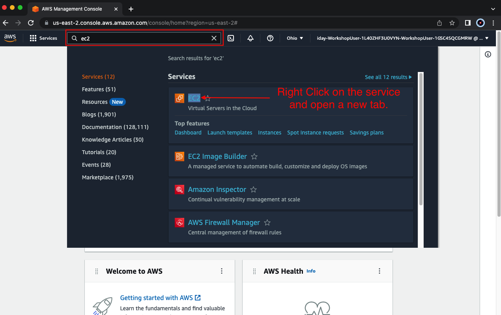
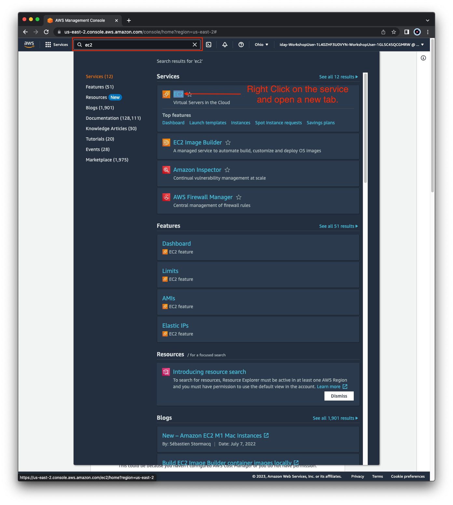

## Accessing an AWS environment

For AWS Immersion Days, Xperts, and other events, we will provide you the following via email on the day of the event:

  * **AWS sign in link**
  * **IAM User w/ console access**
  * **Password for the IAM User**
  * **Terraform outputs with resource URLs**

Here is an example of what will be contained in the email:
```
-=-=-=-=- (aws login info)
console: https://workshop-1234.signin.aws.amazon.com/console
regions: us-west-1 & us-west-2
user: workshop
pass: !SupErS3c6e7!
-=-=-=-=-

-=-=-=-=- (ftnt login info)
username: admin
password FORTInet23!
 
# scw-region1-fmg-login-urll = "https://1.2.3.4"
 
# scw-region1-hub1-login-url: https://2.3.4.5
 
# scw-region2-hub2-login-url https://3.4.5.6
 
# scw-region1-branch1-login-url: https://4.5.6.7

# scw-region2-branch2-login-url: https://5.6.7.8

# route_controller_website_url = "http://scw-uw1-route-controller-123456789012.s3-website-us-west-1.amazonaws.com"
-=-=-=-=-
```

{}

**We recommend using our pre provisioned AWS accounts for the workshop as this provides the fastest hands on experience, without worrying about charges incurred on your AWS bill**.
{}

## Navigating the AWS Console

When you first login you will see the Console Home page.

Use the **Search Box** at the top to search for services such as EC2, VPC, CloudFormation, etc.

When the results pop up, **right click** the name of the service and open the desired console in a new tab. This makes navigation easier.





This concludes this section.