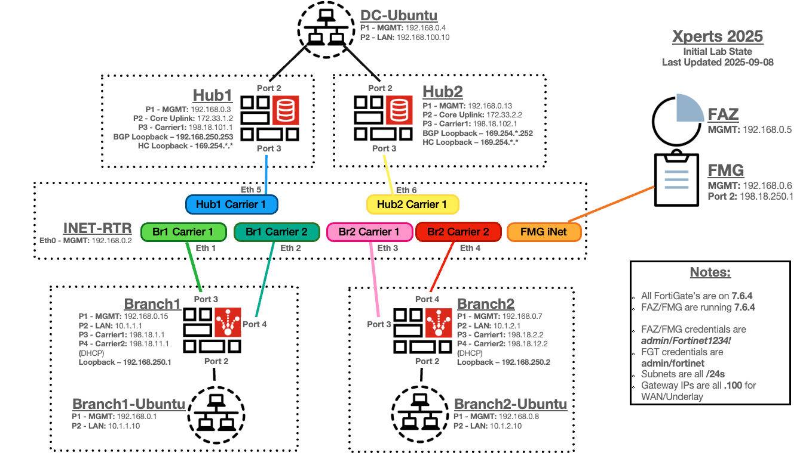

## Getting started with your Lab

---

{} The objective of this lab guide is to teach you one of the many methods of running an SD-WAN POC with FortiManager + ZTP.  There are many different DC designs.  The intention of this lab is not to cover all possible designs and variations.  This lab will show you how to use the SD-WAN Overlay Template generator for the majority of the necessary configurations.{}

---

{} 
The lab can be reached by going to: [FNDN](https://fndn.fortinet.net/cse) at https://fndn.fortinet.net/cse or Click Link in HELPFUL RESOURCES section 'Lab at FNDN'

**Please reference the email for Class Passphrase.  Use your real name and email address to sign in.** 

Multiple files are needed for this lab.  Please download files from the HELPFUL RESOURCES section in the lower left pane.

{}

---

## Starting lab topology diagram:

