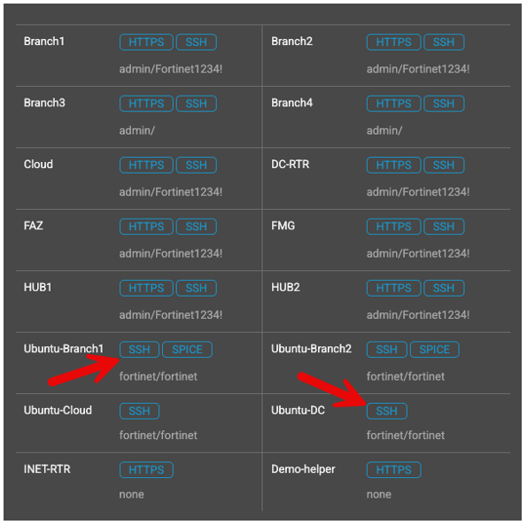
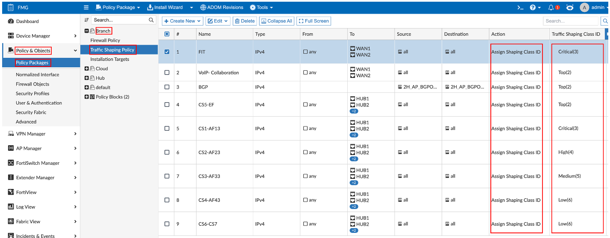
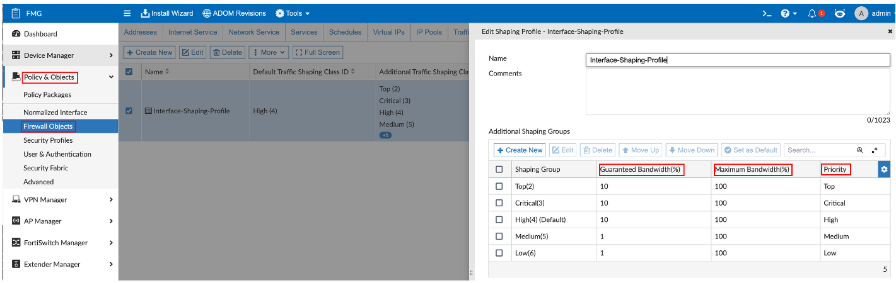
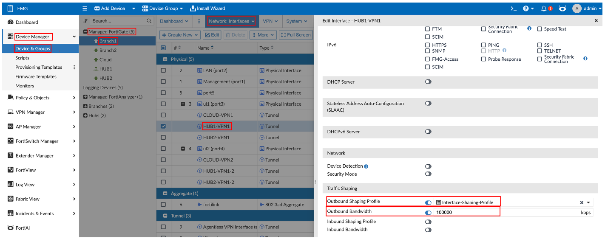
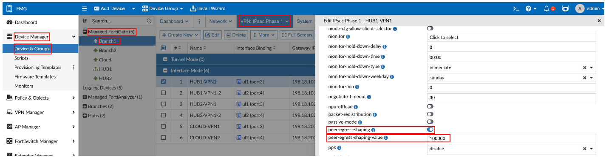
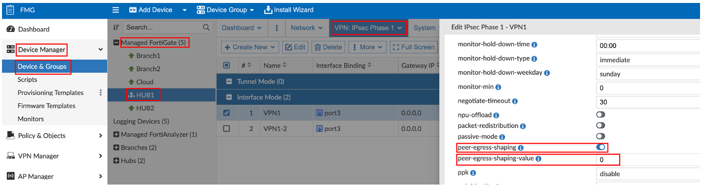
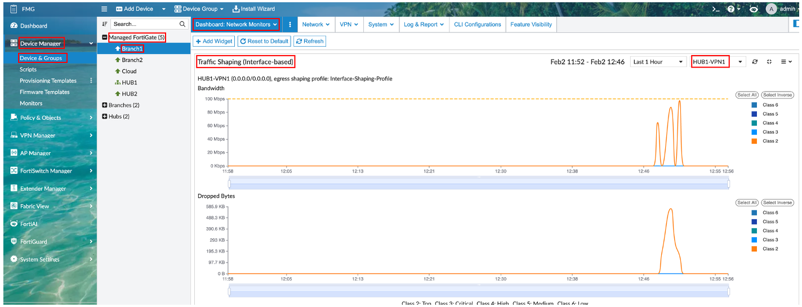
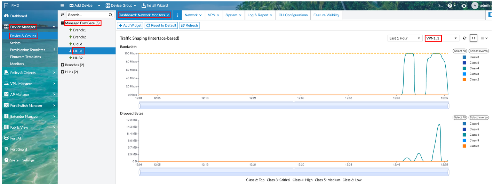

> Additional Demo Section

---

## Traffic Shaping Test

SSH into **Ubuntu-Branch1** and **Ubuntu-DC** and issue the following commands:



**Ubuntu-DC:**

```bash
iperf3 -s -p 6001 -i 1
```

**Ubuntu-Branch1:**

```bash
iperf3 -c 192.168.100.10 -p 6001 -u -i 1 -t 600 -b 25M -l 1360 -P 4 --bidir -S 0xb8
```

---

## Traffic Shaping Configuration

**Navigation:** FMG → Policy & Object → Policy Packages → Branch → Traffic Shaping

- Matching on **TOS values** with masks and specific ports and interfaces.
- Action assigns a **Traffic Shaping Class ID**.



---

## Shaping Profiles

**Navigation:** FMG → Policy & Object → Firewall Objects → Shaping Profile

Priority, Guaranteed, and Maximum Bandwidths are set within the shaping profiles.



---

## Branch Interface Bandwidth

**Navigation:** FMG → Device Manager → Device & Groups → Managed FortiGates → Branch* → Network: Interfaces

The Shaping Profile acts by limiting based on a **percentage of bandwidth**. The bandwidth is defined here along with applying the profile.



---

## Bandwidth Assignment to Dynamic Tunnels

### Branch Side

**Navigation:** FMG → Device Manager → Device & Groups → Managed FortiGates → Branch* → VPN: IPsec Phase 1

- The branches send the hubs BW information about their tunnels.
- The BW value set here should **match** the BW value of the interface.



### Hub Side

**Navigation:** FMG → Device Manager → Device & Groups → Managed FortiGates → Hub* → VPN: IPsec Phase 1

- **Peer Egress Shaping** is enabled on the Hub Tunnels.
- A BW value should **NOT** be set.



---

## Branch Traffic Shaping Monitoring

**Navigation:** FMG → Device Manager → Device & Groups → Managed FortiGates → Branch1 → Dashboard: Network Monitors

Select **HUB1-VPN1** in the Traffic Shaping (Interface-based) widget and expand.



---

## Hub Traffic Shaping Monitoring

**Navigation:** FMG → Device Manager → Device & Groups → Managed FortiGates → Hub1 → Dashboard: Network Monitors

Select **VPN1_0** or **VPN1_1** in the Traffic Shaping (Interface-based) widget and expand.


