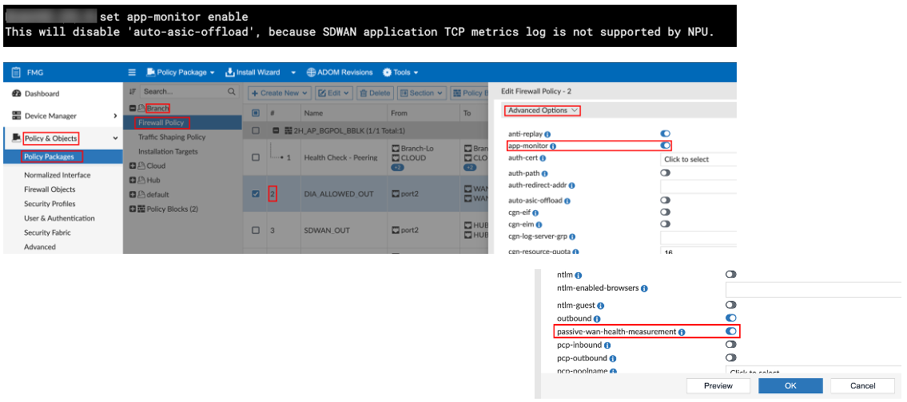
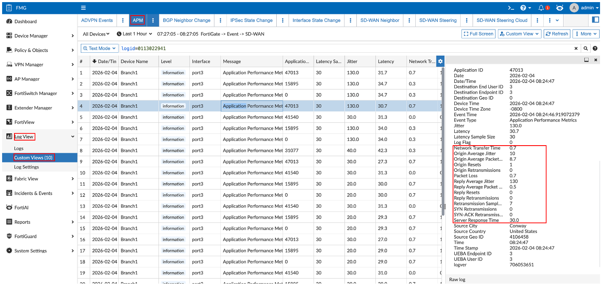
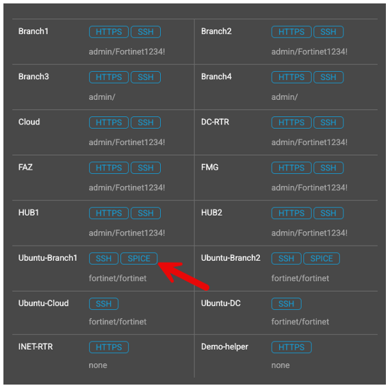
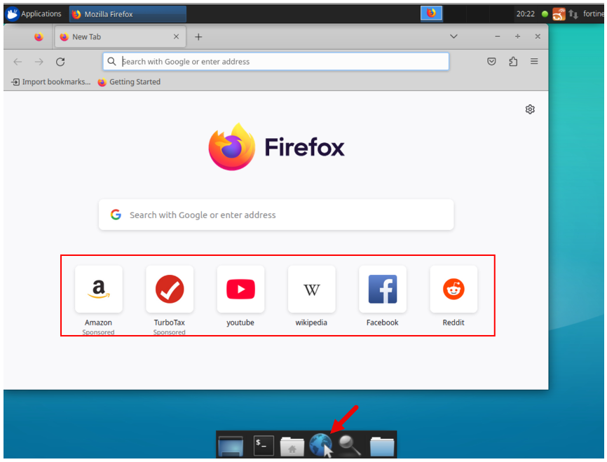
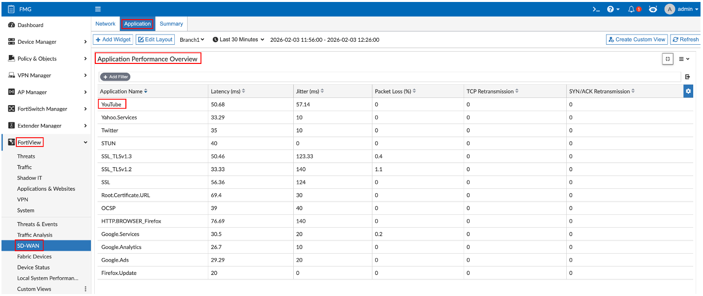
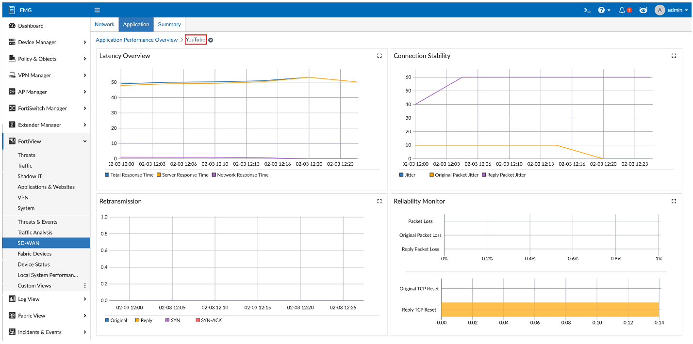

> Additional Demo Section

---

## Enabling Application Performance Monitor

**Navigation:** FMG → Policy & Objects → Policy Packages → Branch → Firewall Policy → Rule 2 → Advanced Options

This is enabled within a firewall policy rule. Both of these settings must be enabled:

- `app-monitor`
- `passive-wan-health-measurement`

> [!NOTE]
> This will disable offloading on that policy automatically.

---

## Application Performance Logs

**Navigation:** FMG → Log View → Custom Views → Application Performance

These are the logs that supply the data to create the graphs. Filter on: `logid="0113022941"`

---

## Generate Application Traffic

### Access Ubuntu-Branch1

Click the **SPICE** button for Ubuntu-Branch1.

### Generate Traffic

1. Open Firefox and click on a few different sites.
2. Stream a YouTube video.

---

## Application Performance Overview

**Navigation:** FMG → FortiView → SD-WAN → Application → Application Performance Overview

View the application performance data collected.

### Drill Down

Drill down into an application for more detailed information.

