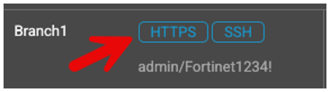
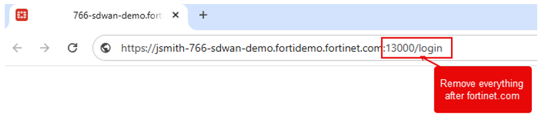
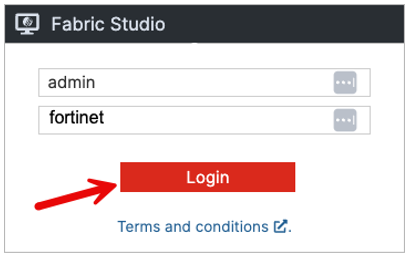
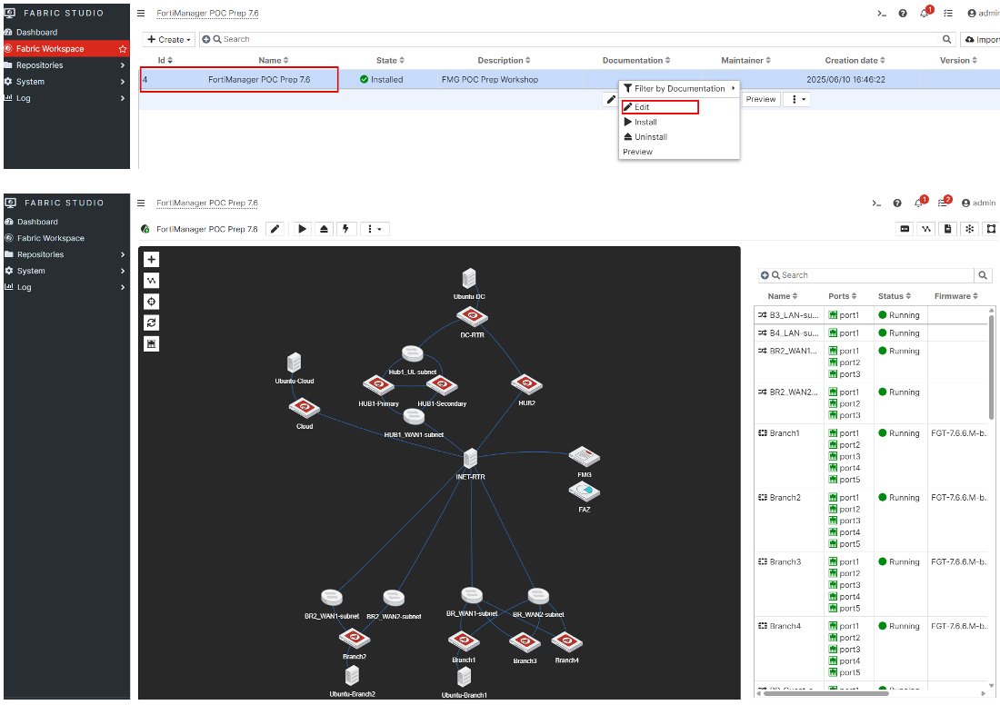
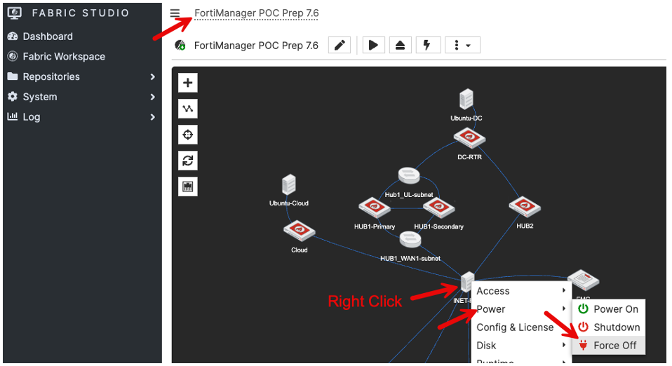
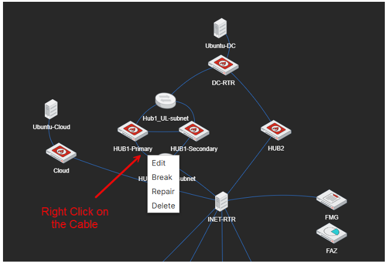
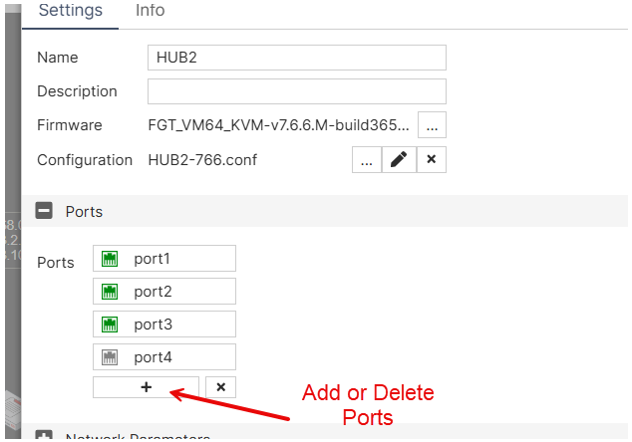
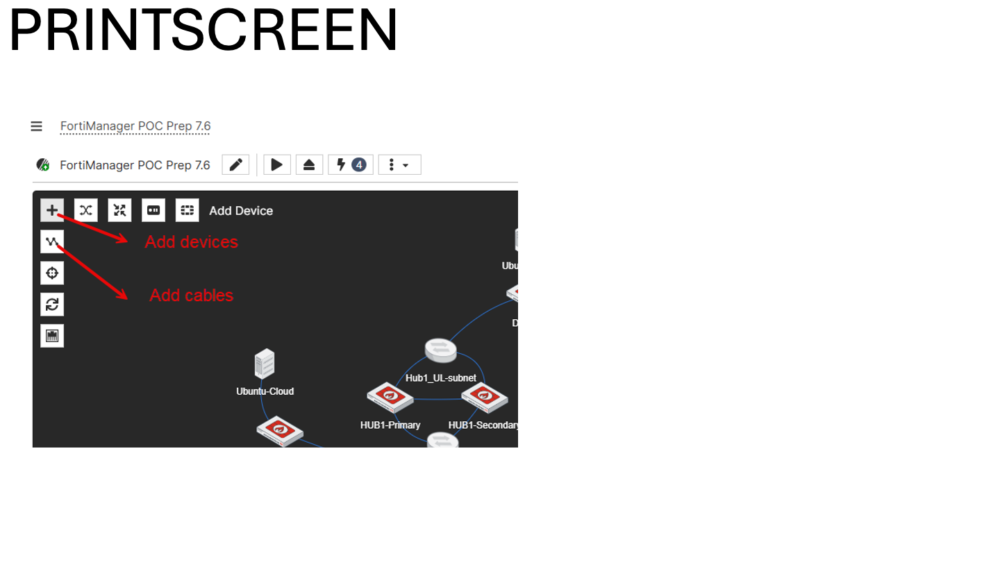
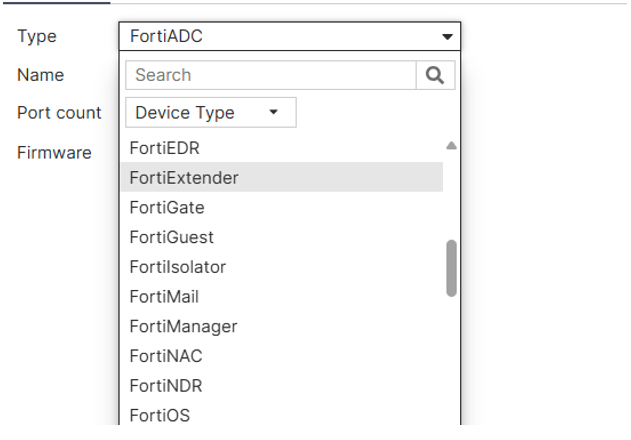

## What is Fabric Studio?

Fabric Studio is an **internal** Fortinet tool to create simple or complex network topologies using different **Fortinet products**.

Key facts:

- It is a network emulation platform like GNS3 or EVE-NG.
- It supports 3rd party devices.
- All FNDN demos and labs are created in Fabric Studio or will be migrated to Fabric Studio.
- The 7.6 US-CSE SD-WAN demo is built in Fabric Studio as well.

**Resources:**

- Fabric Studio SharePoint Page: [Link](https://fortinet.sharepoint.com/sites/FabricStudio/SitePages/Home.aspx)
- Fabric Studio Starting Guide: [Link](https://tec.myfortinet.com/fndn/fabric-studio/)

---

## How to Login to Fabric Studio

1. Open a new HTTPS session to one of the demo FMG/FAZ/FGTs/etc.

   

2. Remove everything after the base URL, which should present you with a login screen of Fabric Studio.

   

3. Login with `admin` / `fortinet`

   

---

## How to Edit the 7.6 SD-WAN Template

Open 7.6 SD-WAN template called **"FortiManager POC Prep 7.6"**.

---

## Fabric Studio Functions

### Reboot INET-RTR

We have seen the INET-RTR VM lock up in some cases. This will cause "internet" connectivity to be down, which obviously causes problems in an SD-WAN demo.

**Resolution:** Powering the INET-RTR off then back on has resolved this issue in every case.

### Break/Repair or Add/Delete Connections

- You can **edit the connections** by right-clicking the cables. This is useful when testing connections, traffic flows, or high-availability (HA) scenarios.

  

- You can **add or remove ports** by editing the device's settings. This is helpful for expanding your lab and incorporating additional devices or scenarios into your demo.

  

### Add or Remove Devices

- You can add additional devices and cables to your demo and customise the environment based on your customer's use cases.

  

- You can view the list of supported Fortinet and third-party devices in Fabric Studio (see documentation).

  
