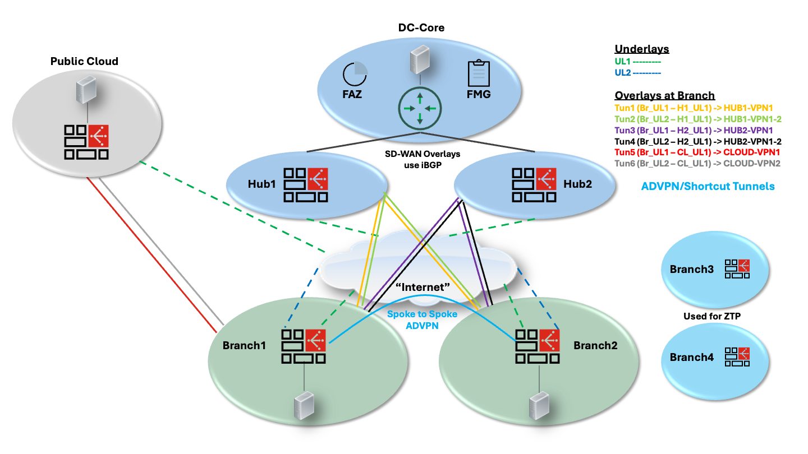
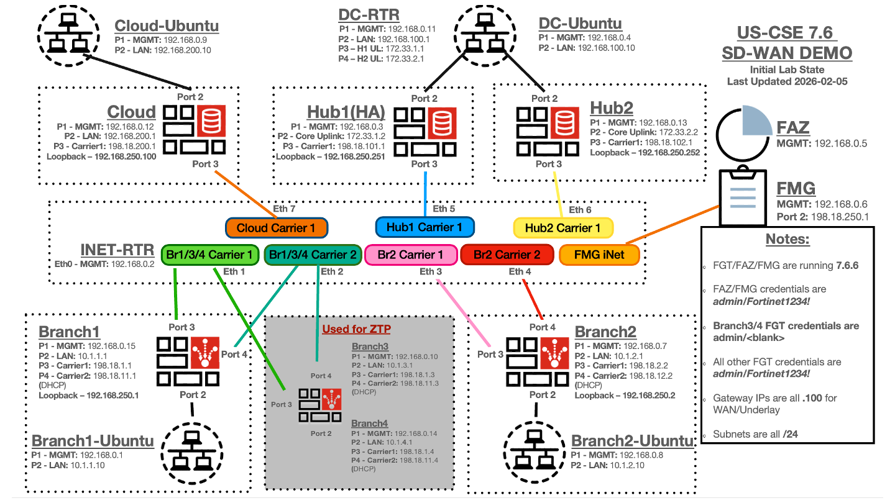

## SD-WAN Key Components

### FortiGate (FGT)

- Foundation of the SD-WAN solution
  - Built-in intelligence (no controller needed)
  - NGFW
  - Advanced routing support

### FortiManager (FMG)

- SD-WAN Monitoring, Management, and Templatization
- Can be physical appliance, VM (public/private), Saas (FortiManager Cloud)
- Single management console for all SD-WAN/Branch components (FGT, FSW, FAP, FEXT)
- ZTP
- Does NOT need to be operational to make configuration changes or SD-WAN to function properly
  - Many competitors require their orchestrator/controller etc to be available

### FortiAnalyzer (FAZ)

- Log collection
- Event management
- Reporting
- FortiView monitoring and visibility

## SD-WAN Terminology

- **Hub** – The Data Centre side firewalls.
- **Branch** – The remote office firewalls. Sometimes called the "Edge or Spoke" devices.
- **Carrier** – The ISP/WAN/Underlay connection to the internet.
- **Underlay** – A traditional WAN/ISP/MPLS path. VPNs between sites are built using this link.
- **Overlay** – An encrypted IPSec tunnel between a branch and hub (or other branches).
- **ADVPN** – Auto Discovery VPN tunnels. Dynamic tunnels between spokes in Hub and Spoke topology.

### SD-WAN Topology Overview

**Components shown in the topology:**

- **DC-Core** with Hub1 (HA) and Hub2 (standalone)
- **Branch1, Branch2, Branch3, Branch4**
- **Public Cloud** (simulated FortiGate)
- **FMG and FAZ** (in the Data Centre)
- **"Internet"** (WAN Emulator)
- Spoke-to-Spoke ADVPN capability

**Underlays:**

| Underlay | Description |
|----------|-------------|
| UL1 | Primary underlay |
| UL2 | Secondary underlay |

**Overlays at Branch:**

| Tunnel | Path | Target |
|--------|------|--------|
| Tun1 | Br_UL1 – H1_UL1 | HUB1-VPN1 |
| Tun2 | Br_UL2 – H1_UL1 | HUB1-VPN1-2 |
| Tun3 | Br_UL1 – H2_UL1 | HUB2-VPN1 |
| Tun4 | Br_UL2 – H2_UL1 | HUB2-VPN1-2 |
| Tun5 | Br_UL1 – CL_UL1 | CLOUD-VPN1 |
| Tun6 | Br_UL2 – CL_UL1 | CLOUD-VPN2 |

- SD-WAN Overlays use **iBGP**
- ADVPN/Shortcut Tunnels are supported
- Branch3/Branch4 are used for **ZTP** (Zero Touch Provisioning)

### US-CSE 7.6 SD-WAN DEMO

### Key Components of Topology

- **Branch1/2** are configured with provisioning templates generated by the SD-WAN Overlay Templates (SOT) feature. Each has 2 Underlays terminating VPNs to Hub1/Hub2/Cloud across both underlays (6 total overlay tunnels).
- **HUB1** is in HA and **HUB2** is standalone, each having 1 Underlay. Both are configured with provisioning templates generated by SOT.
- **Cloud** simulates a FortiGate in any public cloud environment (AWS/Azure/GCP).
- **FMG/FAZ** can be hardware or virtual, hosted on premise or in the Cloud. In this demo they are in the Data Centre.
- **Branch3/4** are blank FGTs used for low touch provisioning demo.
- **"Internet"** – WAN Emulator configured to allow for Underlay impairments or to simulate outage scenarios and demonstrate SD-WAN failover functionality.
