## SD-WAN Demo Helper

To make performing a demo easier, an SD-WAN Demo Helper web page has been created. This page helps you perform multiple demo tasks with a single click.

**How to access:** Navigate to your FNDN Demo page, click on the **'Demo Helper' HTTPS** button.

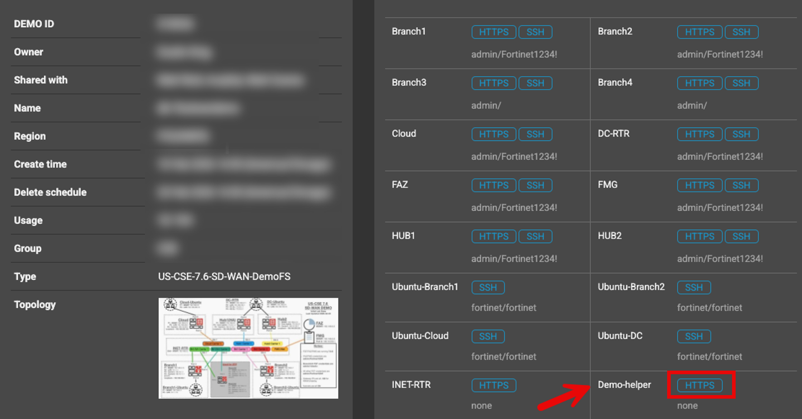

> **Note:** Throughout the demo, guidance is provided on how to use the SD-WAN Demo Helper. Some buttons might not be used for this demo.

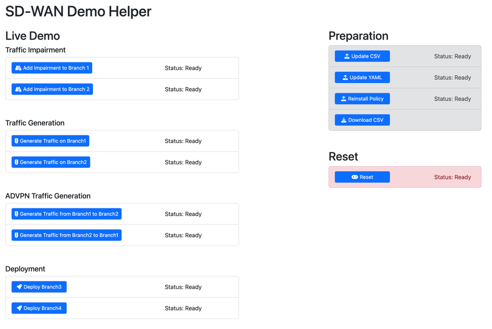

---

## Steps to Take Prior to Your Demo

### Step 1: Reinstall Policies

Typically, when FMG is spun in the lab, the applied Policy Packages and Provisioning Templates appear with a ❓ icon. This can be resolved by re-installing the policy on each device. You can accomplish this now with one click on the SD-WAN Demo Helper page.

1. Log into **FMG → Device Manager → Managed FortiGates** (you might need to scroll right to see all columns).

   - **IF** Branch1/2 and Cloud show down on this screen, see the "Reboot INET-RTR" in the Fabric Studio Functions section towards the end of this doc.

     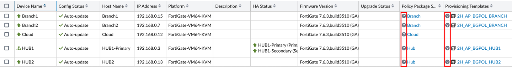

2. In the **Preparation** section of the Demo Helper, click the **Reinstall Policy** button. This will re-install policy on all devices in FMG. This takes a minute — be patient, then refresh your browser.

   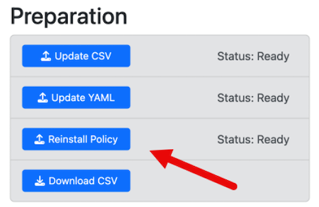

> **Note:** This function may report back as failed but check FMG (next step).

### Step 2: Customise FMG Device Manager Columns

Remove unwanted columns and add suggested ones. Click on the gear icon in the top right corner to edit the columns in FMG Device Manager. Use the default column suggestion provided.

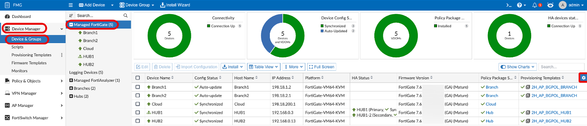

### Step 3: Authorize HUB1 on FAZ

The HUB1 HA pair will come up unauthorised on the FAZ. This is due to the way the lab spins up when created, not an issue on either device. Only 4 devices will show managed in FAZ.

1. Login and go to **FAZ → Device Manager → Unauthorized Devices**
2. Select the device and click **Authorize**.

   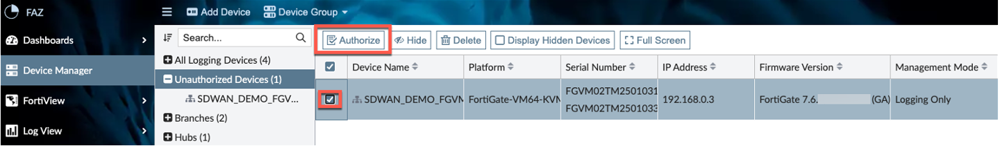

3. Change the "Assign New Device Name" field to **HUB1** and click **Okay**.
   - Log status might take several minutes to show up — refresh browser.

     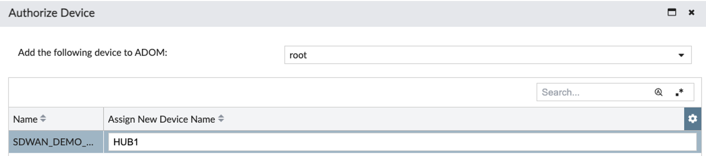

> [!NOTE]
> If other unauthorised devices show, they can be removed but it is not required.

### Step 4: Add FAZ to FMG

1. Log into the FMG and go to **FMG → Device Manager → Device & Groups → Add Device** drop down arrow. Select **Add FortiAnalyzer**.

   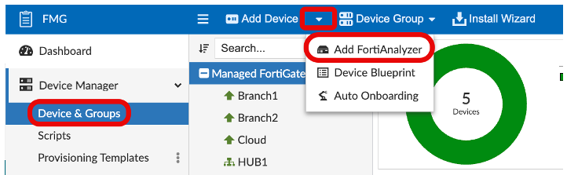

2. Enter the required information and click **Next** twice.

   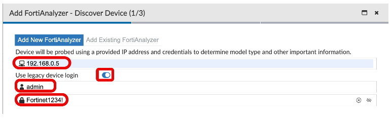

3. Choose **"Synchronize ADOM and Devices."** Then click **"Finish"**.

   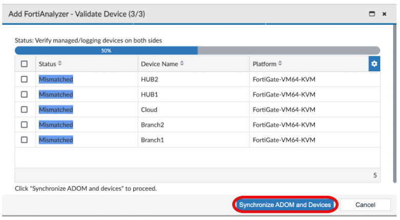

---

## Start Traffic at Branch1

### How to get simulated traffic flowing through Branch1

1. Navigate back to your FNDN Demo page, click on the **'Demo Helper' HTTPS** button if not already open.

   

2. In the **Traffic Generation** section, click on the **'Generate Traffic on Branch1'** button.

   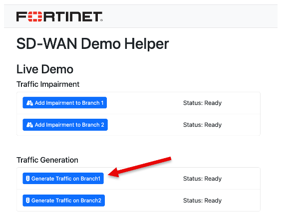

   - This will start FIT running on the Branch1-Ubuntu (10.1.1.10). This will simulate user web traffic and HTTP to Hub1 (192.168.100.10).
   - This will allow you to show logs and validate SD-WAN steering later in your demo.

> [!NOTE]
> You should do this at least **1 hour** before your demo starts.
