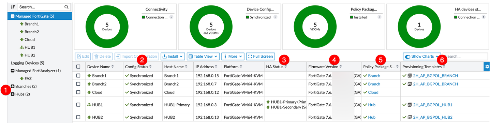
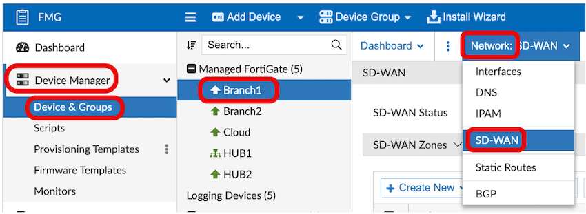
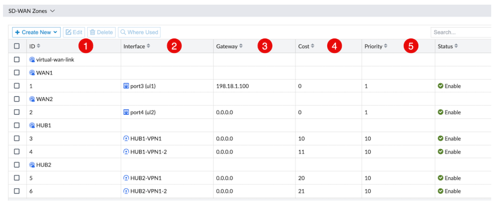
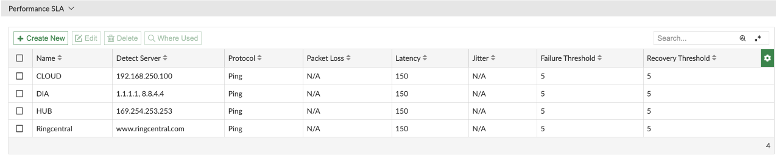
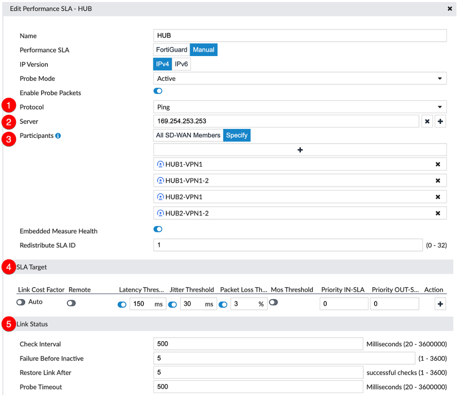
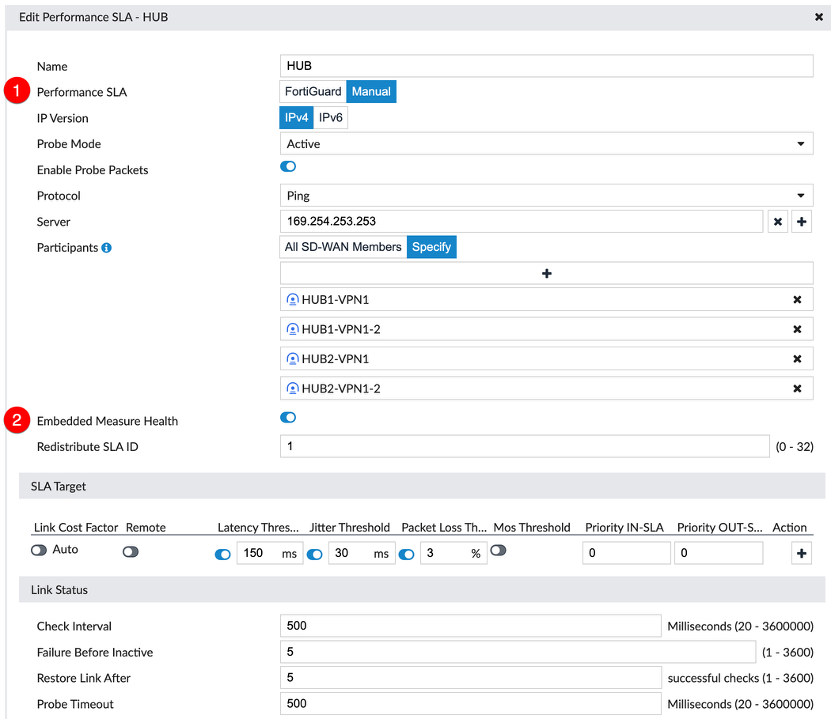
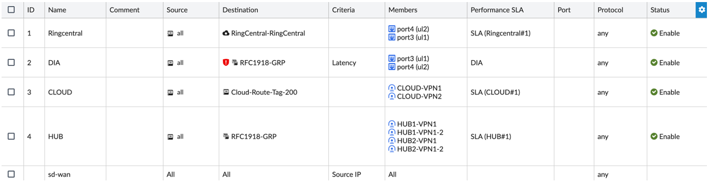
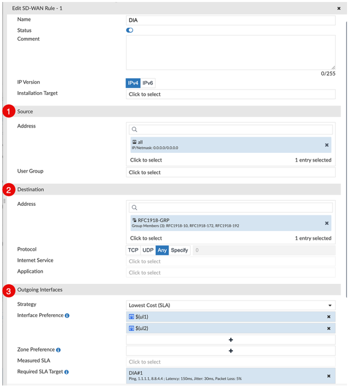
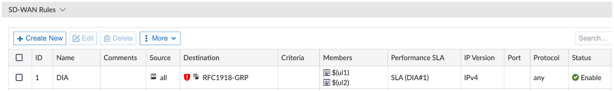

## FortiManager Device Manager Overview

Log into FMG and open Device Manager. Briefly describe the following:

1. **Device Groups** – Easily organise devices by type, region, etc.
2. **Config Status** – Quickly identify the device config synchronisation status.
3. **HA Status** – Cluster members and their status.
4. **Firmware** – Current firmware version.
5. **Policy Package Status** – Policy Package name installed and its status.
6. **Provisioning Templates** – Template group installed and its status.

---

## FortiGate SD-WAN Configuration Overview

Display SD-WAN configuration on Branch1.

**Navigation:** FMG → Device Manager → Device & Groups → Managed FortiGate → Branch1 → Network → SD-WAN

> [!TIP]
> Showing the configuration on the Branch1 device (vs. showing the SD-WAN Provisioning Template) allows you to avoid explaining Templates, Template Groups, Metadata Variables, and other concepts that will be covered later in the Provisioning section.

---

## Zones & Interface Members

1. **Zones** - Primarily referenced in firewall policy. They can also be used in static routes and SD-WAN service rules.
   - Individual members cannot be referenced in FW policy. Therefore, WAN1 and WAN2 have their own zones.
2. **Members** - The underlay/overlay members that we want to intelligently steer traffic to.
3. **Gateway** – IPs are left blank (0.0.0.0) for members using DHCP. UL1 has a static IP/Gateway. UL2 is using DHCP. These IPs are reused as next hops for any static routes that reference SD-WAN members or Zones.
4. **Cost** – Can be used when applying a strategy of "Lowest Cost" in a rule. Explained further in the SD-WAN Rules section.
5. **Priority** – Applied to static routes that reference SD-WAN members.

---

## Performance SLA (Health Checks)

The role of Performance SLAs (Health Checks) is to gather link health information and define thresholds to make steering decisions in SD-WAN rules.

- This demo has a Performance SLA defined for our Cloud connection (CLOUD), an Internet probe for local breakout traffic (DIA), a single SLA for both Hubs (HUB), and a Ringcental specific SLA.

> [!NOTE]
> We generally recommend probes simply from spoke to hub (nothing further into core network)

This demo has the following Performance SLAs defined:

| SLA Name | Purpose |
|----------|---------|
| **Cloud** | Probing loopback configured on Cloud FGT |
| **DIA** | Probing reliable IP(s) on the internet to measure if underlay connectivity is up and healthy |
| **HUB** | Probing the same loopback interface anycast IP on each hub |
| **RingCentral** | Probing the www.ringcentral.com SLA target as defined by FortiGuard |

### Performance SLA Key Configuration Details

Edit the HUB Performance SLA and explain key config details:

1. **Protocol** – Protocol used to determine health of link(s).
2. **Server** – IP(s) or FQDN(s) being monitored.
   - If 2 entries are used, **both** MUST be considered unreachable for the health check to be considered failed.
   - Only the first "Server" in the list will be used when displaying stats, but both are being actively probed.
3. **Participants** – SD-WAN member interface(s) used in this SLA.
4. **SLA Target** – Thresholds set to be used in a lowest cost or maximise bandwidth rule.
   - Multiple threshold sets can be defined for different app tolerances if desired.
5. **Link Status**:
   - **Check Interval** – How frequently the probes are sent, default is 500ms (½ second).
   - **Failures before inactive** – How many UNANSWERED probes before the link is considered "failed" state.
   - **Restore link after** – How many GOOD probes before it goes back to a "healthy" state.

### Performance SLA New Features

Edit the HUB Performance SLA and explain key config details:

1. **Performance SLA**
   - **FortiGuard** – SLA targets defined in and downloaded from FortiGuard.
   - **Manual** – SLA targets configured by the administrator.
2. **Embedded Measure Health** – SLA statistics and status forwarded to the hub. The server IP in the shown config exists on each hub. This is the destination the embedded information is sent to.

---

## SD-WAN Rules

SD-WAN rules steer traffic based on strategy. In this lab there are different rules for:

- **RingCentral** (ISDB)
- **DIA** (Address Group Negate)
- **Cloud** (Route Tag)
- **HUB** (Address Group)

The rules page works like a **top-down policy engine**. The first matched rule is used, and no further rules are evaluated. Other reasons for "skipping" a rule include members being out of SLA or down (configurable).

> **Note:** There is always an implicit/default ALL/ALL rule at the bottom of the list (cannot be removed).

### SD-WAN Rule Key Options

Edit the DIA Rule and explain:

1. **Source address/User group**
   - **Input device** (interface) can be selected or negated in advanced options.

2. **Destination** – Can use address/address group (can be negated) and protocol OR ISDB/App/App group/App Category. Matching based on Route-Tag and TOS/DSCP is also available.

3. **Strategies**

| Strategy | Description |
|----------|-------------|
| **Manual** | Matching traffic towards SD-WAN members in configured order if member interfaces are up. No health check is referenced. |
| **Best Quality** | Choose the best quality link based on selected quality criteria (latency/jitter/etc.) using the measured SLA (health check). `custom-profile` can apply importance (weight) for criteria: `(packet-loss-weight × packet loss) + (latency-weight × latency) + (jitter-weight × jitter) + (bandwidth-weight / bandwidth)` |
| **Lowest Cost** | Use the lowest cost member if the SLA is met. If cost is the same, use the order in which the members are listed (default) or fib-best-match as the tie break. |
| **Load Balance** | An option that can be used with Manual or Lowest Cost steering. Uses ALL of the members listed as long as they meet the required SLA target(s). Sessions can be load balanced using: round-robin (default), source-ip, source-dest-ip, inbandwidth, outbandwidth, or bibandwidth. |

### Steering Rules for This Demo

- **RingCentral** – Lowest Cost (SLA) using an Internet Service DataBase (ISDB) definition. The ISDB is a comprehensive public IP address database combining IP address range, IP owner, service port number, and IP security credibility. The data comes from the FortiGuard service system.
- **DIA** – Local breakout traffic steering. The red exclamation point indicates all traffic **NOT** equal to the RFC1918 address group as the destination (`set dst-negate enable`).

  

- **CLOUD** – Lowest Cost (SLA) using a route-tag dynamically generated from a BGP community string.
- **HUB** – **HUB1** is preferred over **HUB2** in this template. 
  - This rule evaluates the overlays to **HUB1** and **HUB2**. The rules use member cost and then member order. Branch member preference and health is communicated upstream to the Hubs and from there to the client DC.
- **Implicit rule** (bottom of the page) – Traffic that doesn't match an explicit rule will be load balanced to all members of SD-WAN (as long as a valid route exists). Based on routing setup in this lab, internet traffic should not traverse the VPN even if this rule is hit, as route priorities have been configured on overlay member interfaces. It should also be impossible for this rule to be hit since rules for all traffic that is and is not RFC-1918 are defined — this covers all IPv4 address space.
