## SD-WAN Health Monitoring Methods

There are multiple ways to monitor your Enterprise's SD-WAN Health:

- Individually on a FortiGate's GUI or CLI.
- On a per-FortiGate basis via the FortiManager's Managed FortiGate "Network Monitors" dashboard.
- Centrally/Globally via the FortiManager's SD-WAN Monitor under the Device Manager.

## SD-WAN Monitor Map View

**Navigation:** FMG → Device Manager → Monitors → SD-WAN Monitor → Map View

- The wheel icons identify the **hubs**. Computer/FGT icons identify the **spokes**.

  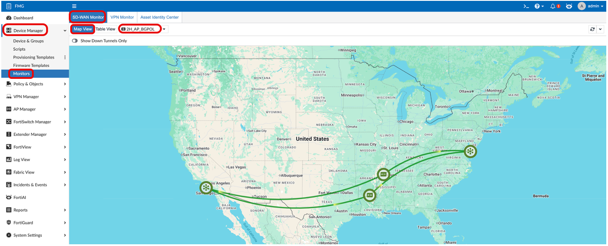

- Connections between FGTs can be hovered on for additional information or drilled down on.

  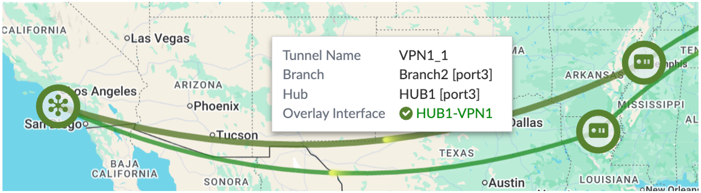

- Map View can be filtered by **SD-WAN Overlay Templates** or **Device Groups**.

  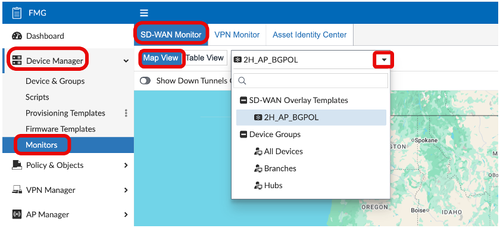

### Map View – Links

**Navigation:** FMG → Device Manager → Monitors → SD-WAN Monitor → Map View

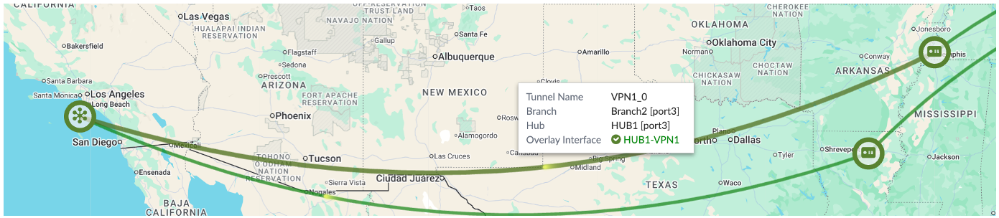

Clicking on an individual link shows:

1. The tunnel name on the Hub.
2. The end point FGTs.
3. The underlays the tunnels are built on.
4. The Branch tunnel health and stats.

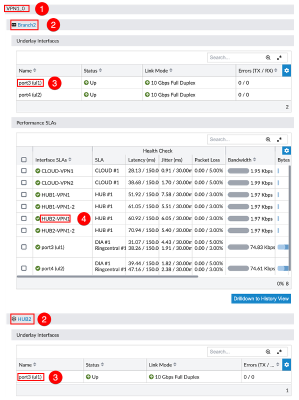

### Map View – FGTs

**Hovering** over an individual device shows summary info.

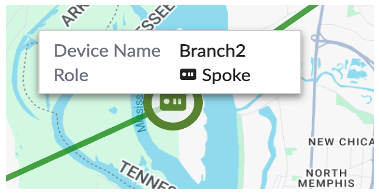

**Clicking** on an individual device shows:

- Underlays and Member SLA Status/Stats

  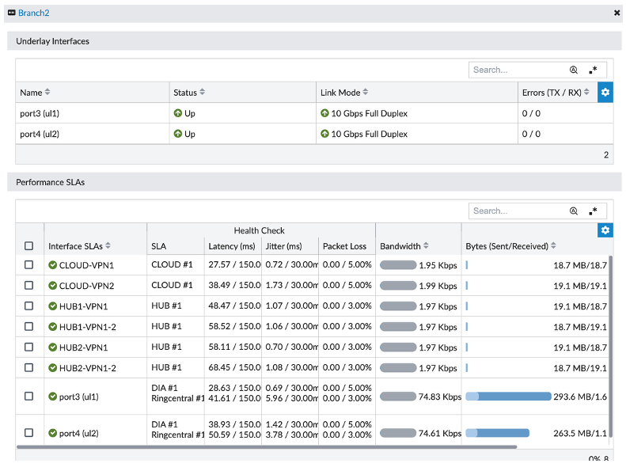

- IPSec VPN

  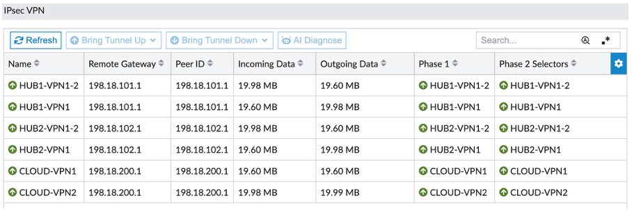

- Full Routing Table

  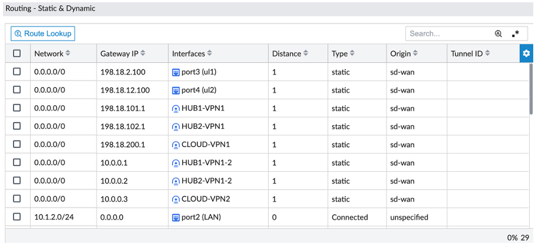

---

## SD-WAN Monitor Table View

**Navigation:** FMG → Device Manager → Monitors → SD-WAN Monitor → Table View

By clicking the Table View, you see the list of your devices and their SD-WAN interfaces with their stats and health check statuses.

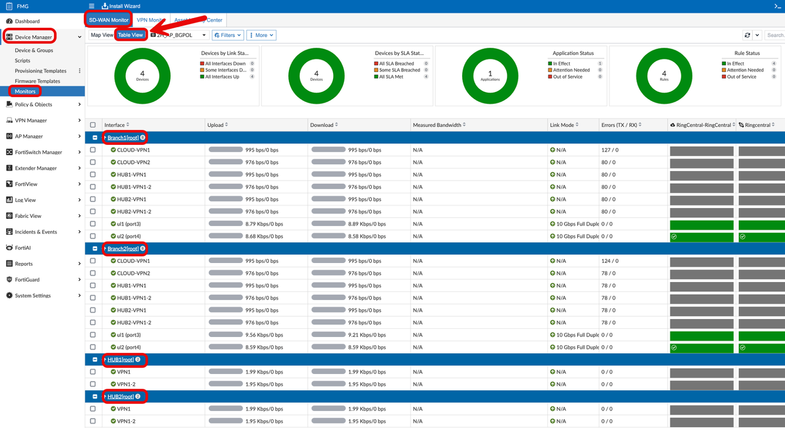

### Network Monitor

You can further drill down into a specific Managed Device by clicking on the device name. This will display the Network Monitor view on the right-hand side.

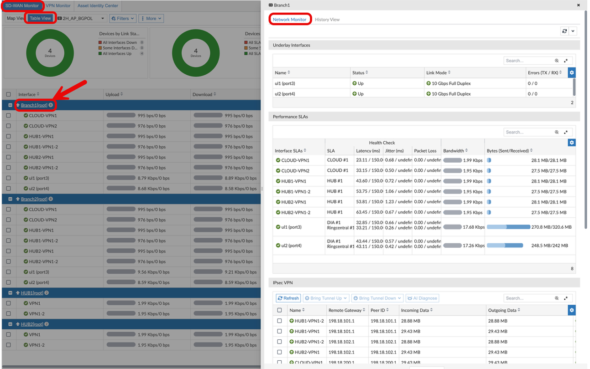

You can scroll through the provided widgets:

- Underlay Interfaces
- Performance SLAs
- IPsec VPN
- Routing – Static & Dynamic

---

## History View

In the same screen, you can click on the **"History View"** to see the traditional SD-WAN monitor view. Here you can see:

- SD-WAN Interfaces
- SD-WAN Rules with selected Member
- Bandwidth and Traffic Growth graphs
- SD-WAN Health Check statistics

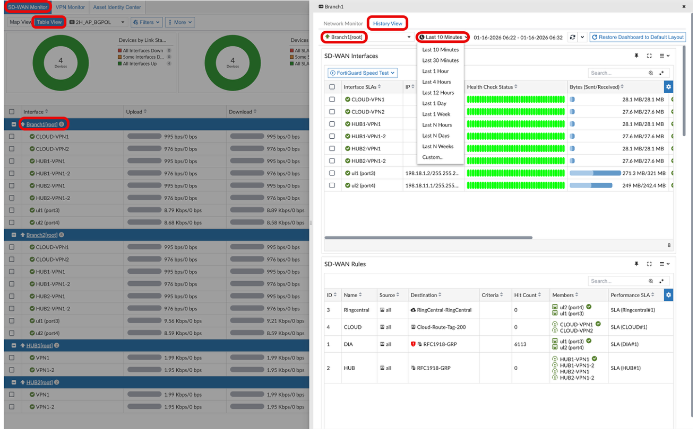

You can change the device and time frame at the top of this page.

### SD-WAN Interfaces

- Shows BW, health check history, Link information, and errors. Your screen should show all green.

  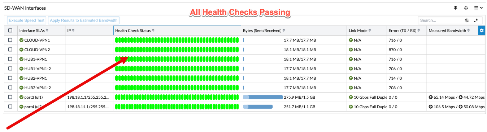

- Hovering over the health check status bar will show individual historical results. More results will show within each line as the historical time frame is extended.

  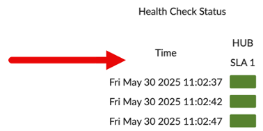

- Hovering over the circle next to the Interface name will supply Health Check statistics.

  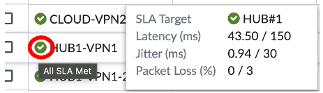

- You can enlarge each section by clicking on the pop-out icon in the upper right-hand corner.

  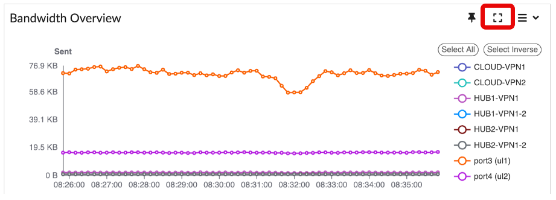

### SD-WAN Rules

- **Source and Destination**
- **Criteria** – Measurement used in a Best Quality rule (none configured in our examples).
- **Hit Count** – Number of times this rule has been matched in the stored history. This number does not change when altering the specified time range.
- **Members** – The member with the check mark is the current preferred path that traffic will take. Hovering over the interface member will show details including health statistics. This can quickly provide information about why a path was or wasn't chosen.
- **Performance SLA** – The health check and its SLA ID referenced by the rule.

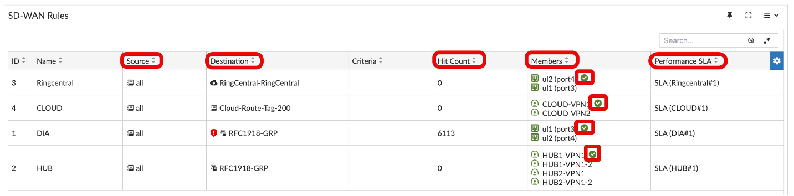

### Bandwidth Overview and Traffic Growth

- **BW Overview** – Measurements per time sample. Hovering over the graph will show measured values for each interface at that point in time.

  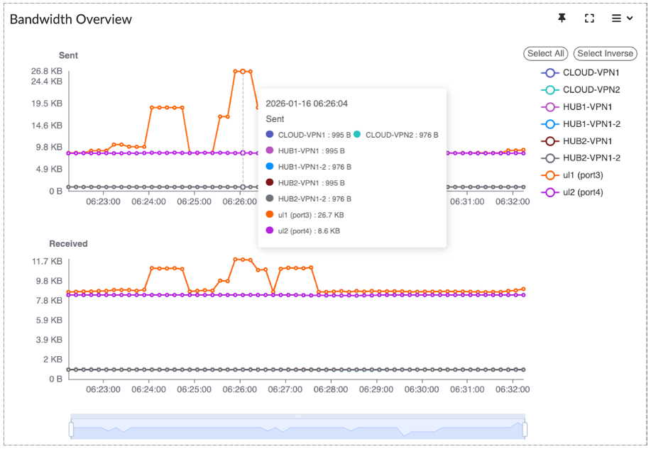

- **Traffic Growth** – Shows cumulative values over the measured history.

  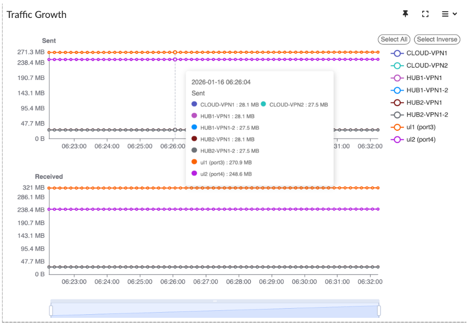

- Selecting or deselecting an interface changes all 4 views. "Select Inverse" swaps the selected interface view.
- The grey-blue bar on the bottom can be manipulated to zoom in and out on the timeline.

## SD-WAN Logging in FMG with FAZ Log View

Since FAZ is joined as a Managed Device in FMG, the FAZ Views are now available in the FMG Console.

**Navigation:** FMG → Log View

For this demo, 9 **Custom Log Views** have been created.

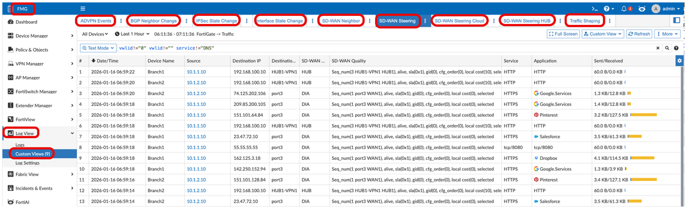

### SD-WAN Steering Traffic Logs

**Navigation:** FMG → Log View → Custom Views → SD-WAN Steering

With these logs you can show:

- DIA traffic getting steered out of **'port3'** via SD-WAN Rule #1 named **'DIA'**.
- In the next section (SD-WAN Link Impairment), you will come back to this view to show traffic has moved to **'port4'**.

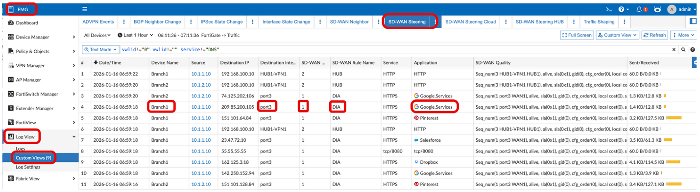

> [!TIP]
> Highlight that you can create custom logging views and customise the column headers.
