> Bulk Provisioning using Device Blueprint and CSV Import

---

## Template Groups

Template Groups are a grouping of individual GUI/CLI Templates that can be assigned to individual devices or device groups.

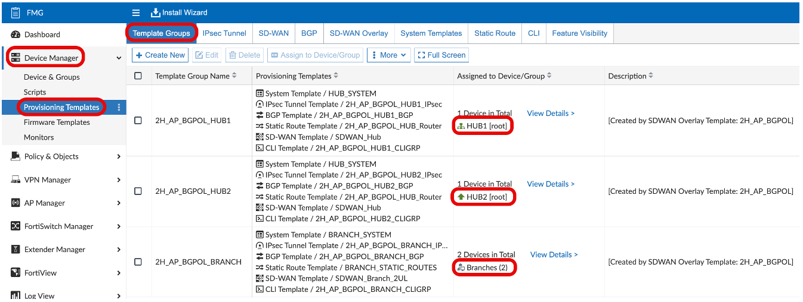

---

## Metadata Variables

Metadata variables are configuration objects that can have multiple per-device mappings. These can be referenced in Templates so they can be applied to multiple devices.

- Metadata variable `lan_subnets` can be referenced in a GUI/CLI template or in a Firewall Address Object by using `$(lan_subnets)` notation.

  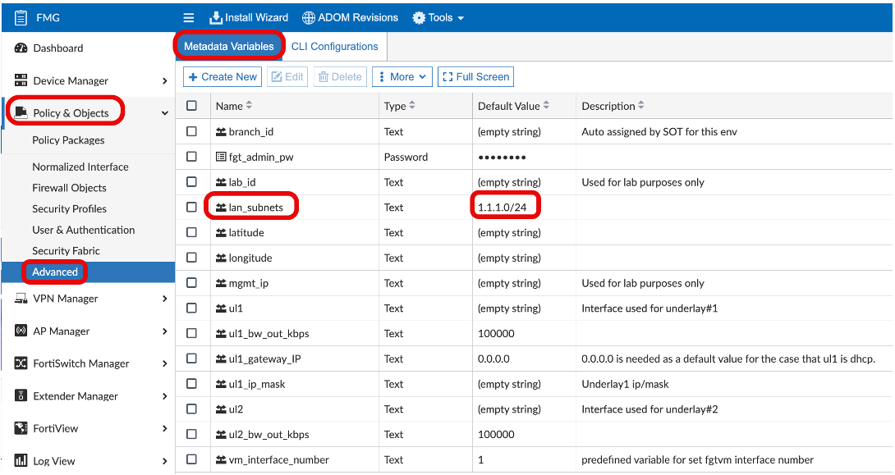

> **Note:** For a metadata variable to be referenced in a Firewall Address Object, a **Default Value MUST** be defined.

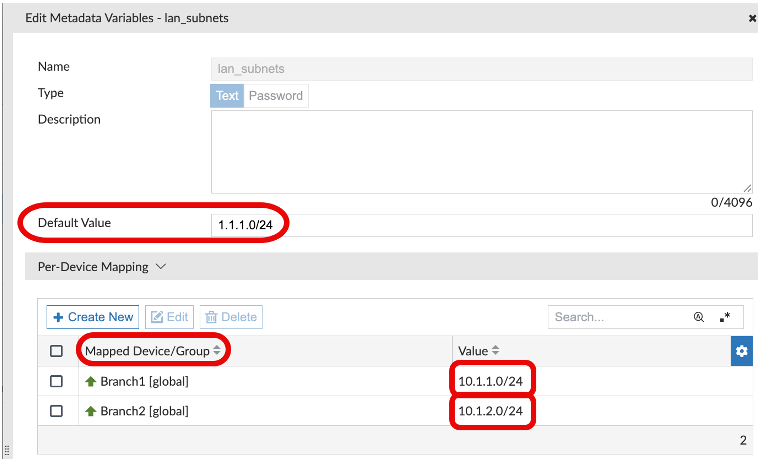

---

## Model Devices

A Model Device is intended for new FortiGate deployments, where no pre-existing configuration on the FortiGate must be preserved. The configuration associated with the model device overwrites the configuration of the FortiGate as part of the ZTP process. FortiManager checks the version of the Internet Service database on the FortiGate after the FortiGate has been authorised.

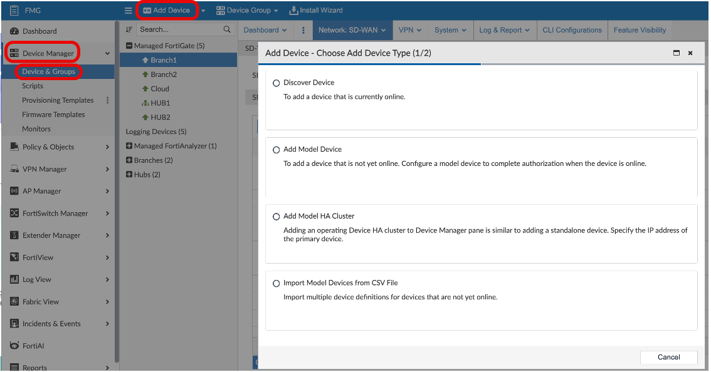

Key points:

- Model devices are used to store configuration for a device that is **not yet online** and not yet connected to the network.
- The serial number should be used if it is known.
- A pre-shared key can be used if the serial number is not known when you add the model device to FortiManager.

---

## Device Blueprint

Device blueprints can be used when adding model devices to simplify configuration of certain device settings, including:

- Device groups
- Pre-run templates
- Policy packages
- Provisioning templates
- And more

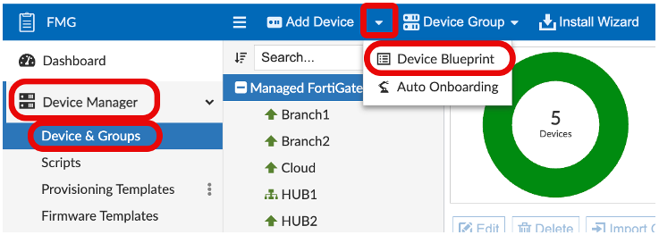

Once a device blueprint has been created, it can be selected when adding a model device or when importing multiple model devices from a CSV file.

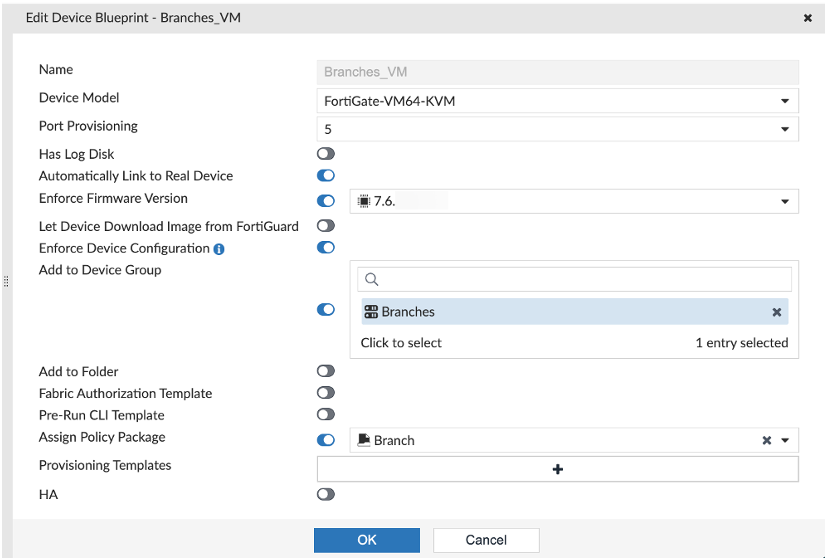

- The Device Blueprint can also be selected in a single model device creation by toggling **'Use Device Blueprint'** to on, then selecting your Device Blueprint.

  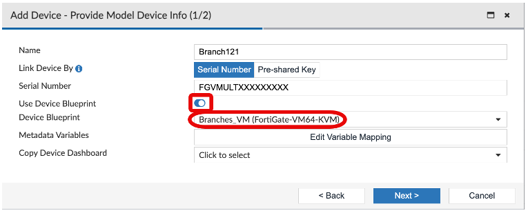

> [!NOTE]
>  A Device Blueprint needs to be created for **every FGT model**.  

- The Device Blueprint can be referenced in a `.CSV` file that is imported for bulk model device creation.

  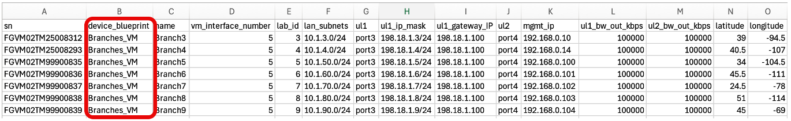

---

## Bulk Import via CSV

A `.CSV` can be used to create bulk Model Devices. This file will provide:

- FGT serial numbers
- The device blueprint name
- Device name
- Number of VM interfaces
- All Metadata Variables

With this method, multiple model devices can be created at one time. This drastically reduces the number of clicks your customer must do to create model devices and define the metadata variable values for each of them upon creation.

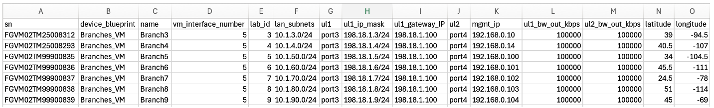

### Required CSV Columns

| Column | Description |
|--------|-------------|
| `sn` | Serial number |
| `device_blueprint` | Blueprint name |
| `name` | Device name |

> [!NOTE]
> Additional columns that do not match an existing Metadata Variable will be ignored.

---

## Demo CSV Update and Download

The CSV for this environment has already been provided. Before use, it needs to be updated with your environment's Branch3 and Branch4 FGT Serial Numbers.

1. Return to your SD-WAN Demo Helper Web Page.
2. In the **Preparation** section, click on the **'Update CSV'** button.
3. Once updated, download this CSV.
4. Once downloaded, you can show your customer the contents and demo the CSV Import feature.

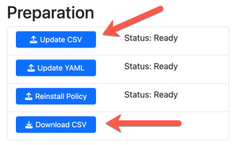

### Import Process

1. The **Import Model Devices from CSV** allows you to drag and drop or select your CSV file for import.

   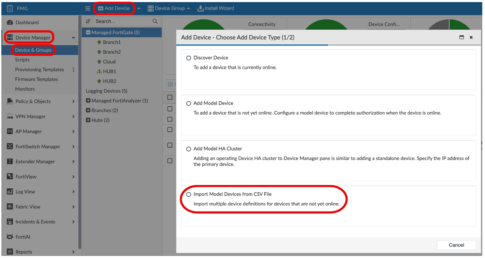

2. Note the **"Copy Device Dashboard"** option — this allows you to copy a modified Dashboard (from Branch1, for instance) to all new devices.

   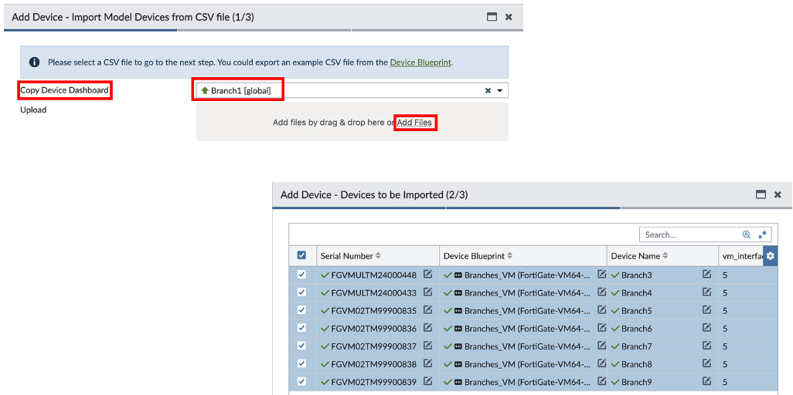

### After Import

After finishing the CSV import, the model devices are created in Device Manager. You are now ready to connect the FortiGates to FortiManager.

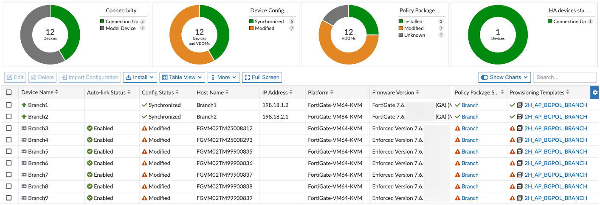

> [!NOTE]
> When using a Device Blueprint, you no longer need to perform an 'Install Policy Package & Device Settings' Install on the newly created model devices.

## Verifying Variable Mappings

Before provisioning Branch3 and Branch4, you can show your customer how the `.CSV` assigned the serial number, Policy Package, Provisioning Templates, and defined the metadata variable mappings.

Right-click on Branch3 and select **Edit Variable Mapping**. Here you can view or edit the mappings imported from the CSV import.

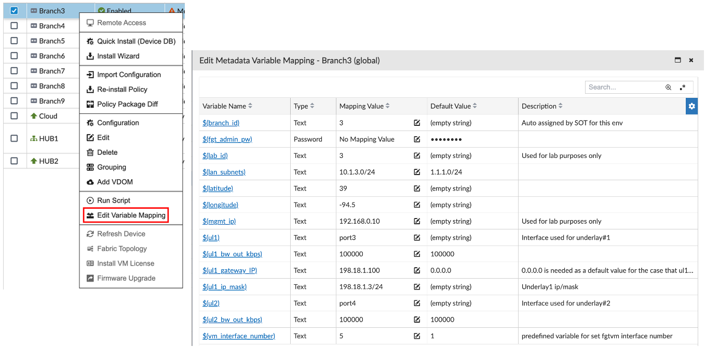

---

## Deployment

We now have Branch3 and Branch4 model devices created with:

- A configuration Template Group applied
- A Policy Package applied
- Metadata Variable mappings defined for each

### Deploy Steps

1. Refer to the SD-WAN Demo Helper Web Page.
2. In the **'Deployment'** section, click the **'Deploy Branch3'** button, **'Deploy Branch4'** button, or both.

   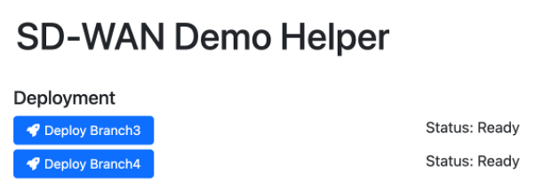

3. Refer to **FortiManager → Device Manager**. You should see **4 active processes** running (2 per branch).

   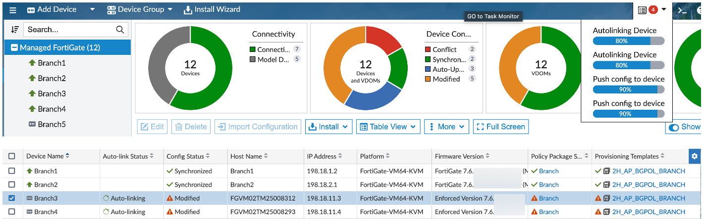

4. After a few minutes, the processes should complete. Branch3 and Branch4 will show connected and fully configured (this might require a browser refresh).

   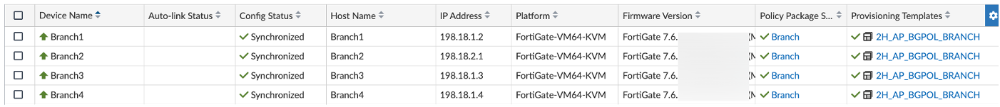

### Verification

Clicking the **Map View** should now show Branch3/4 in their proper locations.

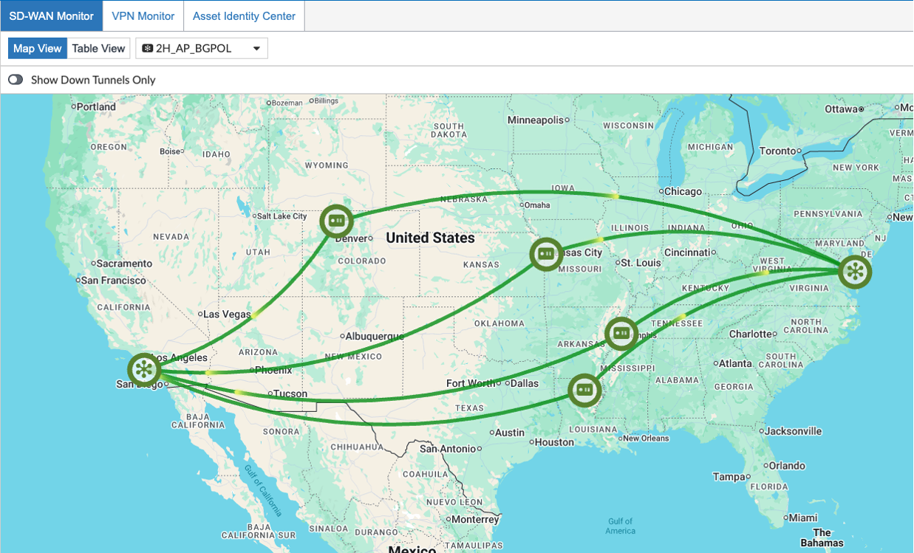
