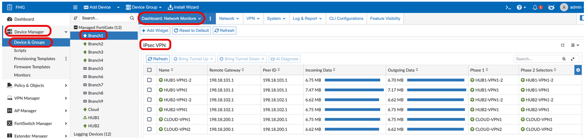
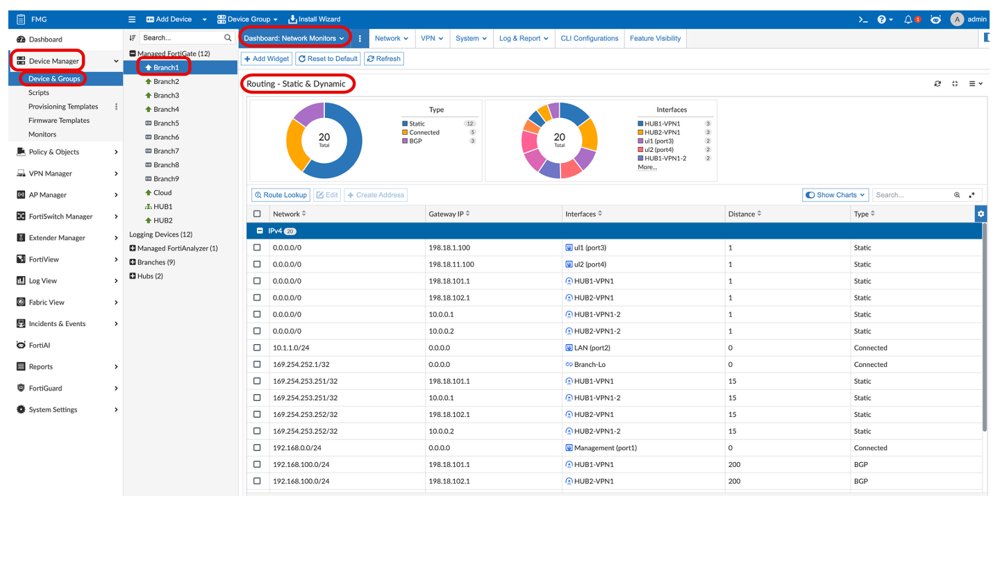
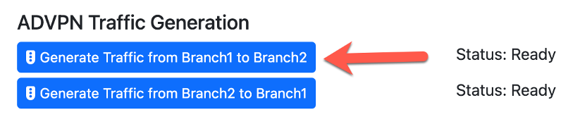
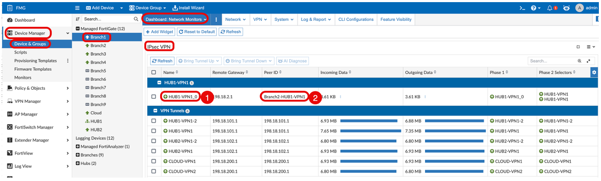
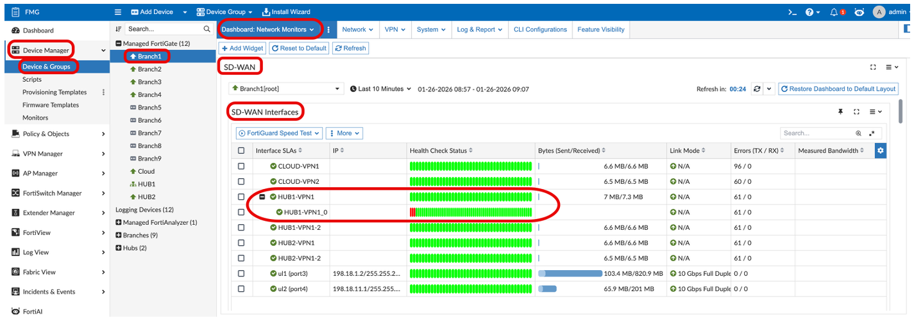
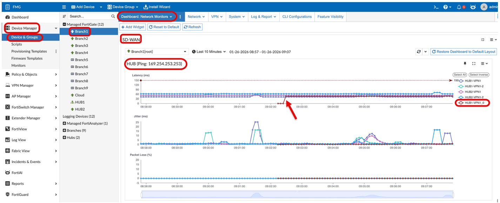
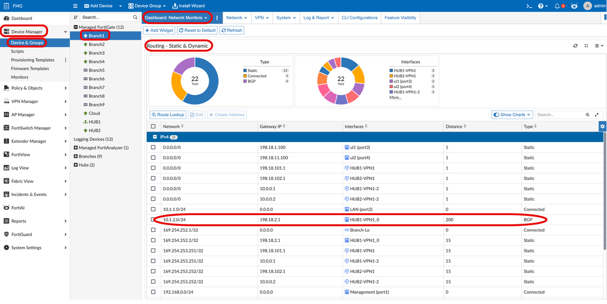
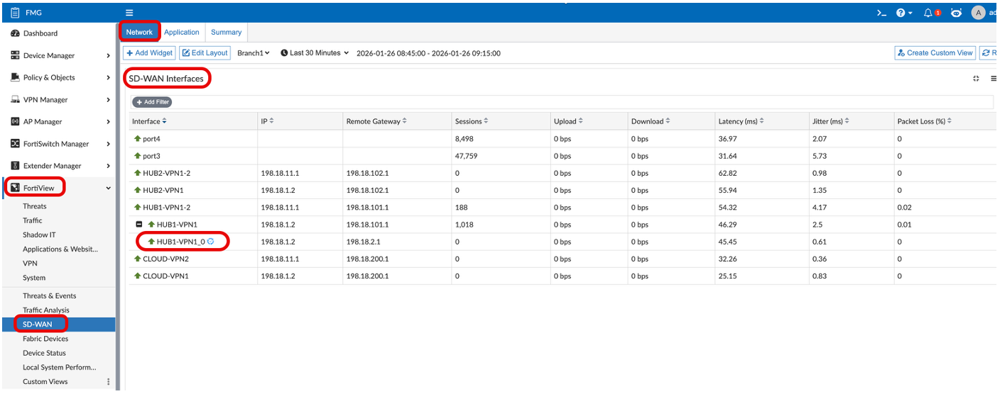
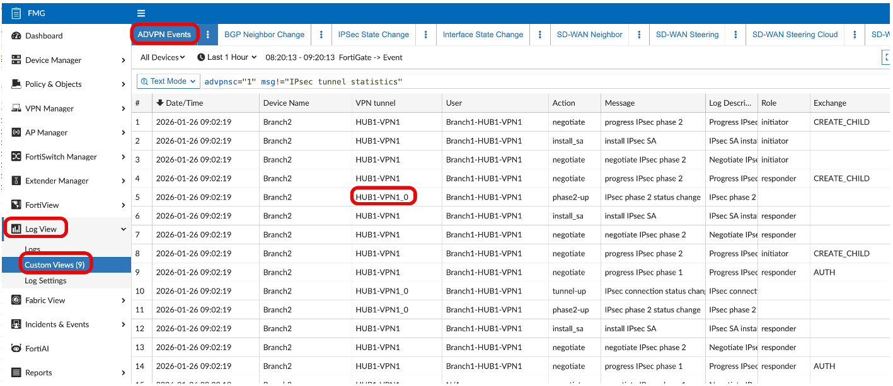
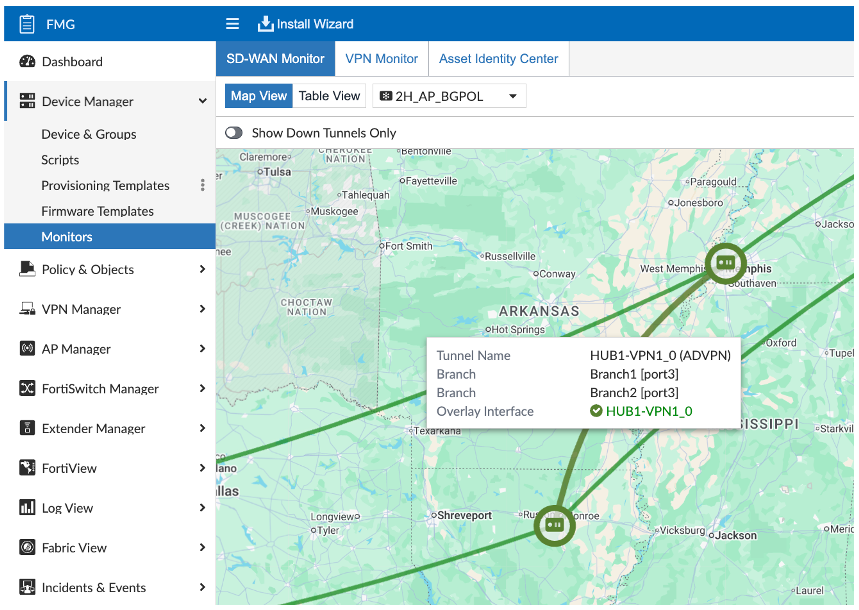

## Overview

Auto-Discovery VPN (ADVPN) allows the Hub to dynamically inform a Branch about a better path for traffic between two Branches.

### 7.4 ADVPN Routing Enhancements

- The Hubs no longer need to be BGP route-reflectors.
  - Default routes or RFC 1918 routes can be used on the Branches to get traffic back to the hub.
- BGP can now be dynamically established between branches over ADVPN.
- Next-hop tunnel interface IP no longer needs to be preserved.
- Branches/Spokes will exchange routes and next hops directly between each other over ADVPN tunnels.

### 7.4 ADVPN 2.0

- Initial tunnel is formed by passing traffic through the hub.
- Branches exchange full underlay information.
- Branches exchange tunnel preference information.
- Branches exchange health check information every 5 seconds.

---

## VPN Monitoring (Before ADVPN)

**Navigation:** Device Manager → Device & Groups → Branch1 → Dashboard → Network Monitors → IPsec VPN (Enlarge)

Branch1 has 2 IPsec VPN tunnels to Hub1, Hub2, and Cloud.

> [!NOTE]
> We will refer to this FMG Dashboard after generating traffic from Branch1 to Branch2 to view the ADVPN shortcut tunnel that was created.

---

## Route Monitoring (Before ADVPN)

**Navigation:** Device Manager → Device & Groups → Branch1 → Dashboard → Network Monitors → Routing – Static & Dynamic (Enlarge)

On the same Dashboard – Network Monitors, if you scroll down, you will see the Routing – Static & Dynamic section.

Notice that Branch1 currently does **not** have a route to the Branch2 network **10.1.2.0/24**.

> After generating traffic from Branch1 to Branch2, we will refer to this FMG Dashboard to view the route learned via BGP for the 10.1.2.0/24 Branch2 network.

---

## Generate Traffic from Branch1 to Branch2

1. Refer to the SD-WAN Demo Helper Web Page.
2. Scroll down to the **'ADVPN Traffic Generation'** section.
3. Click the **'Generate Traffic from Branch1 to Branch2'** button.

   

   This will generate ping traffic from a device behind Branch1 (**10.1.1.10**) toward a device behind Branch2 (**10.1.2.10**).

---

## ADVPN Monitoring

### IPsec VPN Dashboard

**Navigation:** Device Manager → Device & Groups → Branch1 → Dashboard → Network Monitors → IPsec VPN (Enlarge)

Now that traffic is flowing between Branch1 and Branch2, you should see a new ADVPN shortcut IPsec Tunnel named **HUB1-VPN1_0**.

1. ADVPN shortcut IPsec tunnels are named using the **parent tunnel name followed by an underscore**.
2. The Peer ID is **Branch2-HUB1-VPN1**, denoting the far end hostname and far end tunnel name.

### ADVPN Monitoring

When the ADVPN shortcut IPsec tunnel HUB1-VPN1_0 is created, it can be viewed in the SD-WAN Dashboard under the **SD-WAN Interfaces** section below its parent tunnel.

### Health Check

When the ADVPN shortcut IPsec tunnel HUB1-VPN1_0 is created, a health check is also created. It can be viewed in the SD-WAN Dashboard under the Health Check assigned to its parent tunnel.

> [!NOTE]
> The ADVPN Health Check is **not** using the HUB IP of 169.254.253.253 as its target.

---

## Route Monitoring (After ADVPN)

**Navigation:** Device Manager → Device & Groups → Branch1 → Dashboard → Network Monitors → Routing – Static & Dynamic (Enlarge)

Branch1 now has a dynamic **BGP route** to the Branch2 network **10.1.2.0/24** pointing to the shortcut tunnel **HUB1-VPN1_0**.

---

## ADVPN Monitoring – FortiView VPN

**Navigation:** FMG → FortiView → SD-WAN → Secure SD-WAN Monitor → SD-WAN Interfaces

FortiAnalyzer provides the FMG with a Secure SD-WAN Monitor. Here you can see the ADVPN shortcut tunnel **HUB1-VPN1_0** displays under its parent IPsec tunnel **HUB1-VPN1**.

> ADVPN shortcut IPsec tunnels are depicted with a special symbol next to them on this monitor.

---

## ADVPN Logging

**Navigation:** Device Manager → Log View → Custom Views → ADVPN Events

---

## VPN Monitor – ADVPN Links

**Navigation:** FMG → Device Manager → Monitors → SD-WAN Monitor → Map View

Hovering over an individual link shows the ADVPN tunnel name from each Branch endpoint's perspective.

