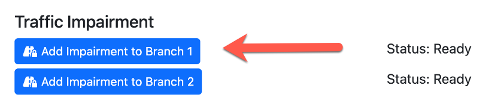
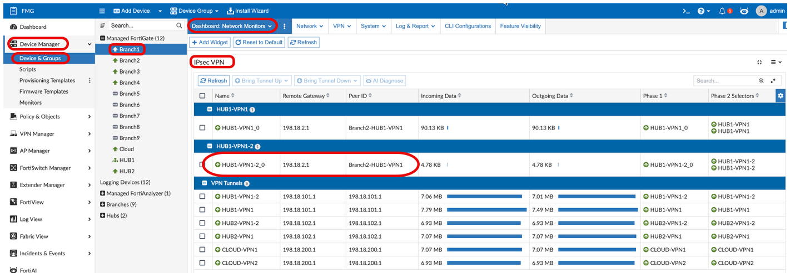
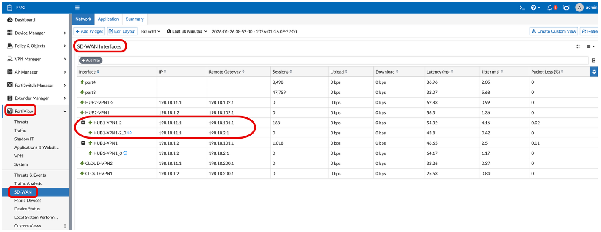
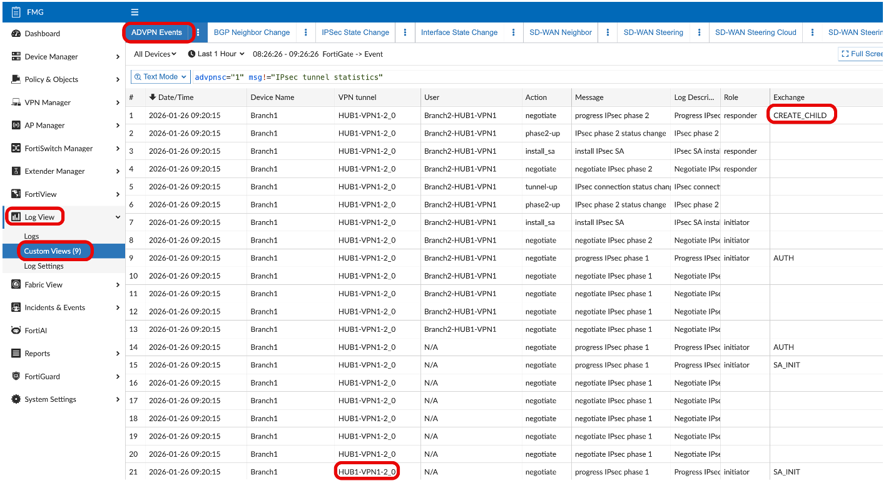
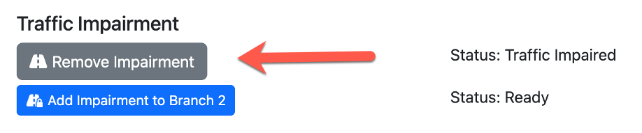
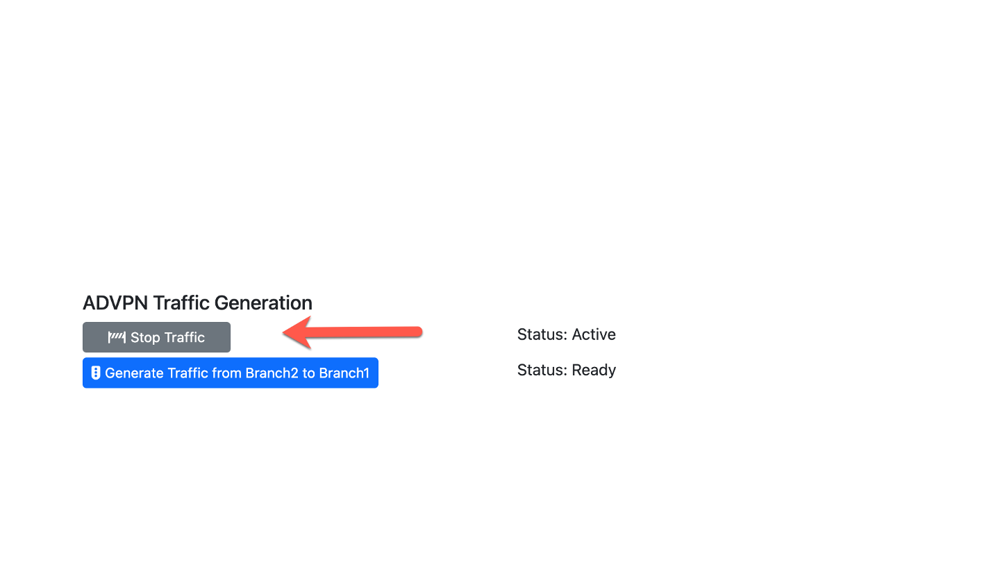

## Adding Impairment

Now that we have a shortcut ADVPN tunnel between Branch1 and Branch2, let's see what happens when we add latency to Branch1's Underlay1.

Refer back to your SD-WAN Demo Helper page.

- In the **Traffic Impairment** section, click on the **'Add Impairment to Branch1'** button.

  

  This will increase the latency on Branch1's Underlay1 link to **195ms**.

---

## ADVPN Monitoring During Impairment

### IPsec VPN Dashboard

**Navigation:** Device Manager → Device & Groups → Branch1 → Dashboard → Network Monitors → IPsec VPN (Enlarge)

Now that Underlay1 has latency over its SLA threshold, the traffic moves to **HUB1-VPN1-2** and creates an ADVPN shortcut IPsec tunnel **HUB1-VPN1-2_0**.

### FortiView Monitors

**Navigation:** FMG → FortiView → Monitors → Secure SD-WAN Monitor → SD-WAN Interfaces

On the FortiAnalyzer Secure SD-WAN Monitor, you can also see the new ADVPN shortcut tunnel **HUB1-VPN1-2_0** under its parent IPsec tunnel **HUB1-VPN1-2**.

> ADVPN shortcut IPsec tunnels are depicted with the (♽) special symbol next to them on this monitor.

---

## ADVPN Logging During Impairment

**Navigation:** Device Manager → Log View → Custom Views → ADVPN Events

---

## Removing the Impairment

1. Return to your SD-WAN Demo Helper Web Page.
2. Click on the **'Remove Impairment'** button.

   

   This will set the latency on Branch1's Underlay1 link back to **20ms**. Therefore, the latency will be below the 150ms latency threshold configured in your HUB SLA.

  Traffic between Branch1 and Branch2 should then move back to using the initial ADVPN shortcut tunnel **HUB1-VPN1_0**.

---

## Stop ADVPN Traffic

1. Return to your SD-WAN Demo Helper Web Page.

   Click on the **'Stop Traffic'** button in the ADVPN Traffic section.

   
