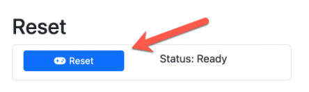

Being able to practice your demo presentation is important, and therefore being able to reset your demo is a must.

---

## Reset Checklist

Before resetting, ensure the following:

1. All Impairments are removed – click buttons on SD-WAN Demo Helper page.
2. Stop any ADVPN traffic being generated – click buttons on SD-WAN Demo Helper page.
3. Stop all Traffic being generated from Branch1 or Branch2.

---

## Reset Procedure

1. Return to your SD-WAN Demo Helper Web Page.
2. In the **Reset** section, click on the **'Reset'** button.

   

   > **Note:** This function may report back as failed but does complete.

### What the Reset Does

- Deletes Branch3 through Branch9 from FMG and FAZ.
- Restores a default configuration on Branch3 and Branch4 FGTs (they will reboot).

> [!NOTE]
> This demo reset will take several minutes to complete — be patient.
