|      |   |  
|:----:|:--|
| **Goal**                   | Utilize Cloud WAN components and Core Network Policy to provide a secured & orchestrated network.
| **Task**                   | Update Core Networking Policy with logic to automate connecting resources to segments and propagating routes to allow secured traffic flow.
| **Validation** | Confirm east/west connectivity from EC2 Instance-A via Ping, HTTP.

## Introduction
In this lab, we will focus on more advanced routing concepts within Cloud WAN in a multi-region deployment. In the Cloud WAN key concepts, you worked with the core building blocks that helped you build a WAN with broad brush strokes. Now we will focus on tailoring the routing for common use cases.


Picking up from the last section we now have attachment policies, segment actions to share routes between segments, and specified a segment to be isolated. In this section, you will need to create the appropriate Cloud WAN Core Network Policy to blackhole certain traffic before reaching the target VPC and also create routing policies that will automatically summarize routes before advertising out to the hub FGTs. Finally you will configure prefix lists and route maps on the hub FortiGates to controll what routes are advertised to Cloud WAN.


## Summarized Steps (click to expand each for details)

###### 1) Core Network Policy route evaluation and manipulation concepts

{}


Below are two tables of how [**route evaluation works within Cloud WAN**](https://docs.aws.amazon.com/network-manager/latest/cloudwan/cloudwan-create-attachment.html#cloudwan-route-evaluation). Understanding this is the foundation for understanding what routes will be selected and if/when you need to apply routing polcies or blackhole routes to acheive the desired routing outcome.

| Step | Evaluation Stage                    | Criteria                                  | What Happens                                           |
| ---- | ----------------------------------- | ----------------------------------------- | ------------------------------------------------------ |
| 1    | Longest Prefix Match                | Most specific route (largest subnet mask) | Always selected first (e.g., /24 beats /16) regardless of the source           |
| 2    | Route Type Priority                 | Static                                    | Static routes are preferred over all dynamic routes    |
| 3    | Local VPC Preference                | Local VPC Propagated                      | VPC-propagated routes in the same Region are preferred over BGP routes |
| 4    | BGP Path Selection (unequal paths)  | AS_PATH length → MED                      | Shortest AS path wins, then lowest MED                 |
| 5    | BGP Source Preference (equal paths) | Attachment type priority                  | See ordered list below                                 |
| 6    | Tie-breaker                         | Identical routes from multiple sources    | Deterministic random selection                         |

If route evaluation is at step 5, this is the attachment priority used to determine the tie-breaker.

| Priority | Route Source   | Description                                  |
| -------- | -------------- | -------------------------------------------- |
| 1        | Direct Connect | Routes from Direct Connect Gateway           |
| 2        | Connect        | Routes from Cloud WAN Connect attachments    |
| 3        | VPN            | Site-to-Site VPN propagated routes           |
| 4        | Other sources  | TGW peering, cross-region (CNE-to-CNE), etc. |

Below is a table of the stages for routes as they are handled by Cloud WAN control plane. Understanding this helps you know which Cloud WAN policy section to use to prefer, modify, or drop routes and where this is occuring in relation to route evaluation.

| Stage                       | Purpose                                                                          | Tool                                    | When it Happens (Relative to Evaluation)     |
| --------------------------- | -------------------------------------------------------------------------------- | --------------------------------------- | -------------------------------------------- |
| Route admission (placement) | Decide which segment an attachment belongs to (therefore where routes can exist) | Attachment policies                     | **Before everything** (pre-routing)          |
| Route propagation           | Move routes between segments                                                     | Segment sharing (segment-actions)       | **Before routing policies**                  |
| **Route policy processing** | Drop, modify, or tag routes (e.g., local-pref, communities)                      | Routing policies (segment / attachment) | **Before route evaluation begins**           |
| Route evaluation            | Select best path (longest prefix, static vs dynamic, BGP attributes, etc.)       | AWS route evaluation logic              | **After routing policies**                   |
| Traffic enforcement         | Force traffic drop regardless of selected route                                  | Blackhole routes (segment-actions)      | **After route selection (forwarding stage)** |


- **Route Admission**: Working from the top down, we are receiving routes from an attachment (either from Connect or VPC attachments). The attachment policies control which segment an attachment belongs to but does not share routes anywhere outside the segment yet. If the segment that the attachment is tied to is isolated, VPC CIDRs will not be propagated within that segment, however this does not stop the VPC CIDR from being shared to other segments if a segment action is defined to share that segment.
- **Route Propagation**: Sharing in segment actions allow routes from one segment to be propagated or advertised into other segments. This is explicit and broad as there can be many routes within a segment since they span multiple regions.
- **Route Policy Processing**: Routing policies are an ordered set of match + action rules. You can match on conditions like prefix-equals/prefix-in-cidr/community-in-list/etc and then apply actions such as drop/allow/summarize/prepend-as-list/add-community/etc. These policies are allow applied with a specified directionality ie inbound or outbound to control rroute propagation. Routing policies are applied at the attachment (typically connect, vpn, direct connect, etc) and also at the segment level by including this in your sharing in segment actions definition.
- **Route Evaluation**: This is defined above in the first two tables above and is critical in understanding route selection with or without routing policies.
- Traffic Enforcement**: Regardless of what decisions where made upstream, you can explicitly define traffic to be dropped. The black hole routes do not affect route propagation between segments, it only has a scope limited to the segment it is defined in.

  {}
When applying a routing policy that drops traffic, modify BGP attributes like local preference, etc this is actually handled before BGP path selection is made. Referencing the table above for route evaluation order, the routing policy would sit after step 3 (Local VPC Preference) and before step 4 (BGP Path Selection). Also, while not explicitly documented Cloud WAN follows a best-path selection similar to standard BGP where it will prioritize local preference before AS_Path and then MED.
  {}

{}

###### 2) Use Case: Block SDWAN VPC CIDRs from workload segments

{}

- **2.1** Navigate back to the **main Core network page** for your Core Network. Select the **Routes tab** and in the route filter, **select the production segment and edge location and click Search routes**. Notice that the SDWAN VPC CIDRs for both regions are shown **10.0.0.0/24 and 10.16.0.0/24**. The workload segments should not have direct access to the FGTs interfaces or anything deployed in the SDWAN VPCs. Currently not only does the production segment have these CIDRs propagated, but also the development and sharedservices segments.
    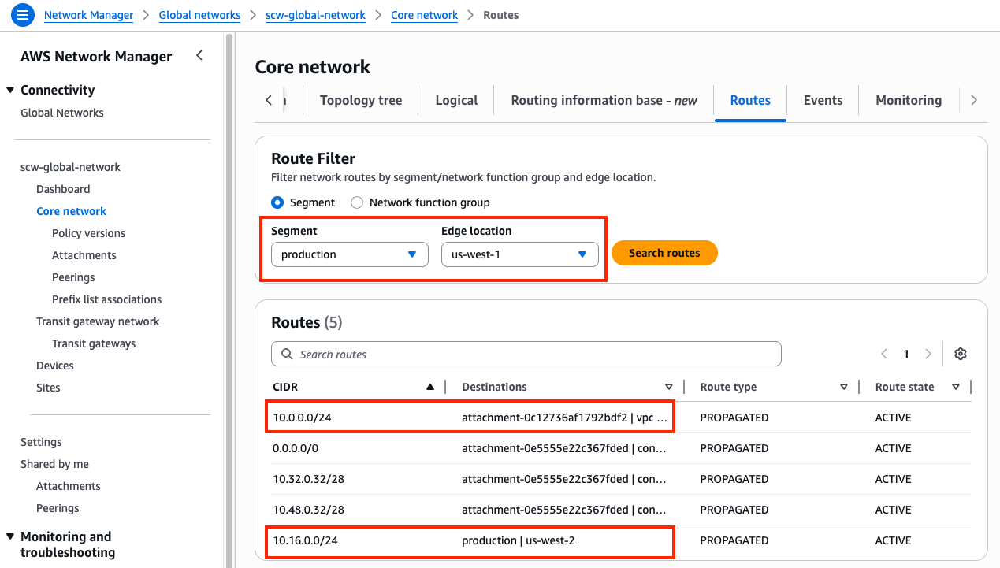

  {}
You may think that you could solve this problem by associating the SDWAN VPC attachments to one segment, ie sdwan-vpc, and the SDWAN Connect attachments to another segment, ie sdwan-connect, and then creating the segment sharing statements for just sdwan-connect to prod/dev/sharedservices. However, according to [**AWS documentation**](https://docs.aws.amazon.com/network-manager/latest/cloudwan/cloudwan-connect-attachment.html#cloudwan-connect-tlc) both the Connect (including Tunnel-less Connect) attachments must be in the same segment as the underlying transport VPC attachment. 

Technically you could solve the core problem by relying on security groups, NACLS, FortiOS trusted hosts, and FortiOS local-in policies. However we are showing how to do this across multiple deployments in broad strokes. So we will solve this use case with other features in the core networking policy.
  {}
  
- **2.2:** In the **Network Manager Console** navigate to the **Policy versions page** for your Core Network and select the latest policy version and **click Edit**.
- **2.3:** Navigate to the **Segment actions tab** find the **Routes section** and click **Create**. Use the table below to create the blackhole routes needed.
    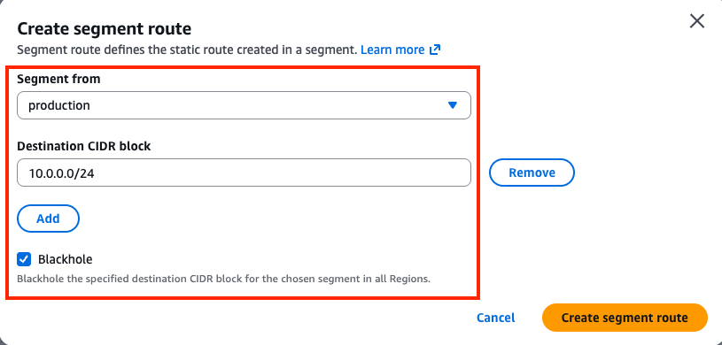
	
	Segment From | Destination CIDR block | Blackhole
	---|---|---|---
	production | 10.0.0.0/24 | Checked
	production | 10.16.0.0/24 | Checked
	development | 10.0.0.0/24 | Checked
	development | 10.16.0.0/24 | Checked
	sharedservices | 10.0.0.0/24 | Checked
	sharedservices | 10.16.0.0/24 | Checked

- **2.4:** Once completed, you should see the following routes in the routes section. 
    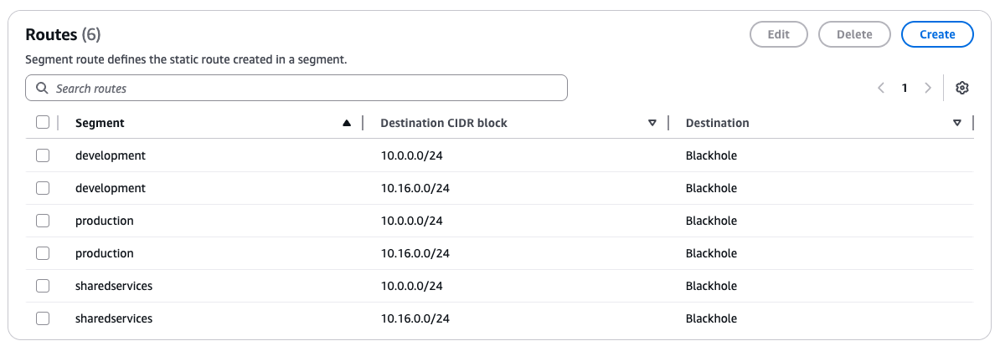

- **2.5** Next **click Create policy**. You should be back on the **Policy versions page** with a new policy version showing. Once **the latest Policy version shows Ready to execute**, select the version and **click View or apply change set**. On the next page click Apply change set. You will be returned to the Policy version page and see the new policy version is executing. In a few moments this will show as Execution succeeded.

- **2.6:** Navigate back to the **main Core network page** for your Core Network. Select the **Routes tab** and in the route filter, **select the production segment and edge location and click Search routes**. Notice that the SDWAN VPC CIDRs are still there but the route type and state show **Static and BLACKHOLE**. These routes will override any other route with the exact CIDR match and drop the traffic.
    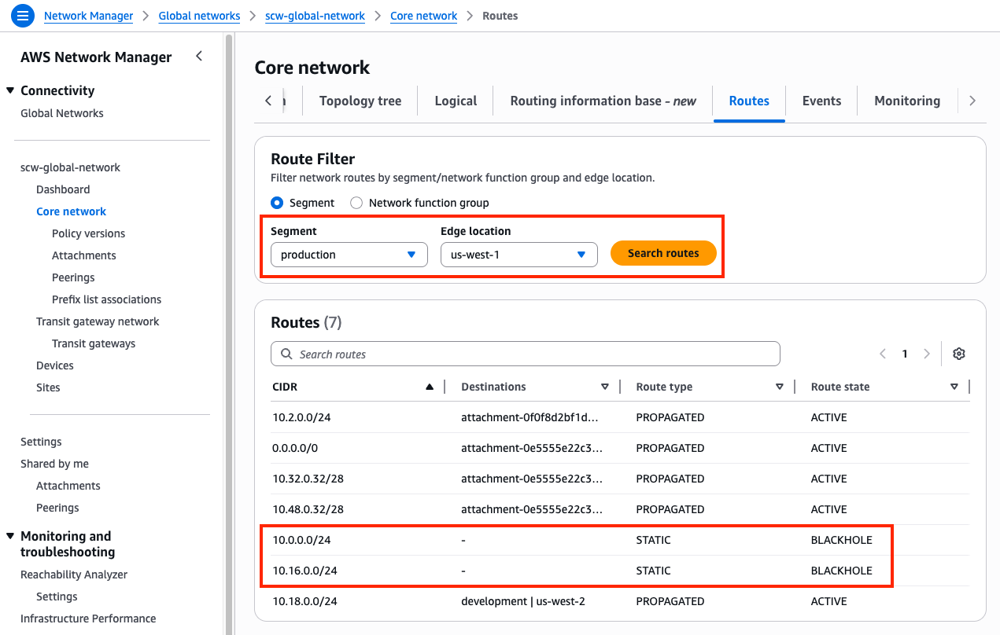

    {}

###### 3) Use Case: Summarize routes from Cloud WAN segments to hub FGTs

{}

- **3.1:** Navigate to the **CloudFormation Console** and **toggle View Nested to off**.
- **3.2:** Select the main template and select the **Outputs tab**.
- **3.3:** Login to **scw-region1-hub1-fgt1**, using the outputs **scw-region1-hub1-login-url** and the credentials **`admin`**, and **`FORTInet123!`**.
- **3.4:** Upon login in the **upper right-hand corner** click on the **>_** icon to open a CLI session.
- **3.5:** Run the command **`get router  info routing-table bgp`** and notice that these CIDRs (**10.1.0.0/24, 10.2.0.0/24, 10.17.0.0/24, 10.18.0.0/24**) are for the prod and dev segment VPCs. In a production environment you will likely have hundreds or thousands of VPC CIDRs as segments are global. So we want to summarize these into a single summary CIDR per region, normally in production you would likely want to have a summary route per segment per region.

  {}
Below is a table showing route limits for inbound and outbound advertised routes. For the full list of service quotas for Cloud WAN, reference [**AWS documentation**](https://docs.aws.amazon.com/network-manager/latest/cloudwan/cloudwan-quotas.html#cloudwan-routing.title).

| Quota                                                                    | Default |
| ------------------------------------------------------------------------ | ------- |
| Routes per core network, across all segments                             | 10,000  |
| Routes advertised over VPN to core network                               | 1,000   |
| Routes advertised from core network over VPN                             | 5,000   |
| Routes advertised over Connect peer to core network                      | 1,000   |
| Routes advertised from core network over Connect peer                    | 5,000   |
| Maximum number of Tunnel-less Connect routes per Connect peer (Inbound)  | 1,000   |
| Maximum number of Tunnel-less Connect routes per Connect peer (Outbound) | 10,000  |

While the service quota for Cloud WAN shows that there can be up to 10,000 routes advertised from the core network to a Connect peer, this can be operationally hard to manage and troubleshoot. Since the majority of CIDRs being advertised will be VPC CIDRs, we can use routing policies to summarize these to simplify the hub and branch FGT route tables.

Also, since the number of routes accepted from a Connect peer into Cloud WAN is limited to 1,000, you will likely need to implement summarization from the hub FGTs. This will be handled in the next use case.
  {}

- **3.6:** In the **Network Manager Console** navigate to the **Policy versions page** for your Core Network and select the latest policy version and **click Edit**.
- **3.7:** Near the top of the screen in the **Choose policy view mode** section **select JSON**. **Select all and delete the current JSON** in the Network Manager Console. Then **copy the new policy below**, which contains a routing policy, and **paste this back into the Network Manager Console**. If completed correctly, **you should see line 200 showing `  "routing-policies": [`**.
    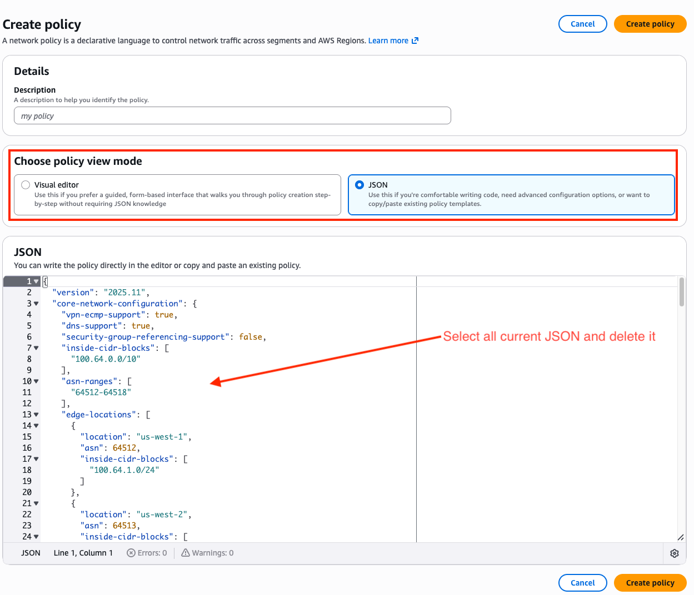
    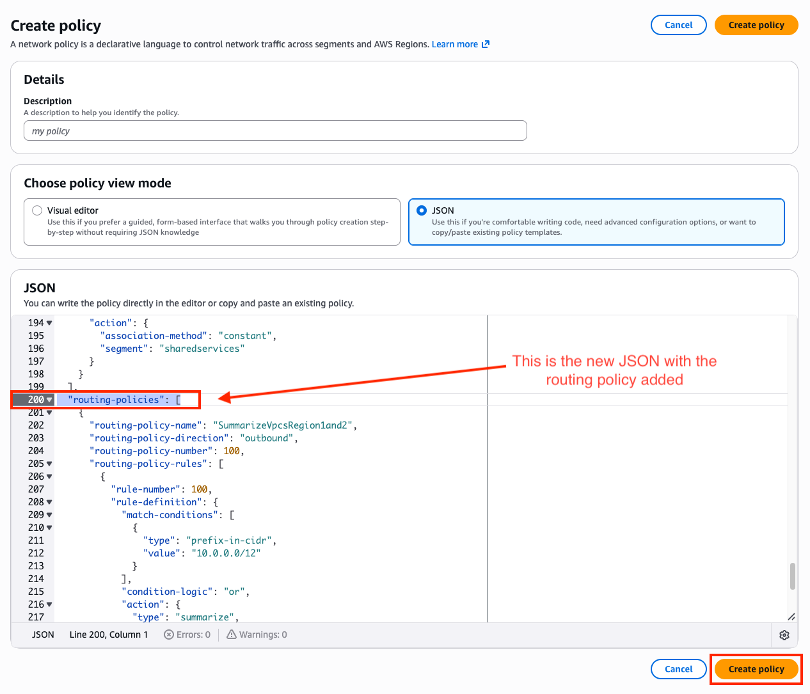

```
{
  "version": "2025.11",
  "core-network-configuration": {
    "vpn-ecmp-support": true,
    "dns-support": true,
    "security-group-referencing-support": false,
    "inside-cidr-blocks": [
      "100.64.0.0/10"
    ],
    "asn-ranges": [
      "64512-64518"
    ],
    "edge-locations": [
      {
        "location": "us-west-1",
        "asn": 64512,
        "inside-cidr-blocks": [
          "100.64.1.0/24"
        ]
      },
      {
        "location": "us-west-2",
        "asn": 64513,
        "inside-cidr-blocks": [
          "100.64.2.0/24"
        ]
      }
    ]
  },
  "segments": [
    {
      "name": "production",
      "require-attachment-acceptance": false,
      "isolate-attachments": true
    },
    {
      "name": "development",
      "description": "development-segment",
      "require-attachment-acceptance": false
    },
    {
      "name": "sharedservices",
      "description": "sharedservices-segment",
      "require-attachment-acceptance": false
    },
    {
      "name": "sdwan",
      "description": "ngfw-segment",
      "require-attachment-acceptance": false
    }
  ],
  "network-function-groups": [],
  "segment-actions": [
    {
      "action": "create-route",
      "segment": "production",
      "destination-cidr-blocks": [
        "10.0.0.0/24"
      ],
      "destinations": [
        "blackhole"
      ]
    },
    {
      "action": "create-route",
      "segment": "production",
      "destination-cidr-blocks": [
        "10.16.0.0/24"
      ],
      "destinations": [
        "blackhole"
      ]
    },
    {
      "action": "create-route",
      "segment": "development",
      "destination-cidr-blocks": [
        "10.0.0.0/24"
      ],
      "destinations": [
        "blackhole"
      ]
    },
    {
      "action": "create-route",
      "segment": "development",
      "destination-cidr-blocks": [
        "10.16.0.0/24"
      ],
      "destinations": [
        "blackhole"
      ]
    },
    {
      "action": "create-route",
      "segment": "sharedservices",
      "destination-cidr-blocks": [
        "10.0.0.0/24"
      ],
      "destinations": [
        "blackhole"
      ]
    },
    {
      "action": "create-route",
      "segment": "sharedservices",
      "destination-cidr-blocks": [
        "10.16.0.0/24"
      ],
      "destinations": [
        "blackhole"
      ]
    },
    {
      "action": "share",
      "mode": "attachment-route",
      "segment": "sdwan",
      "share-with": [
        "production",
        "development",
        "sharedservices"
      ]
    },
    {
      "action": "share",
      "mode": "attachment-route",
      "segment": "sharedservices",
      "share-with": [
        "production",
        "development"
      ]
    }
  ],
  "attachment-policies": [
    {
      "rule-number": 100,
      "condition-logic": "or",
      "conditions": [
        {
          "type": "tag-value",
          "operator": "equals",
          "key": "segment",
          "value": "sdwan"
        }
      ],
      "action": {
        "association-method": "constant",
        "segment": "sdwan"
      }
    },
    {
      "rule-number": 200,
      "condition-logic": "or",
      "conditions": [
        {
          "type": "tag-value",
          "operator": "equals",
          "key": "segment",
          "value": "production"
        }
      ],
      "action": {
        "association-method": "constant",
        "segment": "production"
      }
    },
    {
      "rule-number": 300,
      "condition-logic": "or",
      "conditions": [
        {
          "type": "tag-value",
          "operator": "equals",
          "key": "segment",
          "value": "development"
        }
      ],
      "action": {
        "association-method": "constant",
        "segment": "development"
      }
    },
    {
      "rule-number": 400,
      "condition-logic": "or",
      "conditions": [
        {
          "type": "tag-value",
          "operator": "equals",
          "key": "segment",
          "value": "sharedservices"
        }
      ],
      "action": {
        "association-method": "constant",
        "segment": "sharedservices"
      }
    }
  ],
  "routing-policies": [
    {
      "routing-policy-name": "SummarizeVpcsRegion1and2",
      "routing-policy-direction": "outbound",
      "routing-policy-number": 100,
      "routing-policy-rules": [
        {
          "rule-number": 100,
          "rule-definition": {
            "match-conditions": [
              {
                "type": "prefix-in-cidr",
                "value": "10.0.0.0/12"
              }
            ],
            "condition-logic": "or",
            "action": {
              "type": "summarize",
              "value": "10.0.0.0/12"
            }
          }
        },
        {
          "rule-number": 101,
          "rule-definition": {
            "match-conditions": [
              {
                "type": "prefix-in-cidr",
                "value": "10.16.0.0/12"
              }
            ],
            "condition-logic": "or",
            "action": {
              "type": "summarize",
              "value": "10.16.0.0/12"
            }
          }
        }
      ]
    }
  ]
}
```

- **3.8:** Next **click Create policy**. You should be back on the **Policy versions page** with a new policy version showing. **Select the latest Policy version** and **click Edit**. Then navigate to the **Routing policies tab** and see the new policy created. Notice that the routing policy is directional and it is created as outbound. **Select the first rule and click Edit**. In the **Edit routing policy rule page** select the **Action** and **Conditions** dropdown boxes to see all options available.

    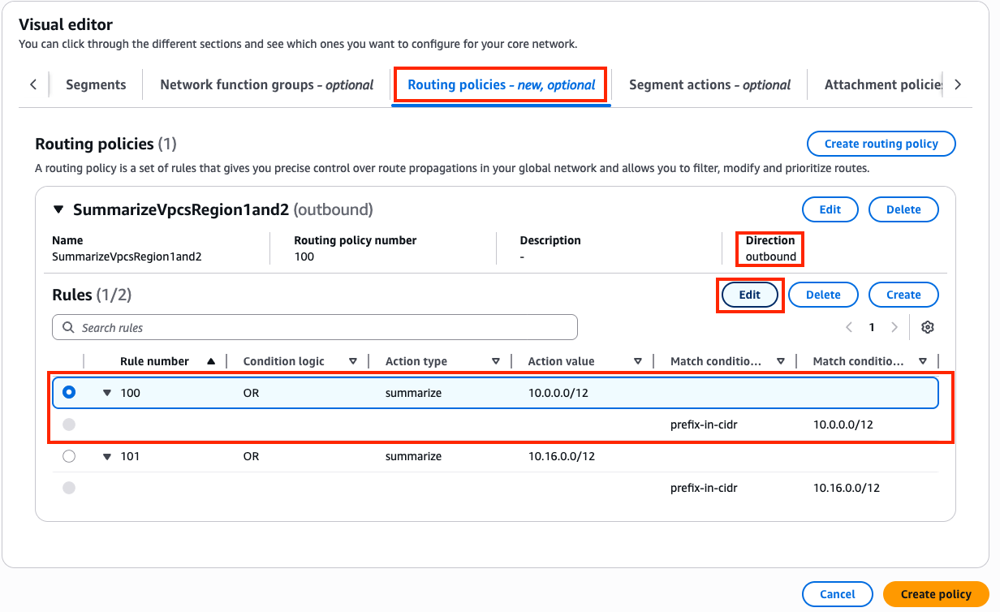
    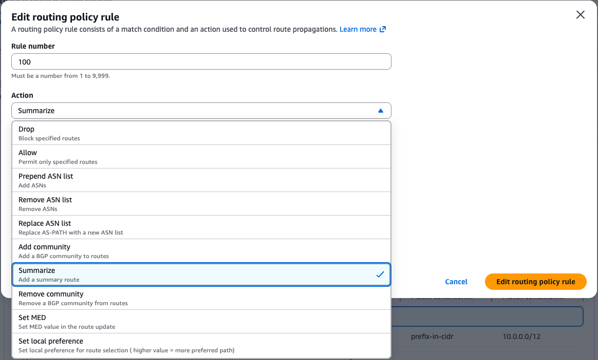
    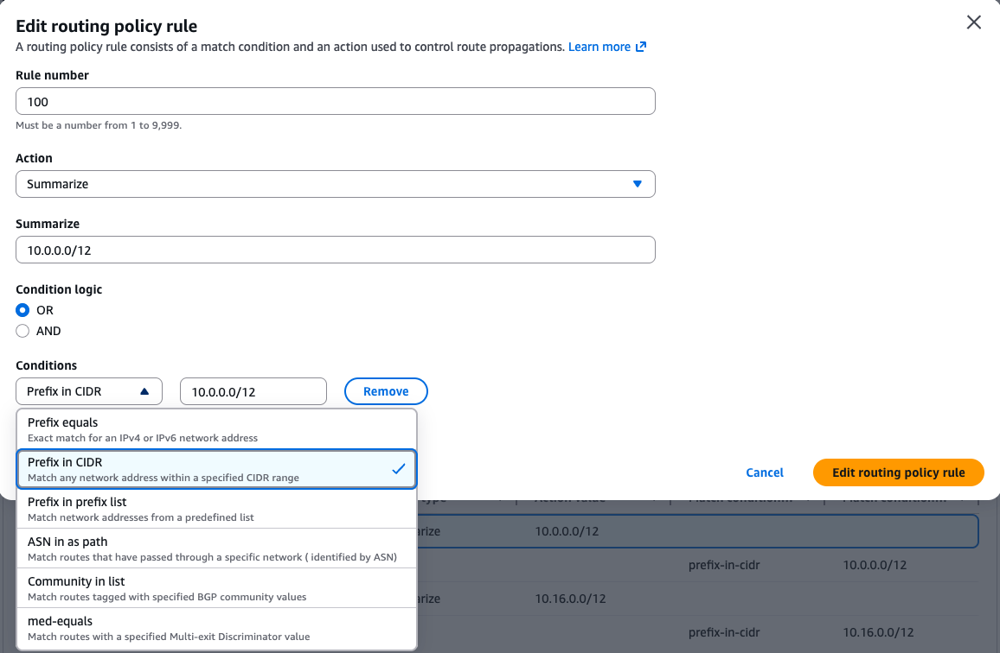
	
- **3.9:** Navigate to the **Attachment policies tab** find the **Attachment routing policies section** and then **Click Create**. On the **Create attachment routing policy page** use the screenshot below to complete the configuration. **Pay attention to the Condtion - Routing policy label** since we will need to use the same value later when editing the Connect attachments.

    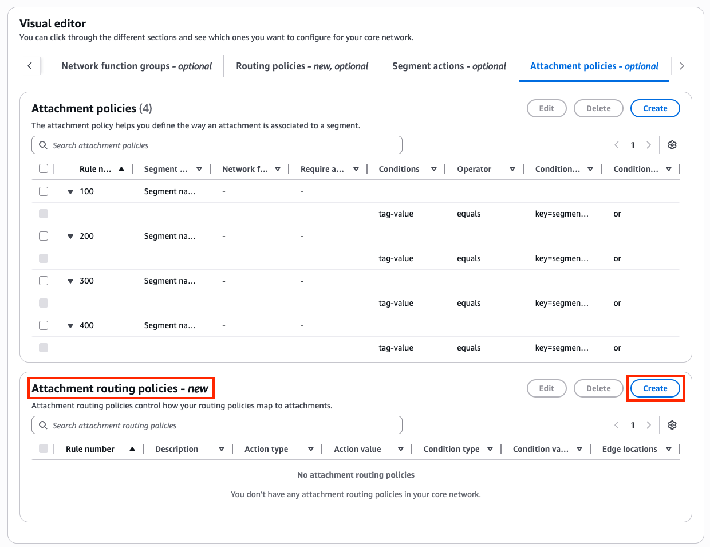
    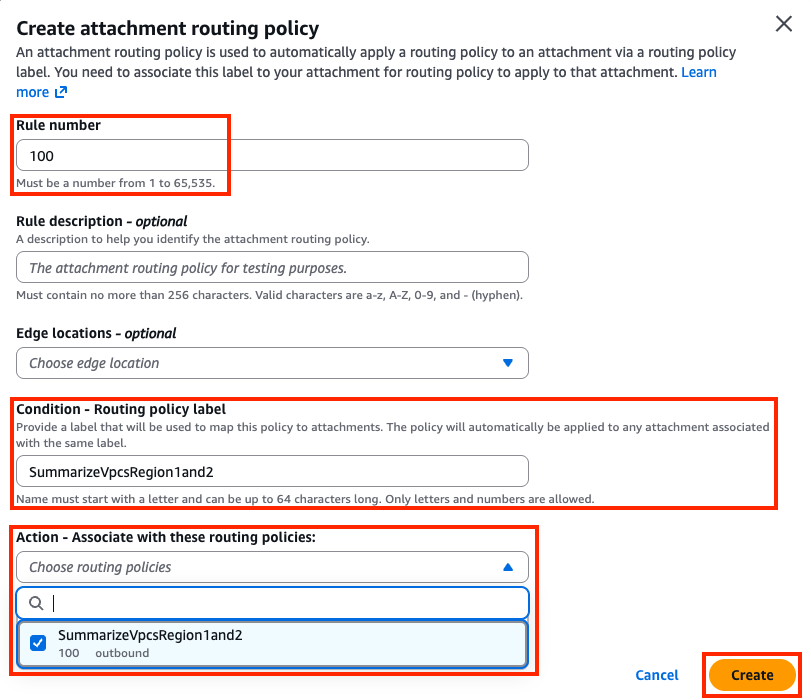

- **3.10:** Next **click Create policy**. You should be back on the **Policy versions page** with a new policy version showing. Once **the latest Policy version shows Ready to execute**, select the version and **click View or apply change set**. On the next page click Apply change set. You will be returned to the Policy version page and see the new policy version is executing. In a few moments this will show as Execution succeeded.

- **3.11:** Navigate to the **attachments page** under your core network. Select the **scw-region1-sdwan-connect-attachment** and select the **Routing policy label tab** in the pane below and **click Create**. On the next page, specify `SummarizeVpcsRegion1and2` for the routing policy label to use and **click Create**. **Follow the same steps to configure the scw-region2-sdwan-connect-attachment**.

    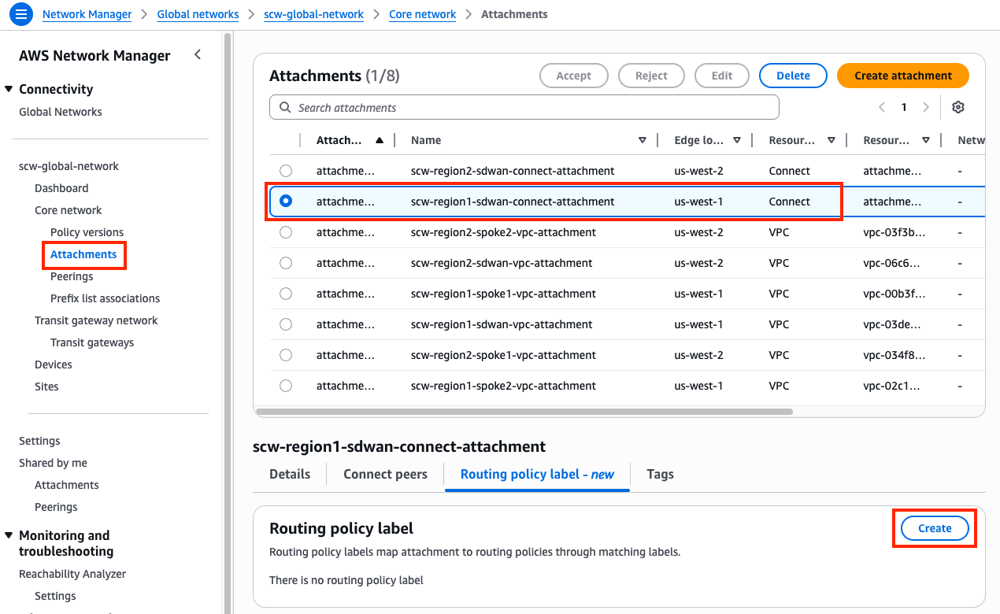
    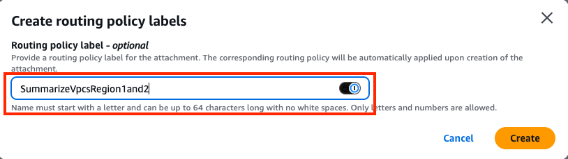

- **3.12:** At first you will see that the routing policy label is applied but there is no attachment routing policy association yet. After a few minutes you should refresh your browser and see that there is now an attachment routing policy association.

    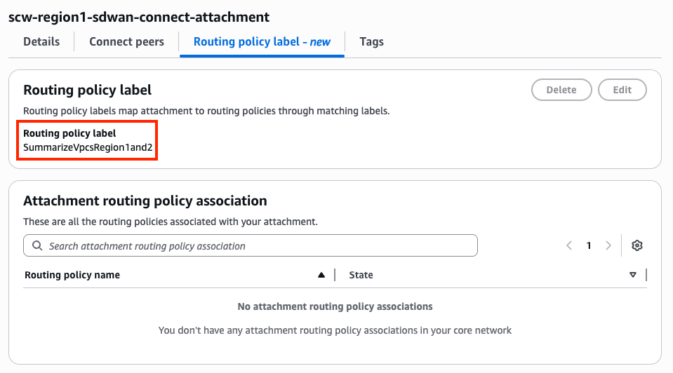
    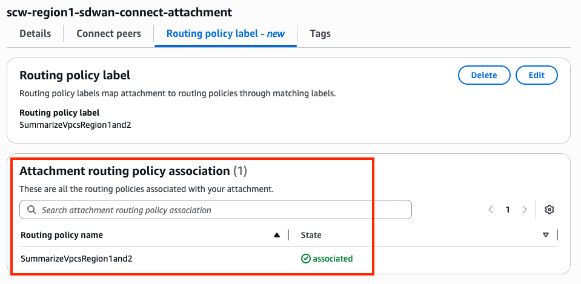

- **3.13:** Login to **scw-region1-hub1-fgt1**, using the outputs **scw-region1-hub1-login-url** and the credentials **`admin`**, and **`FORTInet123!`**.
- **3.14:** Upon login in the **upper right-hand corner** click on the **>_** icon to open a CLI session.
- **3.15:** Run the command **`get router  info routing-table bgp`** and notice that these CIDRs (**10.0.0.0/12, 10.16.0.0/24**) are the summary routes per region for region 1 and region 2 for all segments. As more VPCs are spun up and attached to the prod, dev, and sharedservices segments, if their VPC routes match the routing policy that was added, no new CIDRs will be seen on the hub and branch FGTs.

    {}

###### 4) Use Case: Summarize routes from hub FGTs to Cloud WAN segments to hub FGTs

{}

- **4.1:** Navigate back to the **main Core network page** for your Core Network. Select the **Routes tab** and in the route filter, **select the production segment and edge location and click Search routes**. Notice that the Branch 1 & 2 CIDRs for both regions are shown **10.32.0.32/28 and 10.48.0.32/28**. In a production environment you will likely have hundreds or thousands of branch deployments across premise around the world. So we want to summarize these into a single summary CIDR for both branch 1 & 2, normally in production you would likely want to have a summary route per geo or SDWAN region.

- **4.2:** Navigate to the **CloudFormation Console** and **toggle View Nested to off**.
- **4.3:** Select the main template and select the **Outputs tab**.
- **4.4:** Login to **scw-region1-hub1-fgt1**, using the outputs **scw-region1-hub1-login-url** and the credentials **`admin`**, and **`FORTInet123!`**.
- **4.5:** Upon login in the **upper right-hand corner** click on the **>_** icon to open a CLI session.
- **4.6:** Run the command **`get router info bgp summary`** and to get the list of IPs for the AWS Connect peers and branch FGT peers.
- **4.7:** For each peer, run the command **`get router info bgp neighbors x.x.x.x advertised-routes`** and see what routes are being advertised in each direction. Here is an example of what hub1 FGT should see, **note the Connect peer addresses will be unique for each deploymnet**:

```
scw-region1-hub1-fgt1 # get router info bgp summary

VRF 0 BGP router identifier 169.254.253.252, local AS number 65000
BGP table version is 4
5 BGP AS-PATH entries
0 BGP community entries
Next peer check timer due in 30 seconds

Neighbor      V         AS MsgRcvd MsgSent   TblVer  InQ OutQ Up/Down  State/PfxRcd
100.64.1.15   4      64512    5103    5729        4    0    0 00:09:00        2
100.64.1.23   4      64512       0       0        0    0    0    never Connect    
100.64.1.36   4      64512    5101    5706        4    0    0 00:08:56        2
100.64.1.65   4      64512       0       0        0    0    0    never Connect    
169.254.252.1 4      65000     303     306        4    0    0 00:09:02        1
169.254.252.2 4      65000     301     310        4    0    0 00:09:03        1

scw-region1-hub1-fgt1 # get router info bgp neighbors 100.64.1.15 advertised-routes 
VRF 0 BGP table version is 4, local router ID is 169.254.253.252
Status codes: s suppressed, d damped, h history, * valid, > best, i - internal
Origin codes: i - IGP, e - EGP, ? - incomplete

   Network          Next Hop            Metric     LocPrf Weight RouteTag Path
*> 0.0.0.0/0        10.0.0.42                     100  32768        0 65000 i <-/->
*> 10.32.0.32/28    10.0.0.42                     100      0        0 ? <-/->
*> 10.48.0.32/28    10.0.0.42                     100      0        0 ? <-/->

Total number of prefixes 3


scw-region1-hub1-fgt1 # get router info bgp neighbors 100.64.1.36 advertised-routes
VRF 0 BGP table version is 4, local router ID is 169.254.253.252
Status codes: s suppressed, d damped, h history, * valid, > best, i - internal
Origin codes: i - IGP, e - EGP, ? - incomplete

   Network          Next Hop            Metric     LocPrf Weight RouteTag Path
*> 0.0.0.0/0        10.0.0.42                     100  32768        0 65000 i <-/->
*> 10.0.0.0/12      10.0.0.42                              0        0 64512 ? <-/->
*> 10.16.0.0/12     10.0.0.42                              0        0 64512 ? <-/->
*> 10.32.0.32/28    10.0.0.42                     100      0        0 ? <-/->
*> 10.48.0.32/28    10.0.0.42                     100      0        0 ? <-/->

Total number of prefixes 5


scw-region1-hub1-fgt1 # get router info bgp neighbors 169.254.252.1 advertised-routes
VRF 0 BGP table version is 4, local router ID is 169.254.253.252
Status codes: s suppressed, d damped, h history, * valid, > best, i - internal
Origin codes: i - IGP, e - EGP, ? - incomplete

   Network          Next Hop            Metric     LocPrf Weight RouteTag Path
*>i10.0.0.0/12      169.254.253.252 100           100      0        0 64512 ? <-/->
*>i10.16.0.0/12     169.254.253.252 100           100      0        0 64512 ? <-/->

Total number of prefixes 2


scw-region1-hub1-fgt1 # get router info bgp neighbors 169.254.252.2 advertised-routes
VRF 0 BGP table version is 4, local router ID is 169.254.253.252
Status codes: s suppressed, d damped, h history, * valid, > best, i - internal
Origin codes: i - IGP, e - EGP, ? - incomplete

   Network          Next Hop            Metric     LocPrf Weight RouteTag Path
*>i10.0.0.0/12      169.254.253.252 100           100      0        0 64512 ? <-/->
*>i10.16.0.0/12     169.254.253.252 100           100      0        0 64512 ? <-/->

Total number of prefixes 2
```
- **4.8:** Notice that for the Connect peers, we are advertising each branch FGT local CIDR (**10.32.0.32/28, 10.48.0.32/28**). We want to summarize this to **10.32.0.0/11** as this will cover all brnach FGTs for this SDWAN deployment.  To do this we are going to use prefix lists, route maps, a static route, a bgp network statement, and route-map settings for both Connect Peers and branch FGT peers. The goal is to only advertise the summary route to AWS but not to the branch FGTs so we do not affect ADVPN shortcuts between branches.

- **4.9:** **Copy and paste** the CLI commands below **on both hub FGTs**. These are the prefix lists, route maps, and static route that will be common configuration. **Don't forget to run through this step on hub2 FGT**.

```
### Prefix list for summary for all branches
config router prefix-list
    edit "SUMMARY-ONLY"
        config rule
            edit 1
                set prefix 10.32.0.0 255.224.0.0
            next
        end
    next
end

### Route-map for AWS (allow summary)
config router route-map
    edit "TO-AWS"
        config rule
            edit 1
                set match-ip-address "SUMMARY-ONLY"
            next
            edit 2
                set action deny
            next
        end
    next
end

### Route-map for branches (deny summary)
config router route-map
    edit "TO-BRANCH"
        config rule
            edit 1
                set match-ip-address "SUMMARY-ONLY"
                set action deny
            next
            edit 2
                set action permit
            next
        end
    next
end

config router static
    edit 0
        set dst 10.32.0.0 255.224.0.0
        set blackhole enable
        set comment summary-route-for-all-branches
    next
end
```

- **4.10:** Next, **copy the text below and modify** this with the correct Connect peer IPs for your deployment. These will be **unique to each hub FGT**. This is applying the prefix list and route map from the previous step to the correct neighbors. **Don't forget to run through this step on hub2 FGT**.
```
config router bgp
    config network
        edit 1
            set prefix 10.32.0.0 255.224.0.0
        next
    end
    config neighbor
        edit "100.64.x.y"
            set route-map-out "TO-AWS"
        next
        edit "100.64.x.y"
            set route-map-out "TO-AWS"
        next
        edit "100.64.x.y"
            set route-map-out "TO-AWS"
        next
        edit "100.64.x.y"
            set route-map-out "TO-AWS"
        next
    end
    config neighbor-group
        edit "EDGE"
            set route-map-out "TO-BRANCH"
        next
    end
end
exec router clear bgp all
```
- **4.11:** Run the command **`get router info bgp summary`** again and to get the list of IPs for the AWS Connect peers and branch FGT peers.
- **4.12:** For each peer, run the command **`get router info bgp neighbors x.x.x.x advertised-routes`** and see what routes are being advertised in each direction. **You should see that to AWS we are advertising the summary route, not each branch CIDR**. Also for the **branch FGTs, nothing has changed, as desisred.  Here is an example of what hub1 FGT should see, **note the Connect peer addresses will be unique for each deploymnet**:
```
scw-region1-hub1-fgt1 # get router info bgp summary 

VRF 0 BGP router identifier 169.254.253.252, local AS number 65000
BGP table version is 3
5 BGP AS-PATH entries
0 BGP community entries
Next peer check timer due in 34 seconds

Neighbor      V         AS MsgRcvd MsgSent   TblVer  InQ OutQ Up/Down  State/PfxRcd
100.64.1.15   4      64512    5675    6364        3    0    0 00:02:08        2
100.64.1.23   4      64512       0       0        0    0    0    never Connect    
100.64.1.36   4      64512    5666    6335        3    0    0 00:02:02        2
100.64.1.65   4      64512       0       0        0    0    0    never Connect    
169.254.252.1 4      65000     338     343        3    0    0 00:02:10        1
169.254.252.2 4      65000     336     346        3    0    0 00:02:10        1

Total number of neighbors 6


scw-region1-hub1-fgt1 # get router info bgp neighbors 100.64.1.15 advertised-routes 
VRF 0 BGP table version is 3, local router ID is 169.254.253.252
Status codes: s suppressed, d damped, h history, * valid, > best, i - internal
Origin codes: i - IGP, e - EGP, ? - incomplete

   Network          Next Hop            Metric     LocPrf Weight RouteTag Path
*> 0.0.0.0/0        10.0.0.42                     100  32768        0 65000 i <-/->
*> 10.32.0.0/11     10.0.0.42                     100  32768        0 i <-/->

Total number of prefixes 2


scw-region1-hub1-fgt1 # get router info bgp neighbors 100.64.1.36 advertised-routes
VRF 0 BGP table version is 3, local router ID is 169.254.253.252
Status codes: s suppressed, d damped, h history, * valid, > best, i - internal
Origin codes: i - IGP, e - EGP, ? - incomplete

   Network          Next Hop            Metric     LocPrf Weight RouteTag Path
*> 0.0.0.0/0        10.0.0.42                     100  32768        0 65000 i <-/->
*> 10.32.0.0/11     10.0.0.42                     100  32768        0 i <-/->

Total number of prefixes 2


scw-region1-hub1-fgt1 # get router info bgp neighbors 169.254.252.1 advertised-routes
VRF 0 BGP table version is 3, local router ID is 169.254.253.252
Status codes: s suppressed, d damped, h history, * valid, > best, i - internal
Origin codes: i - IGP, e - EGP, ? - incomplete

   Network          Next Hop            Metric     LocPrf Weight RouteTag Path
*>i10.0.0.0/12      169.254.253.252 100           100      0        0 64512 ? <-/->
*>i10.16.0.0/12     169.254.253.252 100           100      0        0 64512 ? <-/->

Total number of prefixes 2
```
- **4.13:** Navigate back to the **main Core network page** for your Core Network. Select the **Routes tab** and in the route filter, **select the production segment and edge location and click Search routes**. Notice that the Branch 1 & 2 CIDRs are not shown and now you see the summary route **10.32.0.0/11** instead.  **The route tab can be very slow to update** actual routes, so to see the changes **try switching the edge location or the segment** to see that each hub is advertising the same summary route and the local hub FGT's route is being preferred over the other region.

    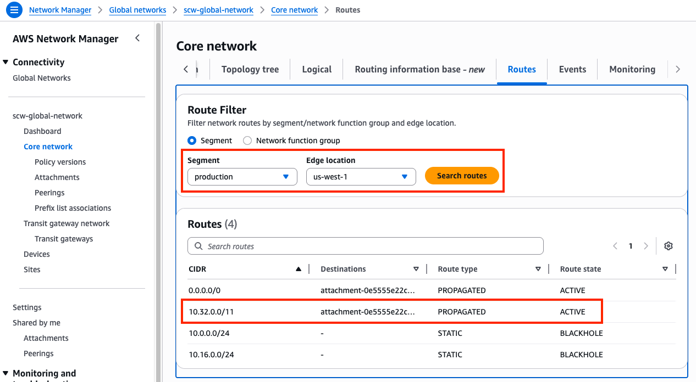

    {}


###### 6) Let's dig deeper to understand how all of this works

{}

- **6.1** Notice that Instance-A can access Instance-B over HTTP but could not access Instance-C, however pings were successful. This is because Instance-A and Instance-B are in VPCs attached to the production segment which is configured as a shared routing domain by default. This allows anything attached to the same segment to communicate bidirectionally. This means anything in VPC A can reach VPC B without being sent through the FGTs in the inspection VPC which is in the firewall segment.
- **6.2** VPC C is in the development segment so when VPC A reaches out to this destination, the routes for the production segment first forwards traffic to the FGTs in the inspection VPC (via 0.0.0.0/0 to Connect attachments). This allowed the FGTs to enforce FW policy that blocked HTTP access from VPC A to VPC C but allowed pings between the different segments.
- **6.3** Segments can be configured to be isolated so that resources attached to the same segment can't communicate directly. Through the Core Network Policy you can still allow access to specific routes or other segments explicitly.
- **6.4** In the **Network Manager Console** navigate to the **Policy versions page** select **'Policy version - 2' and click Edit**.
- **6.5** Select the **Segments tab**, select the **production segment and click Edit**.
- **6.6** On the **Edit segment page**, check the box for **Isolated attachments and click Edit Segment**, then on the next page **click Create Policy**.
	
- **6.7** You should be back on the **Policy versions page** with a new policy version showing. Once **Policy version - 3 shows Ready to execute**, select the version and **click View or apply change set**.
- **6.8** On the **next page click Apply change set**. You will be returned to the Policy version page and see the **new policy version is executing**. In a few moments this will show as **Execution succeeded**.
- **6.9:** Navigate back to the **EC2 Console** and connect to **Instance-A** using the **[Serial Console directions](../3_modulethree.html)** 
	- Password: **`FORTInet123!`**
- **6.10:** Run the following commands to test connectivity again and make sure the results match expectations 
  SRC / DST | VPC B | VPC C 
  ---|---|---
  **Instance A** | **`curl 10.2.2.10`**  | **`curl 10.3.2.10`** 
  **Instance A** | **`ping 10.2.2.10`**  | **`ping 10.3.2.10`** 
  - HTTP should now be block by the FW policy on the FGTs for VPC B and C but Pings allowed

- **6.11** Navigate back to the **main Core network page** for your Core Network. Select the **Routes tab** and in the route filter, **select the production segment and edge location and click Search routes**. You should eventually see routes matching the table below. **The production segment now does not automatically share routes for attachments**.

	Segment | CIDRs
	---|---
	sdwan | 10.0.0.0/16, 10.1.0.0/16, 10.2.0.0/16, 10.10.0.0/16, 10.11.0.0/16, 10.12.0.0/16, 10.101.2.0/24, 10.101.2.0/24, 0.0.0.0/0
	production | 10.0.0.0/16, 10.10.0.0/16, 10.101.2.0/24, 10.102.2.0/24, 0.0.0.0/0
	development | 10.0.0.0/16, 10.2.0.0/16, 10.10.0.0/16, 10.12.0.0/16, 10.101.2.0/24, 10.101.2.0/24, 0.0.0.0/0

  {}

  At this point, all East/West and egress traffic is being sent through the FGTs in the Inspection VPC, even for VPC A to VPC B traffic which are in the same segment. The FGTs in this design are independent but use FGSP (FortiGate Session Life Support Protocol) to synchronize sessions between each other. In this design each FGT is actively handling traffic from Cloud WAN which means that at some point there will be asymmetric traffic flows since TGWs, CNEs, etc are stateless routers. Thus, FGSP is used to keep each FGT aware of each other's sessions.
  
  To view synchronized sessions, generate more PING traffic from Instance A and **run the commands below on both FGTs**. When a session entry is created on the current FGT the **synced** session state flag is set. When a session entry is received from another FGT the **syn_ses** session state flag is set. Notice this when running the commands below on each FGT.

	diag sys session filter proto 1
	diag sys session list | grep -c 'syn_ses'
	diag sys session list | grep -c 'synced'
	diag sys session list
	get sys int physical port2
	show system standalone-cluster
	diag sys ha standalone-peers
	diag sys session sync
	

  While FGSP is great, there are caveats to keep in mind such as: inspecting asymmetric traffic with NGFW L7 features, increased packets per second (PPS) rates due to FGSP can trigger throttling from cloud providers, etc. To find out more about FGSP reference this [**documentation**](https://docs.fortinet.com/document/fortigate/7.6.3/administration-guide/668583/fgsp).

  [**Appliance Mode**](https://docs.aws.amazon.com/vpc/latest/tgw/transit-gateway-appliance-scenario.html) is not required but recommended if FGSP is to be used as it limits the amount of asymmetric traffic that will be handled in an ECMP Active-Active design. Appliance mode will use a flow hash algorithm to send traffic, including reply traffic, for the life of the flow to the same availability zone and network interface of the attachment within the appliance or inspection VPC.
  {}

    {}


## Discussion Points
- Cloud WAN (CWAN) is a global service
  - Network Manager Console, Global Network, and Core Network Policy are global
  - Segments are global, but connected resouces such as CNE locations and attachments are regional
  - Core Network Edge (CNEs), and attachments (VPC, Connect, VPN, Direct Connect, etc) are regional
- Segments are dedicated routing domains that can be isolated or allow direct communication between attached resources
- Core Network Edges (CNEs) are essentially managed TGWs which are peered together with BGP
- Core Network Policy allows granular automation of attachment association, propagation, and sharing of other routes between segments
- CWAN supports ECMP routing with routes from the same attachment type
   - CWAN is a stateless router which will result in asymmetric routing of traffic
   - SNAT is required for flow symmetry to the correct FortiGate in Active-Active design
   - FGSP can be used instead of SNAT for Active-Active East/West inspection with caveats
   - [**Appliance Mode**](https://docs.aws.amazon.com/vpc/latest/tgw/transit-gateway-appliance-scenario.html) is not required but recommended as it limits the amount of asymmetric traffic
- Connect (tunnel-less) attachments use BGP directly to privately connect to an appliance within a VPC only (ie no overlay tunnel IPsec or GRE needed)
- Each CWAN Connect (tunnel-less) peer supports up to 100 Gbps, (actual limit is based on instance type BW)
- Jumbo frames (8500 bytes) are supported for all attachments except VPN (1500 bytes)

{}
Once completed with this task, complete the quiz below as an individual whenever you are ready.
{}



**This concludes this task**
