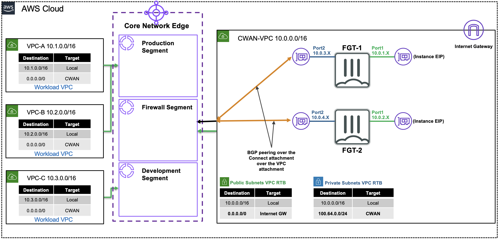
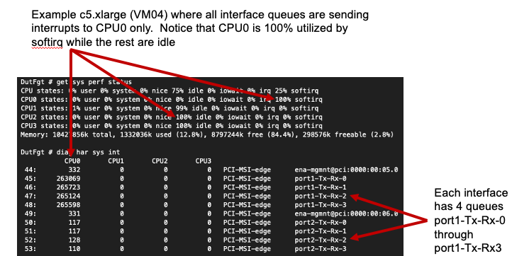

|      |   |  
|:----:|:--|
| **Goal**                   | Utilize Cloud WAN components and Core Network Policy to provide a secured & orchestrated network.
| **Task**                   | Update Core Networking Policy with logic to automate connecting resources to segments and propagating routes to allow secured traffic flow.
| **Validation** | Confirm east/west connectivity from EC2 Instance-A via Ping, HTTP.

## Introduction
In this lab, we will focus on more advanced routing concepts within Cloud WAN in a multi-region deployment. In the Cloud WAN key concepts, you worked with the core building blocks that helped you build a WAN with broad brush strokes. Now we will focus on tailoring the routing for common use cases.

Picking up from the last section we now have attachment policies, segment actions to share routes between segments, and specified a segment to be isolated. In this section, you will need to create the appropriate Cloud WAN Core Network Policy to blackhole certain traffic before reaching the target VPC and also create routing policies that will automatically summarize routes before advertising out to the hub FGTs. Finally you will configure prefix lists and route maps on the hub FortiGates to controll what routes are advertised to Cloud WAN.

### Summarized Steps (click to expand each for details)

###### **Affinity settings for most BW raw and IPsec**
{}

The ENA driver uses SR-IOV to provide high performance network capabilities. Packet handling sends interrupts to the CPU for processing. These interrupts are received in interrupt queue(s). Multi-queue, if more than one queue on a per interface.

The ENA driver provides up to 8 queues for "standard" compute optimized instance families (ie c5, c6i, c7g, c8g, etc) and up to 32 queues for "max networking performance" instance families (ie c5n, c6in, c7gn, c8gn, etc) on a per interface basis depending on the instance size. Reference [**AWS documentation**](https://docs.aws.amazon.com/AWSEC2/latest/UserGuide/ena-queues.html).

Mapping all interface queues to different cores provides better performance since a higher average CPU utilization can be reached.  This is called setting Interrupt ReQuest Affinity (ie IRQ Affinity, Interrupt Affinity).

FortiOS will automatically map each interface queue to a unique CPU on instance sizes up to *.2xlarge (ie 8 vCPU). Anything above that should have the affinity settings configured to maximize performance. This is done by using cpumasks. We set each interface queue to target a different CPU core, to spread out the interrupts evenly.This is done by setting the correct queue names and cpumask values in the CLI table config system affinity-interrupt, reference [**Fortinet documentation**](https://docs.fortinet.com/document/fortigate-private-cloud/8.0.0/kvm-administration-guide/685796/interrupt-affinity).

For demonstration purposes, here is a misconfigured FortiGate to simulate uneven CPU usage due to interrupts all being sent to one CPU core (ie softirq = 100% on CPU 0). Notice that all other CPUs are not handling packets in this bad configuration. Compare that to the second image showing the correct setup where interrupts are spread across all cores. In production, seeing very uneven CPU usage is not ideal so configuring interrupts to spread out packet handling loads across as many CPU cores as possible is the goal. Use [**CPU affinity mask calculators**](https://bitsum.com/tools/cpu-affinity-calculator/) to help get the correct cpumasks quickly.

	

Specifically when dealing with overlay tunnels (ie GRE or IPsec), these can be a bottle neck due to packet handling is limited to a single CPU core be default. This is because the inbound traffic (to be decapsulated for GRE or decrypted for IPsec) will typically be received on the same interface interrupt queue which can only map to one CPU. This occurs because the inbound packet will always look the same (ie src_ip = remote-tunnel-endpoint, dest_ip = fgt-interface-ip, port/protocol) so the NIC driver typically will result in selecting the same interface interrupt queue since the hash or load balancing method results in the same choice.

For GRE, this is a known limitation and the current workaround is to utilize multiple GRE tunnels in ECMP fashion to work around the bottle neck of one tunnel and spread traffic handling across multiple cores.

For IPsec however, we can leverage FortiOS packet redistribution settings (with FortiOS 7.0.8+) to use Receive Packet Steering (RPS) to distribute the decryption and packet handling for inbound traffic across multiple CPU cores (up to 32 CPU cores). This greatly increases performance when working with one or many IPsec tunnels. Reference [**Fortinet documentation**](https://community.fortinet.com/fortigate-3/technical-tip-affinity-packet-redistribution-when-using-single-or-multiple-ipsec-tunnels-on-fortigate-vm-196272)

{}

###### **Sizing, scale up**
{}
asdf
{}

###### **Failover… fgcp in general, tgw/cwan udpates ~30**
{}
adsf
{}

###### **AWS quick reference summary**
{}

| # | Topic | Limit | Notes |
|---|-------|-------|-------|
| 1 | EC2 instance bandwidth | Up to instance max | e.g. `c6i.16xlarge` = 25 Gbps |
| 2 | EC2 baseline/burst | Baseline + burst credits | e.g. `c6i.4xlarge` = 6.25 / 12.5 Gbps |
| 3 | Single-flow limit | **5 Gbps** | Unless same cluster placement group |
| 4 | IGW / LGW multi-flow | 50% of max OR 5 Gbps | ≥32 vCPU = 50%; <32 vCPU = 5 Gbps |
| 5 | Per-instance limits (ENA) | BW / PPS / SG tracking | Visible via FortiOS 7.2+ diag command |
| 6 | AWS VPN / IPsec tunnel | **1.25 Gbps / 140K PPS** | 2 tunnels per VPN conn; TGW ECMP = 2.5 Gbps |
| 7 | TGW / CWAN Connect (GRE) | **5 Gbps / 300K PPS** per peer | 4 peers × up to 5 attachments = 20 Gbps max |
| 8 | CWAN Connect (tunnel-less) | **100 Gbps** per peer | 4 peers × up to 5 attachments |
| 9 | MTU by path | 1500–9001 | See table below |
| 10 | TGW / CWAN routes | 1,000 in / 5,000 out | Per attachment |

---

###### EC2 instance bandwidth

> **Refs:** [1][https://docs.aws.amazon.com/AWSEC2/latest/UserGuide/ec2-instance-network-bandwidth.html] [2][https://docs.aws.amazon.com/ec2/latest/instancetypes/co.html#co_network]

EC2 instances have an aggregate "up to" bandwidth ceiling. Some smaller instances also use a network I/O credit mechanism for baseline vs. burst.

The EC2 "up to" bandwidth numbers represent the maximum theoretical network throughput an instance can achieve under ideal, highly optimized, and specific network conditions. These numbers are rarely hit during normal internet traffic but are achievable for specialized workloads (ie between 2x instances in the same AZ, using placement groups, ENA driver, large instance types *.18xlarge, and parallelization (ie multiple tcp/udp flows)).

| Instance | Baseline | Burst ("up to") |
|----------|----------|-----------------|
| `c6i.16xlarge` | — | 25 Gbps |
| `c6i.4xlarge` | 6.25 Gbps | 12.5 Gbps |

---

###### Single-flow limit

> **Ref:** [1][https://docs.aws.amazon.com/AWSEC2/latest/UserGuide/ec2-instance-network-bandwidth.html]

A single 5-tuple TCP/UDP flow (or 3-tuple for GRE/IPsec) is limited to **5 Gbps** unless both instances are in the same [cluster placement group](https://docs.aws.amazon.com/AWSEC2/latest/UserGuide/placement-groups.html). This applies regardless of instance size, VPC, subnet, or AZ.

This means that a single overlay tunnel, GRE or IPsec, is considered to be one flow and capped at 5 Gbps. To get more bandwidth you will need to use ECMP tunnels and routing strategy to get more than 5 Gbps.

---

###### IGW / LGW multi-flow limits

> **Ref:** [1][https://docs.aws.amazon.com/AWSEC2/latest/UserGuide/ec2-instance-network-bandwidth.html]

Traffic through an Internet Gateway or Local Gateway (Outposts) is subject to additional BW caps, even when multiple flows are used.

If you are using a instance size that is less than 32 CPU cores (ie *.4xlarge = 16 vCPU), then you will be capped at 5 Gbps through the IGW/LGW regardless of the instance "up to" bandwidth number. To get more than 5 Gbps throug the IGGW/LGW you will need to be using an instance that has at least a 32 CPU Cores (ie *.8xlarge = 32 vCPU).

| Instance vCPUs | Max through IGW/LGW | Example |
|----------------|---------------------|---------|
| ≥ 32 vCPUs | 50% of "up to" bandwidth | `c6i.16xlarge` → ~12.5 Gbps |
| < 32 vCPUs | 5 Gbps | `c6i.4xlarge` → 5 Gbps |

---

###### Per-instance ENA limits

> **Refs:** [3][https://aws.amazon.com/blogs/networking-and-content-delivery/amazon-ec2-instance-level-network-performance-metrics-uncover-new-insights/] [4][https://docs.aws.amazon.com/AWSEC2/latest/UserGuide/monitoring-network-performance-ena.html] [10][https://community.fortinet.com/t5/FortiGate/Technical-Tip-How-to-check-Network-Performance-Metrics-of-a-AWS/ta-p/294251] [11](https://docs.aws.amazon.com/AWSEC2/latest/UserGuide/security-group-connection-tracking.html)

Traffic to/from an instance can be limited or dropped based on per-instance-type thresholds for:
- Bandwidth in/out
- Packets per second (PPS) in/out
- Security Group connection tracking

FortiOS 7.2+ exposes these metrics via a `diag` command, ie (diagnose hardware deviceinfo nic-stats port1 | grep exceeded). If you run this command multiple times on any data plane interface and you see any of the exceeded counters increase, traffic is actively being dropped for exceeding that threshold.

For security group connection tracking, you can bypass this by using rules that do not contain a source address (ie source: 0.0.0.0/0, port: 80: proto: tcp). You can use FortiOS FW policy, local-in policy, and trusted hosts to restrict traffic instead of relying heavily on security group tracking.
---

###### AWS VPN / IPsec tunnel limits

> **Refs:** [1][https://docs.aws.amazon.com/AWSEC2/latest/UserGuide/ec2-instance-network-bandwidth.html] [5][https://docs.aws.amazon.com/vpn/latest/s2svpn/vpn-limits.html#vpn-quotas-bandwidth] [6][https://docs.aws.amazon.com/vpc/latest/tgw/transit-gateway-quotas.html] [12](https://aws.amazon.com/blogs/networking-and-content-delivery/introducing-aws-site-to-site-vpn-5-gbps-tunnels-to-support-high-throughput-workloads/) [9](https://docs.aws.amazon.com/network-manager/latest/cloudwan/cloudwan-quotas.html)

Each IPsec tunnel (1x Site-toSite VPN connection contains 2x IPsec tunnels) supports up to **1.25 Gbps** and **140K PPS**. Each VPN Connection includes
2 tunnels.

Starting in November 2025, AWS introduced a "Large" AWS Site-toSite VPN conection option can now support up to **5 Gbps** per IPsec tunnel. This means if you are using both IPsec tunnels in an ECMP fashion, you can get "up to" 10 Gbps.

It is recommended to use FortiOS packet-redistribution settings (discussed in affinity settings) to get the most IPsec performance from the FortiGate to reach high IPsec BW.

| Gateway type | ECMP supported | Max per VPN Connection |
|---|---|---|
| Cloud WAN and Transit Gateway (Large BW option) | Yes | ~2.5 Gbps / 280K PPS |
| Cloud WAN and Transit Gateway (Standard BW option) | Yes | ~5.0 Gbps / ??? PPS |
| Virtual Private Gateway | No | 1.25 Gbps / 140K PPS |

---

###### TGW / CWAN Connect limits

> **Refs:** [6][ref6] [9][ref9]

| Mode | Per peer | Peers per attachment | Max attachments per VPC | Max per attachment |
|------|----------|----------------------|-------------------------|--------------------|
| GRE tunnel | 5 Gbps / 300K PPS | 4 | 5 | 20 Gbps / 1.2M PPS |
| Tunnel-less | 100 Gbps | 4 | 5 | 400 Gbps |

> **Note:** GRE tuple flows are handled by a **single CPU core**.

---

###### MTU limits by path

> **Refs:** [6][ref6] [7][ref7] [8][ref8] [9][ref9]

| Path | Max MTU |
|------|---------|
| VPC | 9001 |
| TGW / CWAN | 8500 |
| Direct Connect (DX) | 9001 |
| Internet Gateway (IGW) | 1500 |
| VPN Connection | 1500 |
| VPC Peering | 1500 |

### MTU overhead at 1500 baseline

| Protocol | Overhead | Effective MSS (TCP) |
|----------|----------|---------------------|
| IP + TCP | 40 B | 1460 |
| IP + UDP | 28 B | 1472 |
| IP + TCP + GRE | 64 B | 1436 |
| IP + TCP + ESP (AES-GCM-256 + NAT-T) | ~102 B | ~1398 |

Use the [IPsec overhead calculator](https://ipsec-overhead-calculator.netsec.us/) for custom configs.

---

###### TGW / CWAN route limits

> **Refs:** [6][ref6] [9][ref9]

- **Inbound** (advertised to TGW/CWAN): 1,000 routes
- **Outbound** (advertised from TGW/CWAN): 5,000 routes

---
{}

[ref1]: https://docs.aws.amazon.com/AWSEC2/latest/UserGuide/ec2-instance-network-bandwidth.html
[ref2]: https://docs.aws.amazon.com/ec2/latest/instancetypes/co.html#co_network
[ref3]: https://aws.amazon.com/blogs/networking-and-content-delivery/amazon-ec2-instance-level-network-performance-metrics-uncover-new-insights/
[ref4]: https://docs.aws.amazon.com/AWSEC2/latest/UserGuide/monitoring-network-performance-ena.html
[ref5]: https://docs.aws.amazon.com/vpn/latest/s2svpn/vpn-limits.html#vpn-quotas-bandwidth
[ref6]: https://docs.aws.amazon.com/vpc/latest/tgw/transit-gateway-quotas.html
[ref7]: https://docs.aws.amazon.com/AWSEC2/latest/UserGuide/network_mtu.html
[ref8]: https://docs.aws.amazon.com/directconnect/latest/UserGuide/interface-set-mtu.html
[ref9]: https://docs.aws.amazon.com/network-manager/latest/cloudwan/cloudwan-quotas.html
[ref10]: https://community.fortinet.com/t5/FortiGate/Technical-Tip-How-to-check-Network-Performance-Metrics-of-a-AWS/ta-p/294251
[ref11]: (https://docs.aws.amazon.com/AWSEC2/latest/UserGuide/security-group-connection-tracking.html)
[ref12]: (https://aws.amazon.com/blogs/networking-and-content-delivery/introducing-aws-site-to-site-vpn-5-gbps-tunnels-to-support-high-throughput-workloads/)
[ref13]: https://docs.aws.amazon.com/network-manager/latest/cloudwan/cloudwan-quotas.html
**This concludes this task**
