|      |   |  
|:----:|:--|
| **Goal**                   | Utilize Cloud WAN components and Core Network Policy to provide a secured & orchestrated network.
| **Task**                   | Update Core Networking Policy with logic to automate connecting resources to segments and propagating routes to allow secured traffic flow.
| **Validation** | Confirm east/west connectivity from EC2 scw-region1-spoke1-linux-instance via Ping, HTTP.

## Introduction
In this lab, we will focus on Cloud WAN key components in a multi-region deployment. [**AWS Cloud WAN (CWAN)**](https://docs.aws.amazon.com/network-manager/latest/cloudwan/what-is-cloudwan.html) is an intent-driven managed wide area network (WAN), described by a policy you define that unifies your data center, branch, and AWS networks. While you can create your own global network by interconnecting multiple Transit Gateways across Regions, Cloud WAN provides built-in automation, segmentation, and configuration management features designed specifically for building and operating global networks, based on your core network policy. Cloud WAN has added features such as automated VPC attachments, integrated performance monitoring, and centralized configuration.

Currently, Cloud WAN is configured with multiple segments and attachments (both VPC and Tunnel-less Connect).  You will need to create the appropriate Cloud WAN Core Network Policy to automatically enforce segment attachment rules and propagation of routes between segments to direct traffic to the FortiGate Active-Passive cluster in the same local region.

In this setup these FortiGate are clustered together using FGCP unicast to synchronize configuration and sessions to provide SDWAN hub functionality and dynamic routing for branch locations into Cloud WAN. This design specifically uses Tunnel-less Connect attachments to allow dynamic routing between EC2 instances and a Cloud WAN Core Network Edge (CNE) without needing IPsec or GRE based overlay tunnels. This removes the overhead and bottlenecks that come with overlay tunnel protocols while still providing dynamic routing. As these FortiGates are working in an Active-Passive cluster, the passive FortiGate will not have an active BGP session to Cloud WAN as the data plane interfaces will be down.

## Summarized Steps (click to expand each for details)

###### 0) Lab environment setup

{}

- **0.1:** Login to your AWS account and navigate to the **CloudFormation Console** and **toggle View Nested to off**.
- **0.2:** Make sure you are in the **United States (Oregon) region** as this is where the stack should be deployed.
    {}
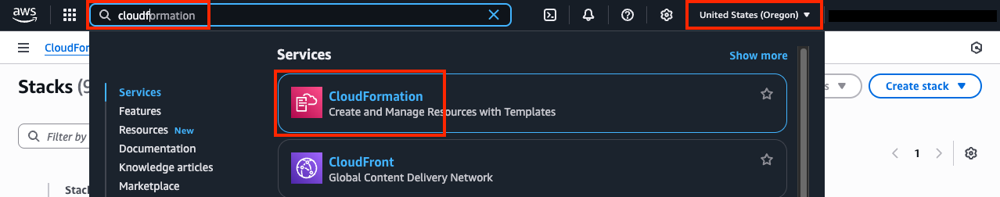
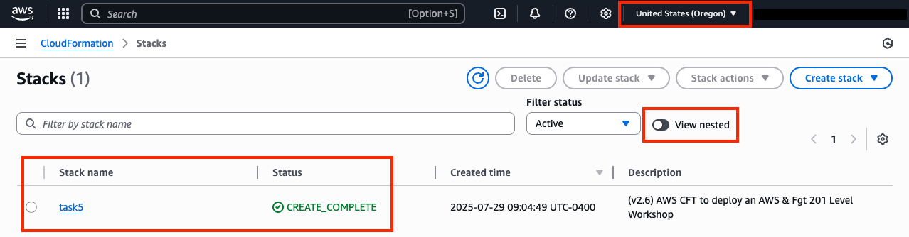
    {}

  {}
All AWS resources for this lab will be deployed in the **United States (Oregon) region**. Either switch the region for your existing browser tabs (using the region selector in the upper right corner of the AWS Console) to this region or close all other browser tabs. Otherwise, you might accidently configure the wrong AWS resources.
  {}

  {}

###### 1) What are the key components of Cloud WAN

{}

Below is a table of the key components in Cloud WAN. Since Cloud WAN is a managed global WAN using AWS's backbone, there are Key components that operate at global and regional levels.

| Component             | Regional or Global     | What it is                               | Why it matters                              |
|-----------------------|------------------------|------------------------------------------|---------------------------------------------|
| Core Network          | Global                 | Global WAN construct                     | The backbone you're building                |
| Core Network Policy   | Global                 | Central config & control plane (JSON)    | Defines routing and segmentation globally   |
| Segment               | Global                 | Logical routing domain (like VRF)        | Enables isolation between environments      |
| Network Function Group| Global                 | Logical service insertion group          | Forces traffic through network appliances (FW, IDS) |
| Core Network Edge     | Regional               | Regional hub (ie "edge location")        | Entry/exit point into AWS backbone          |
| Attachment            | Regional               | Connection into Cloud WAN Segment        | How resources join the network              |
| Connect               | Regional               | Integration mechanism (uses GRE Overlay) | Enables SD-WAN connectivity to AWS          |
| Tunnel-less Connect   | Regional               | Optimized SD-WAN path (no Overlay)       | Reduces overhead vs traditional tunnels     |

- **Core Network**: This contains all of the components below it in the table above, so this acts as a logical container and reference point.
- **Core Network Policy**: This is managed in the AWS Network Manager Console to manipulate settings directly in a browser or you can upload the JSON policy directly through the Console, API, or CLI. This is where you define your segments, Network Function Groups (NFGs), Core Network Edges (CNEs) as edge locations, attachment policies (automate attaching attachments to segments), and segment actions (sharing routes across segments, service insertion), and even routing policies (control bgp route propagation).
- **Segment**: This is a dedicated and isolated routing domain within the global network (wherever a CNE/edge location is defined). Attachments connect to segments like a VPC attachment connects to a TGW route table. By default, only attachments within the same segment can communicate. Optionally, resources in the same segment can be isolated from each other, with access only to shared services. Ultimately, you can define segment actions that share routes across segments in the core network policy.
- **Network Function Group (NFG)**: Similar to a segment in that it is a logical grouping of core network attachments, however these are specifically for hosted security and network appliances. Typically you would be using a Gateway Load Balancer and a fleet of FortiGates to provide the NGFW inspection. NFGs enable automated service insertion and traffic steering across segments by redirecting traffic through these inspection points. Service insertion rules are defined in the core network policy.

Below is a table of example Cloud WAN segments & NFGs including what they are commonly used for:
| Name             | Type    | Purpose                          |
|------------------|---------|----------------------------------|
| Prod             | Segment | Production workloads             |
| Dev              | Segment | Development and testing          |
| Shared Services  | Segment | DNS, AD, logging, common infra   |
| Partner          | Segment | External or third-party access   |
| inspection       | NFG     | Central traffic inspection       |
| egress           | NFG     | Controlled internet breakout     |
| ingress          | NFG     | Inbound traffic control          |

- **Core Network Edge (CNE)**: This is a local AWS managed connection point in each region (like TGW) where attachments connect to. These will have settings such as a BGP ASN and Inside CIDR Block for dynamic routing with Connect & Tunnel-less Connect Attachments.
- **Attachments**: Similar to attachments for TGW there are many options to integrate VPCs, remote sites, and even SDWAN appliances to Cloud WAN by attaching to a specific edge location which is a Core Network Edge. Attachments are created, either manually or via IaC (CloudFormation, Terraform), and then typically you will have attachment policies defined in the core network policy to look for certain tags applied to the attachment to decide which segment to automatically attach it to.

Below is a table Cloud WAN attachment types and what they are commonly used for:

| Attachment Type            | Connects                | Typical Use                                  |
|----------------------------|------------------------|----------------------------------------------|
| VPC Attachment             | VPC → Cloud WAN        | Application connectivity                     |
| VPN Attachment             | Site → AWS             | Encrypted hybrid access                      |
| Direct Connect Attachment  | Data Center → AWS      | Private high-bandwidth connectivity          |
| Connect Attachment         | SD-WAN → AWS           | Scalable SD-WAN integration                  |
| Transit Gateway (Route Table Integration) | TGW → Cloud WAN (via routing) | Migration, coexistence, or phased adoption       |

- **Connect & Tunnel-less Connect**: These are attachment types that that are created on top of VPC attachments that allow BGP routing between an SDWAN appliance in AWS with a CNE in Cloud WAN. The traditional Connect Attachment uses GRE overlay tunnel to BGP peer and route data plane traffic, masking this from the VPC route tables where the SDWAN appliance sits. The Tunnel-less Connect Attachment allows BGP peering and routing of data plane traffic directly without any overlay tunnel. This gets rid of typical overhead and bottle necks that overlay tunnels can cause with high performance requirements (high packets per second and or high bandwidth). When creating a Connect Attachment, you define the connect protocol as either GRE or Tunnel-less to select which type will be used.

{}

###### 2) Inspect the Cloud WAN attachments and segments

{}

- **2.1:** In the **Network Manager Console** go to the **Global Networks page** (menu on the left), then find and select your Global Network ID.
    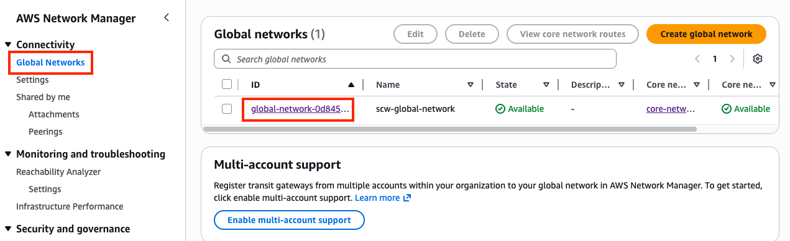
- **2.2:** Once the CWAN Global Network has loaded, go to the **Core network page** (menu on the left), then notice that there are **four segments and two edge locations**.
    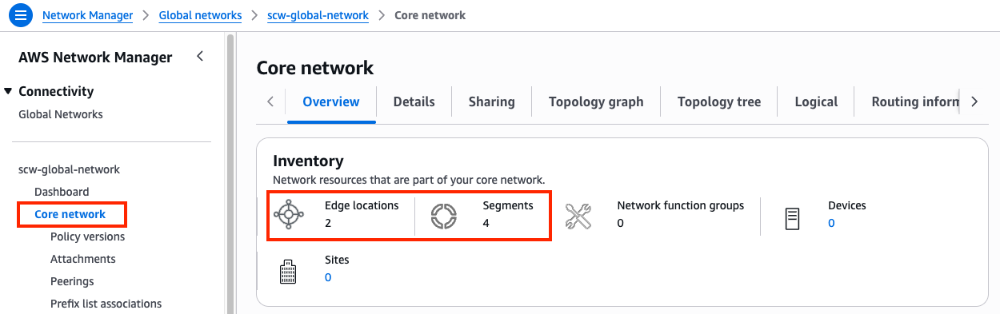
- **2.3:** Scroll down the page and notice the attachments widget shows a total of **4 attachments (3 VPC & 1 Connect) per region**.
- **2.4:** Navigate to the **attachments page** under your core network. Select the **scw-region1-sdwan-connect-attachment** and view the **Details tab** in the pane below, notice the **segment and attachment policy rule number are empty**.
    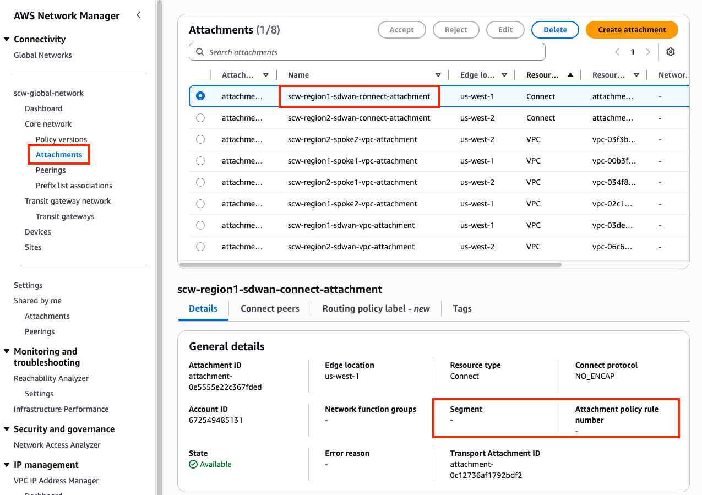
- **2.5:** On the same pane, switch to the **Connect peers tab** and notice the **Peer and Core network BGP 1/2 addresses**. The Peer addresses are the FGT private IPs and Core network are the BGP router endpoints for the Core Network Edge (CNE, ie managed TGW). The **BGP Status may show as down for both peers** due to a delay for the console to update the latest values. Normally the BGP status will be up for the peer configuration pointing to the primary Hub FGT for that Connect attachment and down for the secondary Hub FGT.
    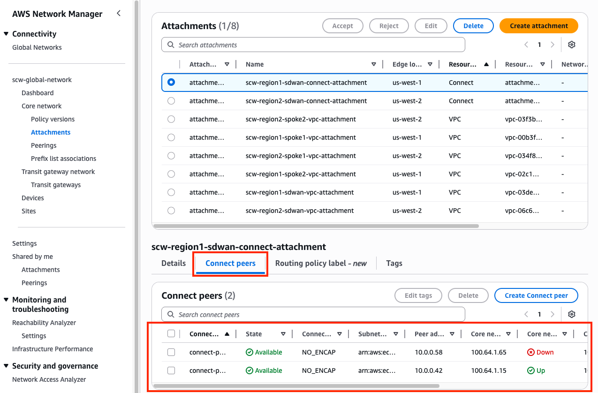
- **2.6:** In the same pane, switch to the **Tags tab** and notice the **segment key and the configured value**. These should match the table below. Select the other attachments to check the tag key value as well.

	Attachment Name | Tag (Key, Value)
	---|---
	scw-region1-sdwan-connect-attachment | segment = sdwan
	scw-region2-sdwan-connect-attachment | segment = sdwan
	scw-region1-sdwan-vpc-attachment | segment = sdwan
	scw-region2-sdwan-vpc-attachment | segment = sdwan
	scw-region1-spoke1-vpc-attachment | segment = production
	scw-region2-spoke1-vpc-attachment | segment = production
	scw-region1-spoke2-vpc-attachment | segment = development
	scw-region2-spoke2-vpc-attachment | segment = development

    {}

###### 3) Review FortiGate1's BGP config and current routes advertised/received

{}

- **3.1:** Navigate to the **CloudFormation Console** and **toggle View Nested to off**.
- **3.2:** Select the main template and select the **Outputs tab**.
- **3.3:** Login to **scw-region1-hub1-fgt1**, using the outputs **scw-region1-hub1-login-url** and the credentials **`admin`**, and **`FORTInet123!`**.
- **3.4:** Upon login in the **upper right-hand corner** click on the **>_** icon to open a CLI session.
- **3.5:** Run the command **`get sys int physical port2`** and notice **the interface and IP is private** and this also **matches one of the peer address in the Connect peers tab** of the corresponding Connect attachment.
- **3.6:** Run the command **`show router bgp`** and notice the **AS and BGP peers match the Connect peers information from the previous section**.

  {}
Notice that 2 out of the 4 BGP peers with the address 100.64.x.x are showing down while the others are up. This is because we are using FGCP dual AZ HA where each FGT is in a different subnet and thus needs it's own Connect Peer definition. Since these FGTs are clustered, we are syncing all 4 addresses with both primary and backup to keep config management simple with FortiManager. It is only ever expected that the Connect Peers actually meant for each FGT will be up while the others will be down due to not matching the expected IP on the Connect Peer definition.
  {}

- **3.7:** Run the command **`get router info bgp summary`** and notice the **State/PfxRcd values are zero for all peers with 100.64.x.x addresses**.
- **3.8:** Run the command **`get router info bgp neighbors <peer-ip> advertised-routes`** for each BGP neighbor and notice **a default route and branch route are advertised**.
- **3.9:** Run the command **`get router info bgp neighbors <peer-ip> routes`** for each BGP neighbor and notice **no routes are received from Cloud WAN**.
    {}

###### 4) Update & Apply Core Network Policy

{}

- **4.1:** In the **Network Manager Console** navigate to the **Policy versions page** for your Core Network and select the only policy version and **click Edit**.
    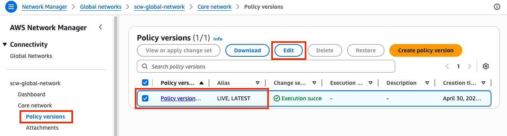
- **4.2:** Select the **Segments tab** and notice the existing segments. You should see **four segments (sdwan, production, development, and sharedservices)**.
- **4.3:** Select the **Segments actions tab** then find the **Sharing** section and **click Create**. Use the table below to create the sharing rules need.
    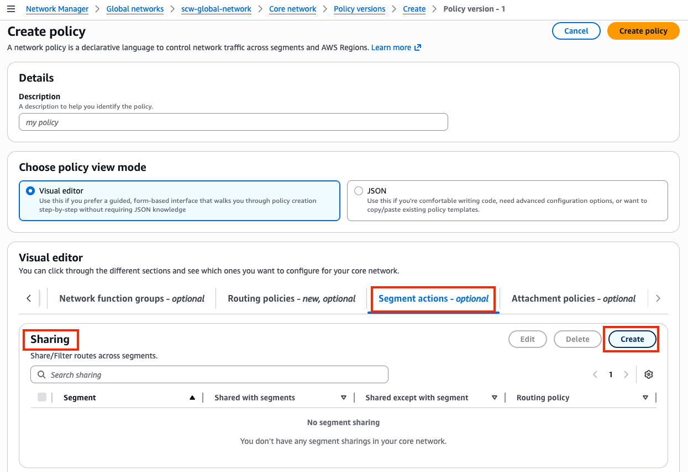

	Segment from | Segment to | Allow segment list
	---|---|---
	sdwan | allow selected | production, development, sharedservices
	sharedservices | allow selected | production, development

- **4.4:** Next, select the **Attachment policies tab** then find the **Attachment policies** section and **click Create**. Use the table below to create the sharing rules need. Here is an example of the first rule.
    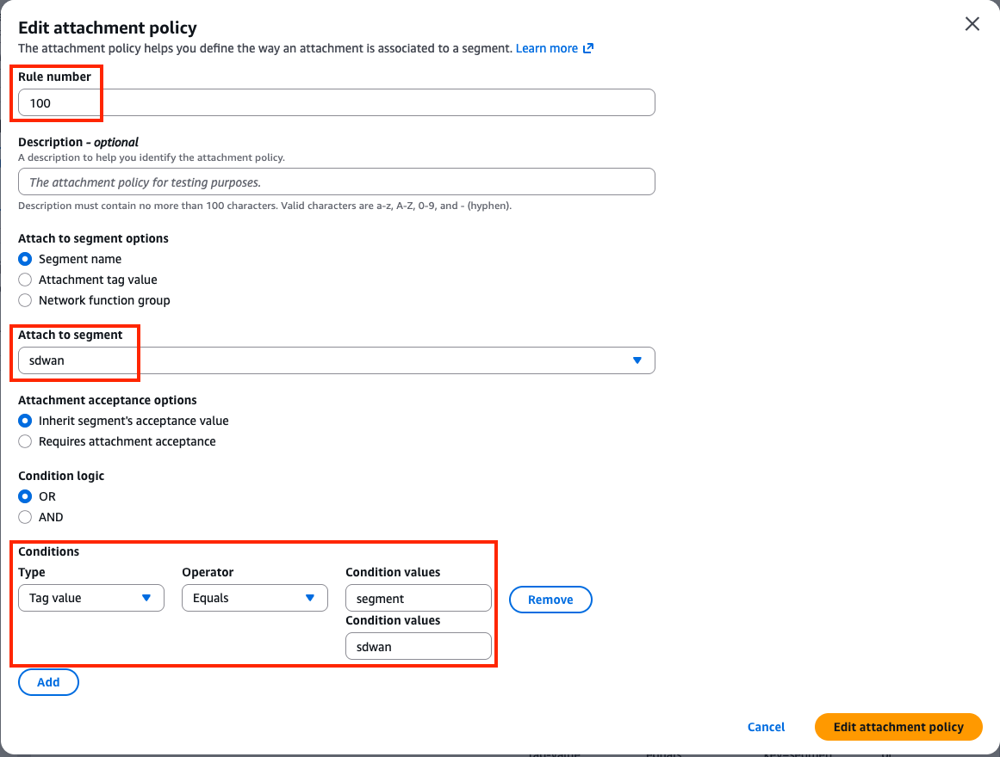

	rule number | Attach to Segment | Conditions Values (Tag Key, Tag Value)
	---|---|---
	100| sdwan | Type=Tag Value, Operator=Equals, Condition Values=segment, sdwan
	200| production | Type=Tag Value, Operator=Equals, Condition Values=segment, production
	300| development | Type=Tag Value, Operator=Equals, Condition Values=segment, development
	400| sharedservices | Type=Tag Value, Operator=Equals, Condition Values=segment, sharedservices

- **4.5:** Once completed, you should see these attachment policies. Next, **click Create policy**.
    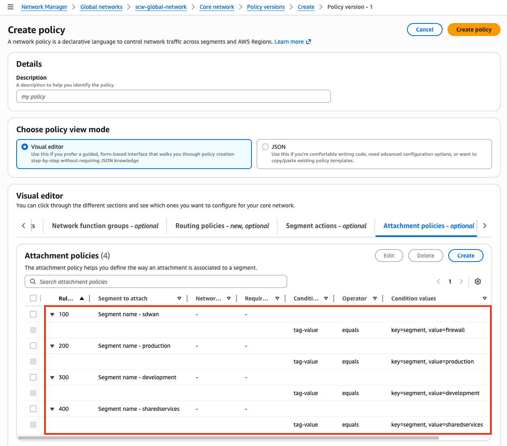
- **4.6:** You should be back on the **Policy versions page** with a new policy version showing. Once **Policy version - 2 shows Ready to execute**, select the version and **click View or apply change set**.
     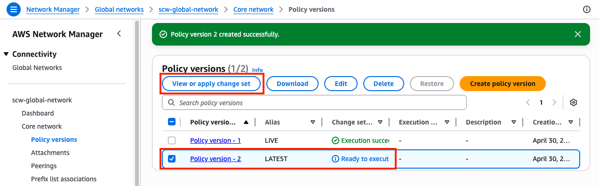
- **4.7:** On the **next page click Apply change set**. You will be returned to the Policy version page and see the **new policy version is executing**. In a few moments this will show as **Execution succeeded**.
     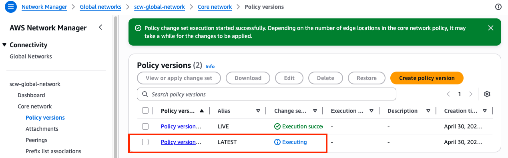
     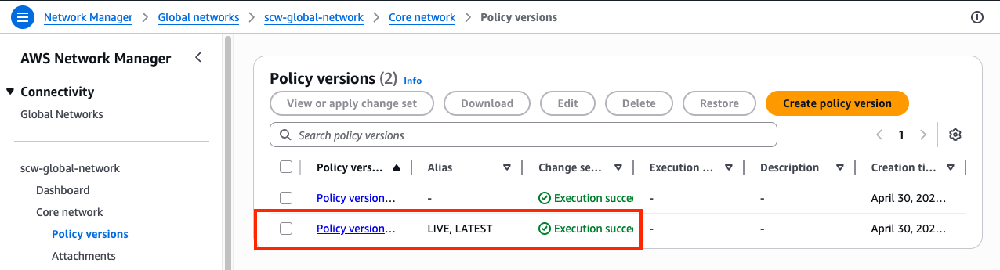

    {}

###### 5) Test traffic and Validate Results

{}

- **5.1:** Navigate to the **attachments page** under your Core Network. Select the **scw-region1-sdwan-connect-attachment** and view the **Details tab**. Notice the **segment and attachment policy rule number are now populated**. The table below should match what your environment looks like after applying the correct Core Network Policy. Select the other attachments to verify the results.

	Attachment | Segment | Rule
	---|---|---
	scw-region1-sdwan-connect-attachment | sdwan | 100
	scw-region2-sdwan-connect-attachment | sdwan | 100
	scw-region1-sdwan-vpc-attachment | sdwan | 100
	scw-region2-sdwan-vpc-attachment | sdwan | 100
	scw-region1-spoke1-vpc-attachment | production | 200
	scw-region2-spoke1-vpc-attachment | production | 200
	scw-region1-spoke2-vpc-attachment | development | 300
	scw-region2-spoke2-vpc-attachment | development | 300
	
	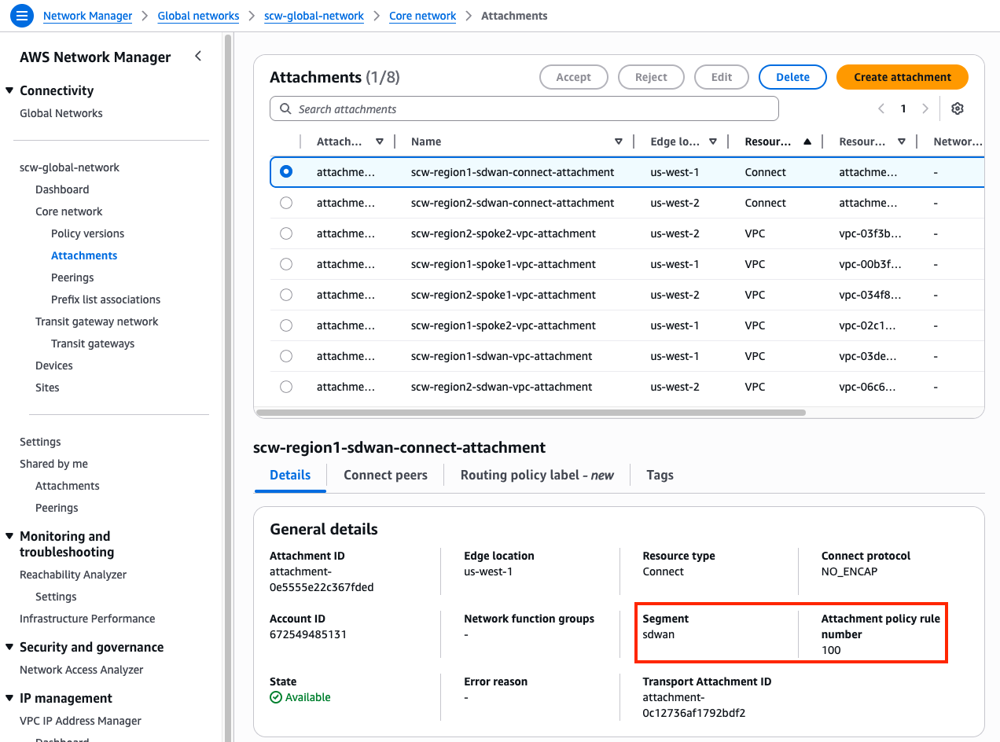

- **5.2:** Navigate to the **main Core network page** for your Core Network. Select the **Routes tab** and in the route filter, **select a segment and edge location and click Search routes**. You should eventually see routes matching the table below. Notice, the **default route is from the local region's Hub FGTs through the connect attachment**.

	Segment | CIDRs
	---|---
	sdwan | 10.0.0.0/24, 10.1.0.0/24, 10.2.0.0/24, 10.16.0.0/24, 10.17.0.0/24, 10.18.0.0/24, 10.32.0.0/16, 10.48.0.0/24, 0.0.0.0/0
	production | 10.0.0.0/24, 10.1.0.0/24, 10.16.0.0/24, 10.17.0.0/24, 0.32.0.0/16, 10.48.0.0/24, 0.0.0.0/0
	development | 10.0.0.0/24, 10.2.0.0/24, 10.16.0.0/24, 10.18.0.0/24, 0.32.0.0/16, 10.48.0.0/24, 0.0.0.0/0
	sharedservices | 10.0.0.0/24, 10.1.0.0/24, 10.2.0.0/24, 10.16.0.0/24, 10.17.0.0/24, 10.18.0.0/24, 10.32.0.0/16, 10.48.0.0/24, 0.0.0.0/0

	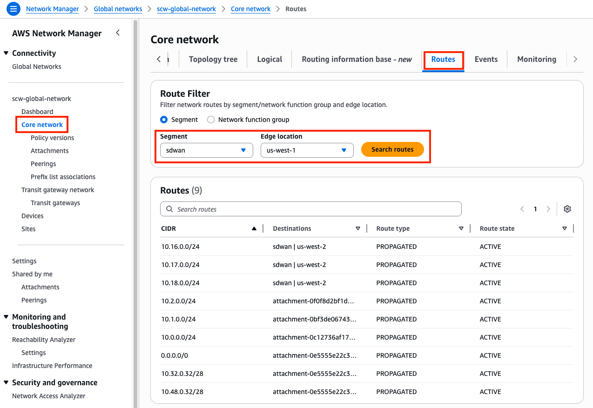
	
- **5.3:** Login to **scw-region1-hub1-fgt1**, using the outputs **scw-region1-hub1-login-url** and the credentials **`admin`**, and **`FORTInet123!`**.
- **5.4:** Upon login in the **upper right-hand corner** click on the **>_** icon to open a CLI session.
- **5.5:** Run the command **`get router info bgp summary`** and notice **State/PfxRcd is now showing six routes received**.
- **5.6:** Run the command **`get router info bgp neighbors <peer-ip> routes`** for each BGP neighbor and notice **six routes are received from Cloud WAN**. Notice that the **Next Hop address** is the IP of the Core Network attachment **scw-region1-sdwan-vpc-attachment** in the same subnet as port2 of FortiGate1. Also, notice the **Path column which shows the AS Path received**. You can see which routes are **originating from region1 vs region2 CNEs**.
- **5.7:** Run the command **`get router info routing-table all`** and notice there is **a static route for 100.64.0.0/24 & 10.0.0.0/24 out port2**. This allows the FGTs to BGP directly with the Core Network Edge (CNE).
- **5.8:** Navigate to the **EC2 Console** and connect to **scw-region1-spoke1-linux-instance** using the **[Serial Console directions](../05_modulefive.html)** 
    - Password: **`FORTInet123!`**
- **5.9:** Run the following commands to test connectivity and make sure the results match expectations 
  SRC / DST | scw-region1-spoke2-linux-instance (dev) | scw-region2-spoke3-linux-instance (prod)
  ---|---|---
  **scw-region1-spoke1-linux-instance (prod)** | **`curl 10.2.0.14`**  | **`curl 10.17.0.14`** 
  **scw-region1-spoke1-linux-instance (prod)** | **`ping 10.2.0.14`**  | **`ping 10.17.0.14`** 

    {}

###### 6) Let's dig deeper to understand how all of this works

{}

- **6.1** Notice that scw-region1-spoke1-linux-instance can access scw-region2-spoke3-linux-instance over HTTP and PING but could not access scw-region1-spoke2-linux-instance. This is because scw-region1-spoke1-linux-instance and scw-region2-spoke3-linux-instance are in VPCs attached to the production segment which is configured as a shared routing domain by default. This allows anything attached to the same segment to communicate bidirectionally. This means anything in scw-region1-spoke1-vpc can reach scw-region2-spoke3-vpc without being sent through the FGTs in scw-region1-sdwan-vpc which is in the sdwan segment.
- **6.2** scw-region1-spoke2-vpc is in the development segment so when scw-region1-spoke1-vpc reaches out to this destination, the routes for the production segment first forwards traffic to the FGTs in the inspection VPC (via 0.0.0.0/0 to Connect attachments). This allowed the FGTs to enforce FW policy, implicit in this case, that blocked access from scw-region1-spoke1-vpc to scw-region1-spoke2-vpc since there is no FW policy explicitly allowing that right now.
- **6.3** Segments can be configured to be isolated so that resources attached to the same segment can't communicate directly. Through the Core Network Policy you can still allow access to specific routes or other segments explicitly.
- **6.4** In the **Network Manager Console** navigate to the **Policy versions page** select **'Policy version - 2' and click Edit**.
- **6.5** Select the **Segments tab**, select the **production segment and click Edit**.
- **6.6** On the **Edit segment page**, check the box for **Isolated attachments and click Edit Segment**, then on the next page **click Create Policy**.
	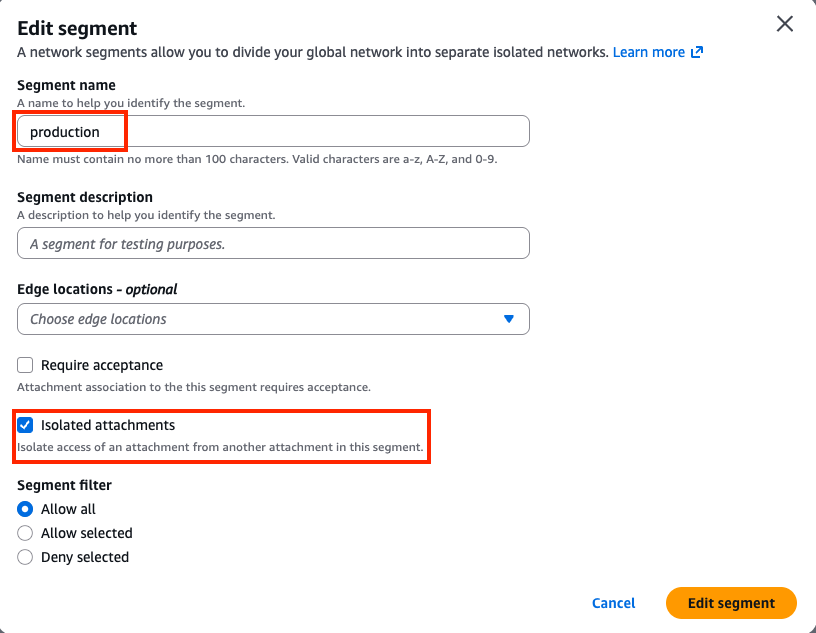
- **6.7** You should be back on the **Policy versions page** with a new policy version showing. Once **Policy version - 3 shows Ready to execute**, select the version and **click View or apply change set**.
- **6.8** On the **next page click Apply change set**. You will be returned to the Policy version page and see the **new policy version is executing**. In a few moments this will show as **Execution succeeded**.
- **6.9:** Navigate back to the **EC2 Console** and connect to **scw-region1-spoke1-linux-instance** using the **[Serial Console directions](../05_modulefive.html)** 
	- Password: **`FORTInet123!`**
- **6.10:** Run the following commands to test connectivity again and make sure the results match expectations 
  SRC / DST | scw-region1-spoke2-linux-instance (dev) | scw-region2-spoke3-linux-instance (prod)
  ---|---|---
  **scw-region1-spoke1-linux-instance (prod)** | **`curl 10.2.0.14`**  | **`curl 10.17.0.14`** 
  **scw-region1-spoke1-linux-instance (prod)** | **`ping 10.2.0.14`**  | **`ping 10.17.0.14`** 
  - Traffic should now be block by the implicit FW policy on the FGTs for scw-region1-spoke1-vpc to scw-region1-spoke2-vpc and scw-region2-spoke3-vpc

- **6.11** Navigate back to the **main Core network page** for your Core Network. Select the **Routes tab** and in the route filter, **select the production segment and edge location and click Search routes**. You should eventually see routes matching the table below. **The production segment now does not automatically share routes for attachments**. Note, that **the production VPC CIDRs will now not be advertised to the FGTs** as these routes are no longer in the production segment.

	Segment | CIDRs
	---|---
	sdwan | 10.0.0.0/24, 10.1.0.0/24, 10.2.0.0/24, 10.16.0.0/24, 10.17.0.0/24, 10.18.0.0/24, 10.32.0.0/16, 10.48.0.0/24, 0.0.0.0/0
	production | 10.0.0.0/24, 10.16.0.0/24, 10.32.0.0/16, 10.48.0.0/24, 0.0.0.0/0
	development | 10.0.0.0/24, 10.2.0.0/24, 10.16.0.0/24, 10.18.0.0/24, 0.32.0.0/16, 10.48.0.0/24, 0.0.0.0/0
	sharedservices | 10.0.0.0/24, 10.1.0.0/24, 10.2.0.0/24, 10.16.0.0/24, 10.17.0.0/24, 10.18.0.0/24, 10.32.0.0/16, 10.48.0.0/24, 0.0.0.0/0
  {}

## Discussion Points
- Cloud WAN (CWAN) is a global service
  - Network Manager Console, Global Network, and Core Network Policy are global
  - Segments are global, but connected resources such as CNE locations and attachments are regional
  - Core Network Edge (CNEs), and attachments (VPC, Connect, VPN, Direct Connect, etc) are regional
- Segments are dedicated routing domains that can be isolated or allow direct communication between attached resources
- Core Network Edges (CNEs) are essentially managed TGWs which are peered together with BGP
- Core Network Policy allows granular automation of attachment association, propagation, and sharing of other routes between segments
- CWAN supports ECMP routing with routes from the same attachment type
   - CWAN is a stateless router which will result in asymmetric routing of traffic
   - SNAT is required for flow symmetry to the correct FortiGate in Active-Active design
   - FGSP can be used instead of SNAT for Active-Active East/West inspection with caveats
   - [**Appliance Mode**](https://docs.aws.amazon.com/vpc/latest/tgw/transit-gateway-appliance-scenario.html) is not required but recommended as it limits the amount of asymmetric traffic
- Connect (tunnel-less) attachments use BGP directly to privately connect to an appliance within a VPC only (ie no overlay tunnel IPsec or GRE needed)
- Each CWAN Connect (tunnel-less) peer supports up to 100 Gbps, (actual limit is based on instance type BW)
- Jumbo frames (8500 bytes) are supported for all attachments except VPN (1500 bytes)

{}
Once completed with this task, complete the quiz below as an individual whenever you are ready.
{}



**This concludes this task**
