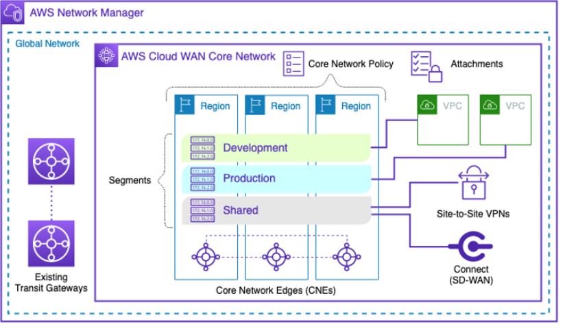
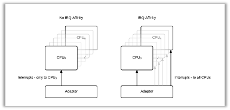
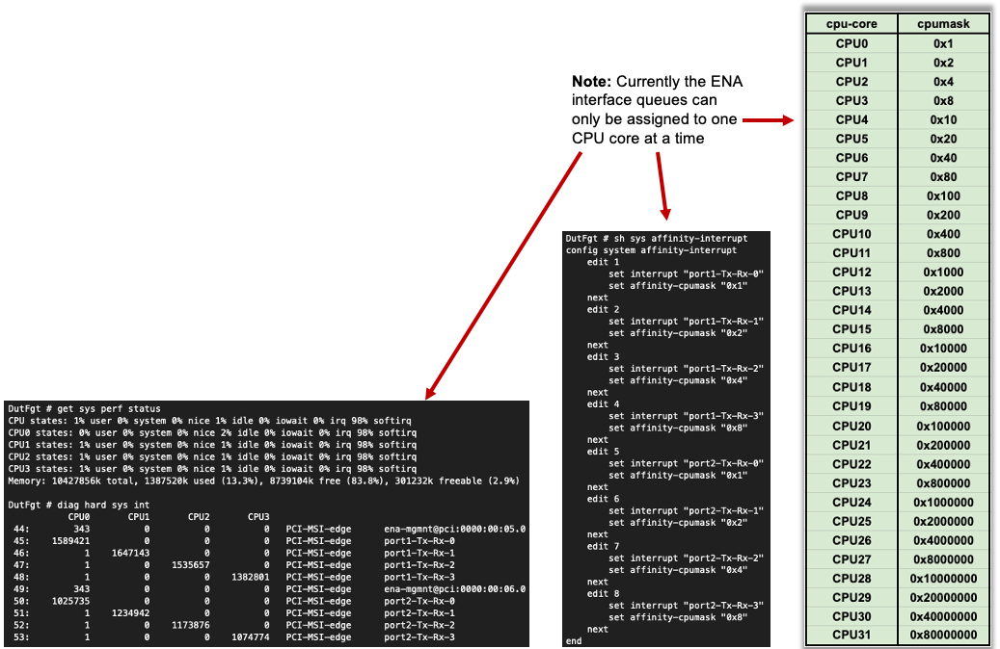

|      |   |  
|:----:|:--|
| **Goal**                   | Utilize Cloud WAN components and Core Network Policy to provide a secured & orchestrated network.
| **Task**                   | Update Core Networking Policy with logic to automate connecting resources to segments and propagating routes to allow secured traffic flow.
| **Validation** | Confirm east/west connectivity from EC2 Instance-A via Ping, HTTP.

## Introduction
In this lab, we will focus on more advanced routing concepts within Cloud WAN in a multi-region deployment. In the Cloud WAN key concepts, you worked with the core building blocks that helped you build a WAN with broad brush strokes. Now we will focus on tailoring the routing for common use cases.



Picking up from the last section we now have attachment policies, segment actions to share routes between segments, and specified a segment to be isolated. In this section, you will need to create the appropriate Cloud WAN Core Network Policy to blackhole certain traffic before reaching the target VPC and also create routing policies that will automatically summarize routes before advertising out to the hub FGTs. Finally you will configure prefix lists and route maps on the hub FortiGates to controll what routes are advertised to Cloud WAN.


### Summarized Steps (click to expand each for details)

###### **Affinity settings for most BW raw and IPsec**
{}

The ENA driver uses SR-IOV to provide high performance network capabilities. Packet handling sends interrupts to the CPU for processing. These interrupts are received in interrupt queue(s). Multi-queue, if more than one queue on a per interface.



The ENA driver provides up to 8 queues for "standard" compute optimized instance families (ie c5, c6i, c7g, c8g, etc) and up to 32 queues for "max networking performance" instance families (ie c5n, c6in, c7gn, c8gn, etc) on a per interface basis depending on the instance size. Reference [**AWS documentation**](https://docs.aws.amazon.com/AWSEC2/latest/UserGuide/ena-queues.html).

Mapping all interface queues to different cores provides better performance since a higher average CPU utilization can be reached.  This is called setting Interrupt ReQuest Affinity (ie IRQ Affinity, Interrupt Affinity).

FortiOS will automatically map each interface queue to a unique CPU on instance sizes up to *.2xlarge (ie 8 vCPU). Anything above that should have the affinity settings configured to maximize performance. This is done by using cpumasks. We set each interface queue to target a different CPU core, to spread out the interrupts evenly. This is done by setting the correct queue names and cpumask values in the CLI table config system affinity-interrupt, reference [**Fortinet documentation**](https://docs.fortinet.com/document/fortigate-private-cloud/8.0.0/kvm-administration-guide/685796/interrupt-affinity).

For demonstration purposes, here is a misconfigured FortiGate to simulate uneven CPU usage due to interrupts all being sent to one CPU core (ie softirq = 100% on CPU 0). Notice that all other CPUs are not handling packets in this bad configuration. Compare that to the second image showing the correct setup where interrupts are spread across all cores. In production, seeing very uneven CPU usage is not ideal so configuring interrupts to spread out packet handling loads across as many CPU cores as possible is the goal. Use [**CPU affinity mask calculators**](https://bitsum.com/tools/cpu-affinity-calculator/) to help get the correct cpumasks quickly.


	


Overlay tunnels (ie GRE or IPsec)  can be a bottle neck due to the fact that packet handling is limited to a single CPU core be default. This is because the inbound traffic (to be decapsulated for GRE or decrypted for IPsec) will typically be received on the same interface interrupt queue which can only map to one CPU. This occurs because the inbound packet will always look the same (ie src_ip = remote-tunnel-endpoint, dest_ip = fgt-interface-ip, port/protocol) so the NIC driver typically will result in selecting the same interface interrupt queue since the hash or load balancing method results in the same choice.

For GRE, this is a known limitation and the current workaround is to utilize multiple GRE tunnels in ECMP fashion to work around the bottle neck of one tunnel and spread traffic handling across multiple cores.

For IPsec however, we can leverage FortiOS packet redistribution settings (with FortiOS 7.0.8+) to use Receive Packet Steering (RPS) to distribute the decryption and packet handling for inbound traffic across multiple CPU cores (up to 32 CPU cores). This greatly increases performance when working with one or many IPsec tunnels. Reference [**Fortinet documentation**](https://community.fortinet.com/fortigate-3/technical-tip-affinity-packet-redistribution-when-using-single-or-multiple-ipsec-tunnels-on-fortigate-vm-196272)

{}

###### **Sizing**
{}

When using FGCP Unicast Active-Passive, you can scale up the instance size, change the instance type to a better performing family (ie c6in vs c6i for more BW + PPS caps and more interface interrupt queues), and increase the FortiOS VM license to support using more CPUs.

Scaling up in size refers to using a larger AWS instance. Even if you are not increasing the FortiOS VM license, if the FGT CPU is not the bottle neck, you can shutdown both instances (ie primary and secondary) then edit the instance settings to switch the instance size to a larger instance (ie c6in.4xlarge -> c6in.8xlarge). Doing this can get your more bandwidth through the IGW, especially if using less than a 32 vCPU instance size, and generally higher BW, PPS, security group connection tracking limits.

Eventually scaling up will have a limit of how much you will be able to get out of one instance being the primary/active unit at a time. Depending on your traffic mix (frame size, PPS, fragmentation, etc) and major features used on top of IPsec or SDWAN (ie NGFW features like App Control, IPS, etc) we have tested up to 10-15 Gbps with a simulated traffic generator (FortiTester using HTTP CPS tests with 1x 44KB payloads over each HTTP session, 1Gbps = 2,500 CPS, 10Gbps = 25,000 CPS). 

Scaling out in size refers to using an active active design where multiple FGTs are actively handling traffic and BGP peering with Cloud WAN or Transit Gateway. This design has pros and cons to consider. The pros are that you can spread out the BW, PPS, etc across multiple active FGTs to get higher bandwidth. The cons are complexity, asymmetric routing, and being generally limited to FW + SDWAN features only (ie no L7 NGFW due to asymmetric routing). Cloud WAN CNEs and Transit Gateway are stateless routers that are not flow aware. When there is ECMP routing introduced, a session may come inbound through one FGT and then the reply traffic goes through another FGT. To work with this, you will need to leverage **tcp-session-without-sync** in your firewall policy to allow this traffic through, reference [**Fortinet documentation**](https://community.fortinet.com/fortigate-3/technical-tip-use-case-of-tcp-session-without-syn-in-firewall-policy-136374) for more information. While you can use FGSP to sync session tables across the active group of FGTs, this can have a large impact to the PPS rate (packets per second) and cause AWS to throttle the instances for passing their threshold. This should be used sparingly on specific protocols, ports, and source/destinations. For more information on FGSP, reference [**Fortinet documentation**](https://docs.fortinet.com/document/fortigate/8.0.0/administration-guide/668583/fgsp).

{}

###### **Failover Times**
{}

FGCP Unicast in AWS works mostly like FGCP on premise besides a few key points. The FGTs must reach out to AWS EC2 API to "failover" or update the SDN (software defined networking) around the FGTs to point the current primary unit. This involved moving cluster Elastic IPs and replacing VPC routes to point to the correct interface on the current primary unit. Typically, the failover occurs anywhere from 5-10 seconds, that is with measuring ICMP against the cluster Elastic IPs during failover. This measures the time it takes for FGCP to failover between the FGTs (within 1 second) and for the AWS EC2 API to apply the requested infrastructure updates (ie move EIPs and replace routes, usually 5-6 seconds). For more information on the FGCP Unicast failover process in AWS, reference [**Fortinet Cloud CSE documentation**](https://fortinetcloudcse.github.io/FGCP-in-AWS/).

When working with dynamic routing to AWS infrastructure such as Cloud WAN to Transit Gateway, you also must consider the BGP timers. With the default values for BGP keep alive and hold down timers, there is a up to a 10 second keep alive and 30 second hold down timer. It is highly recommended to change these to considerably lower values. Here is a table showing the default and lowest recommended minimums. Technically you can go down to 1 & 3 but this will likely cause unexpected BGP flapping with high CPU and or BW scenarios.

| Connection Type                         | Keepalive (Default) | Hold Time (Default) | Keepalive (Lowest Recommended Minimum) | Hold Time (Lowest Recommended Minimum) |
| --------------------------------------- | ------------------- | ------------------- | ------------------- | ------------------- |
| **TGW Connect (GRE)**                   | 10 sec              | 30 sec              | 3 sec               | 9 sec               |
| **Cloud WAN Connect (GRE)**             | 10 sec              | 30 sec              | 3 sec               | 9 sec               |
| **Cloud WAN Connect (Tunnel-less)**     | 10 sec              | 30 sec              | 3 sec               | 9 sec               |
| **Site-to-Site VPN (Dynamic BGP)**      | 10 sec              | 30 sec              | 3 sec               | 9 sec               |
| **Direct Connect (Private/Public VIF)** | 30 sec              | 90 sec              | 3 sec               | 9 sec               |

Also, BGP graceful router restart and BFD are not officially supported for BGP sessions outside of Direct Connect. So Connect, Tunnel-less Connect, and VPN connections are unable to take advantage of these features.

Additionally, Transit Gateway and Cloud WAN both need to update TGW route tables and Cloud WAN segments after BGP state and or route changes. Typically this is another 20-35 seconds.

Adding this all together, an expected failover time between FGTs in an FGCP Unicast cluster in AWS is around ~50-60 seconds. In an active active design where both FGTs are up and handling traffic and one fails, the expected failover time is ~20-30 seconds. This is faster due to both FGTs already being up from a data plane perspective and already having BGP sessions established with Cloud WAN CNE or TGW.

{}

###### **AWS Considerations**
{}

Here is a quick reference summary table. For more details on each topic, reference the sections below. Each section has links to relevant documentation.

| # | Topic | Limit | Notes |
|---|-------|-------|-------|
| 1 | EC2 instance bandwidth | Up to instance max | ie c6i.16xlarge = 25 Gbps |
| 2 | EC2 baseline/burst | Baseline + burst credits | ie c6i.4xlarge = 6.25 / 12.5 Gbps |
| 3 | Single-flow limit | **5 Gbps** | Unless same cluster placement group |
| 4 | IGW / LGW multi-flow | 50% of max or 5 Gbps | ≥32 vCPU = 50%; <32 vCPU = 5 Gbps |
| 5 | Per-instance limits (ENA) | BW / PPS / SG tracking | Visible via FortiOS 7.2+ diag command |
| 6 | AWS VPN / IPsec tunnel | **5 Gbps / 400K PPS** (when using Large BW option)| 2 tunnels per VPN conn; ECMP = ~10 Gbps |
| 7 | TGW / CWAN Connect (GRE) | **5 Gbps / 300K PPS** per peer | 4 peers × up to 5 attachments = 20 Gbps max |
| 8 | CWAN Connect (tunnel-less) | **100 Gbps** per peer | 4 peers × up to 5 attachments |
| 9 | MTU by path | 1500–9001 | See table below |
| 10 | TGW / CWAN routes | 1,000 in / 5,000-10,000 out (depending on attachment)| Per attachment |

---

###### **EC2 instance bandwidth**

> **Refs:** [**1**](https://docs.aws.amazon.com/AWSEC2/latest/UserGuide/ec2-instance-network-bandwidth.html) [**2**](https://docs.aws.amazon.com/ec2/latest/instancetypes/co.html#co_network)

EC2 instances have an aggregate "up to" bandwidth ceiling. Some smaller instances also use a network I/O credit mechanism for baseline vs. burst.

The EC2 "up to" bandwidth numbers represent the maximum theoretical network throughput an instance can achieve under ideal, highly optimized, and specific network conditions. These numbers are rarely hit during normal internet traffic but are achievable for specialized workloads (ie between 2x instances in the same AZ, using placement groups, ENA driver, large instance types *.18xlarge, and parallelization (ie multiple tcp/udp flows).

| Instance | Baseline | Burst ("up to") |
|----------|----------|-----------------|
| `c6i.16xlarge` | — | 25 Gbps |
| `c6i.4xlarge` | 6.25 Gbps | 12.5 Gbps |

---

###### **Single-flow limit**

> **Ref:** [**1**](https://docs.aws.amazon.com/AWSEC2/latest/UserGuide/ec2-instance-network-bandwidth.html)

A single 5-tuple TCP/UDP flow (or 3-tuple for GRE/IPsec) is limited to **5 Gbps** unless both instances are in the same [**cluster placement group**](https://docs.aws.amazon.com/AWSEC2/latest/UserGuide/placement-groups.html). This applies regardless of instance size, VPC, subnet, or AZ.

This means that a single overlay tunnel, GRE or IPsec, is one flow and capped at 5 Gbps. To get more bandwidth you will need to use ECMP tunnels and routing strategy to get more than 5 Gbps.

---

###### **IGW / LGW multi-flow limits**

> **Ref:** [**1**](https://docs.aws.amazon.com/AWSEC2/latest/UserGuide/ec2-instance-network-bandwidth.html)

Traffic through an Internet Gateway or Local Gateway (Outposts) is subject to additional BW caps, even when multiple flows are used.

If you are using a instance size that is less than 32 CPU cores (ie *.4xlarge = 16 vCPU), then you will be capped at 5 Gbps through the IGW/LGW regardless of the instance "up to" bandwidth number. To get more than 5 Gbps through the IGW/LGW you will need to be using an instance that has at least a 32 CPU Cores (ie *.8xlarge = 32 vCPU).

| Instance vCPUs | Max through IGW/LGW | Example |
|----------------|---------------------|---------|
| ≥ 32 vCPUs | 50% of "up to" bandwidth | c6i.16xlarge → ~12.5 Gbps |
| < 32 vCPUs | 5 Gbps | c6i.4xlarge → 5 Gbps |

---

###### **Per-instance ENA limits**

> **Refs:** [**3**](https://aws.amazon.com/blogs/networking-and-content-delivery/amazon-ec2-instance-level-network-performance-metrics-uncover-new-insights/) [**4**](https://docs.aws.amazon.com/AWSEC2/latest/UserGuide/monitoring-network-performance-ena.html) [**10**](https://community.fortinet.com/t5/FortiGate/Technical-Tip-How-to-check-Network-Performance-Metrics-of-a-AWS/ta-p/294251) [**11**](https://docs.aws.amazon.com/AWSEC2/latest/UserGuide/security-group-connection-tracking.html)

Traffic to/from an instance can be limited or dropped based on per-instance-type thresholds for:
- Bandwidth in/out
- Packets per second (PPS) in/out
- Security Group connection tracking

FortiOS 7.2+ exposes these metrics via a `diag` command, ie (diagnose hardware deviceinfo nic-stats port1 | grep exceeded). If you run this command multiple times on any data plane interface and you see any of the exceeded counters increase, traffic is actively being dropped for exceeding that threshold.

For security group connection tracking, you can bypass this by using rules that do not contain a source address (ie source: 0.0.0.0/0, port: 80: proto: tcp). You can use FortiOS FW policy, local-in policy, and trusted hosts to restrict traffic instead of relying heavily on security group tracking.

---

###### **AWS VPN / IPsec tunnel limits**

> **Refs:** [**1**](https://docs.aws.amazon.com/AWSEC2/latest/UserGuide/ec2-instance-network-bandwidth.html) [**5**](https://docs.aws.amazon.com/vpn/latest/s2svpn/vpn-limits.html#vpn-quotas-bandwidth) [**6**](https://docs.aws.amazon.com/vpc/latest/tgw/transit-gateway-quotas.html) [**12**](https://aws.amazon.com/blogs/networking-and-content-delivery/introducing-aws-site-to-site-vpn-5-gbps-tunnels-to-support-high-throughput-workloads/) [**9**](https://docs.aws.amazon.com/network-manager/latest/cloudwan/cloudwan-quotas.html)

Each IPsec tunnel (1x Site-toSite VPN connection contains 2x IPsec tunnels) supports up to **1.25 Gbps** and **140K PPS**. Each VPN Connection includes
2 tunnels.

Starting in November 2025, AWS introduced a "Large" AWS Site-to-Site VPN conection option can now support up to **5 Gbps** per IPsec tunnel. This means if you are using both IPsec tunnels in an ECMP fashion, you can get "up to" 10 Gbps.

It is recommended to use FortiOS packet-redistribution settings (discussed in affinity settings) to get the most IPsec performance from the FortiGate to reach high IPsec BW.

Typical behavior seen with a AWS Site-to-Site VPN connection is that not all throughput is available out the gate but after sustained high bandwidth usage there is a "ramp up" behavior to get to the "up to" bandwidth number.

| Gateway type | ECMP supported | Max per VPN Connection |
|---|---|---|
| Cloud WAN and Transit Gateway (Large BW option) | Yes | ~2.5 Gbps / 280K PPS |
| Cloud WAN and Transit Gateway (Standard BW option) | Yes | ~10 Gbps / 800K PPS |
| Virtual Private Gateway | No | 1.25 Gbps / 140K PPS |

---

###### **TGW / CWAN Connect limits**

> **Refs:** [**6**](https://docs.aws.amazon.com/vpc/latest/tgw/transit-gateway-quotas.html) [**9**](https://docs.aws.amazon.com/network-manager/latest/cloudwan/cloudwan-quotas.html)

| Mode | Per peer | Peers per attachment | Max attachments per VPC | Max per attachment |
|------|----------|----------------------|-------------------------|--------------------|
| GRE tunnel | 5 Gbps / 300K PPS | 4 | 5 | 20 Gbps / 1.2M PPS |
| Tunnel-less | 100 Gbps | 4 | 5 | 400 Gbps |

---

###### **TGW / CWAN route limits**

> **Refs:** [**6**](https://docs.aws.amazon.com/vpc/latest/tgw/transit-gateway-quotas.html) [**9**](https://docs.aws.amazon.com/network-manager/latest/cloudwan/cloudwan-quotas.html)

When using dynamic routing with Transit Gateway or Cloud WAN, you will likely need to perform summarization from the FGTs towards TGW/CWAN since the limit for inbound routes per Connect Peer (GRE or Tunnel-less) or Site-to-Site VPN connection is limited to 1,000 routes. For outbound from TGW/CWAN this is anywhere from 5,000 to 10,000 depending on the type of attachment.

| Transit Gateway Quota                                                    | Default |
| ------------------------------------------------------------------------ | ------- |
| Routes per TGW, across all TGW route tables                              | 10,000  |
| Routes advertised from VPN to TGW                                        | 1,000   |
| Routes advertised from TGW to VPN                                        | 5,000   |
| Routes advertised from Connect peer to TGW                               | 1,000   |
| Routes advertised from TGW to Connect peer                               | 5,000   |

| Cloud WAN Quota                                                          | Default |
| ------------------------------------------------------------------------ | ------- |
| Routes per core network, across all segments                             | 10,000  |
| Routes advertised from VPN to core network                               | 1,000   |
| Routes advertised from core network to VPN                               | 5,000   |
| Routes advertised from Connect peer (GRE) to core network                | 1,000   |
| Routes advertised from core network to Connect peer (GRE)                | 5,000   |
| Maximum number of Tunnel-less Connect routes per Connect peer (Inbound)  | 1,000   |
| Maximum number of Tunnel-less Connect routes per Connect peer (Outbound) | 10,000  |

---

###### **MTU limits by path**

> **Refs:** [**6**](https://docs.aws.amazon.com/vpc/latest/tgw/transit-gateway-quotas.html) [**7**](https://docs.aws.amazon.com/AWSEC2/latest/UserGuide/network_mtu.html) [**8**](https://docs.aws.amazon.com/directconnect/latest/UserGuide/interface-set-mtu.html) [**9**](https://docs.aws.amazon.com/network-manager/latest/cloudwan/cloudwan-quotas.html) [**13**](https://community.fortinet.com/fortigate-3/technical-tip-setting-tcp-mss-value-96548)

In certain cases, you are able to take advantage of configuring a FGT "physical" interface to have a high MTU that 1500. For example if you are doing east/west inspection and the workloads generating traffic are using jumbo frames for inter-vpc or even vpc to premise over Direct Connect. Also, when using Gateway Load Balancer, this can be beneficial as well. 

When working with IPsec tunnels or other overlay tunnels, you will have MTU overhead that needs to be considered. Not only will setting MTU be needed but likely setting TCP MSS to help applications make the best use of the path and not cause heavy fragmentation which will impact performance (ie higher PPS, CPU usage for interrupts + decrypt/decapsulation). 

| Path | Max MTU |
|------|---------|
| VPC | 9001 |
| TGW / CWAN | 8500 |
| GWLB | 8500 |
| Direct Connect (DX) | 9001 |
| Internet Gateway (IGW) | 1500 |
| VPN Connection | 1500 |
| VPC Peering | 1500 |

Here is an example of how you can configure an MTU override on a "physical" interface:
```
config system interface
edit port1
set vdom root
set alias public
set mode dhcp
set allowaccess ping https ssh http fgfm
set type physical
set mtu-override enable
set mtu 9001
next
end
```

Here is an example of how you can configure an MTU and TCP MSS override on an IPsec tunnel interface:
```
config system interface
edit vpn-conn-012345678912-0
set ip 169.254.x.x 255.255.255.255
set allowaccess ping
set tcp-mss 1379
set remote-ip 169.254.x.y/30
set mtu-override enable
set mtu 1427
next
edit vpn-conn-012345678912-1
set ip 169.254.y.y 255.255.255.255
set allowaccess ping
set tcp-mss 1379
set remote-ip 169.254.y.z/30
set mtu-override enable
set mtu 1427
next
end
```

Use the [**IPsec overhead calculator**](https://ipsec-overhead-calculator.netsec.us/) for custom configs.

| Protocol | Overhead | Effective MSS (TCP) |
|----------|----------|---------------------|
| IP + TCP | 40 B | 1460 |
| IP + UDP | 28 B | 1472 |
| IP + TCP + GRE | 64 B | 1436 |
| IP + TCP + ESP (AES-GCM-256 + NAT-T) | ~102 B | ~1398 |

---

###### **Reference Links**

Reference # | Link
------------|-----
1 | https://docs.aws.amazon.com/AWSEC2/latest/UserGuide/ec2-instance-network-bandwidth.html
2 | https://docs.aws.amazon.com/ec2/latest/instancetypes/co.html#co_network
3 | https://aws.amazon.com/blogs/networking-and-content-delivery/amazon-ec2-instance-level-network-performance-metrics-uncover-new-insights/
4 | https://docs.aws.amazon.com/AWSEC2/latest/UserGuide/monitoring-network-performance-ena.html
5 | https://docs.aws.amazon.com/vpn/latest/s2svpn/vpn-limits.html#vpn-quotas-bandwidth
6 | https://docs.aws.amazon.com/vpc/latest/tgw/transit-gateway-quotas.html
7 | https://docs.aws.amazon.com/AWSEC2/latest/UserGuide/network_mtu.html
8 | https://docs.aws.amazon.com/directconnect/latest/UserGuide/interface-set-mtu.html
9 | https://docs.aws.amazon.com/network-manager/latest/cloudwan/cloudwan-quotas.html
10 | https://community.fortinet.com/t5/FortiGate/Technical-Tip-How-to-check-Network-Performance-Metrics-of-a-AWS/ta-p/294251
11 | https://docs.aws.amazon.com/AWSEC2/latest/UserGuide/security-group-connection-tracking.html
12 | https://aws.amazon.com/blogs/networking-and-content-delivery/introducing-aws-site-to-site-vpn-5-gbps-tunnels-to-support-high-throughput-workloads/
13 | https://community.fortinet.com/fortigate-3/technical-tip-setting-tcp-mss-value-96548

---
{}

**This concludes this task**
