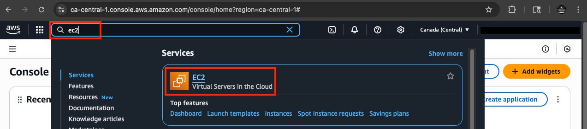
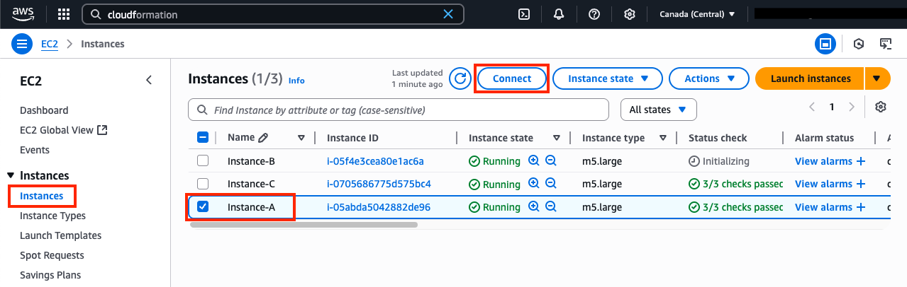
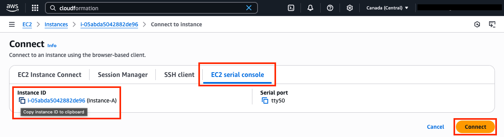
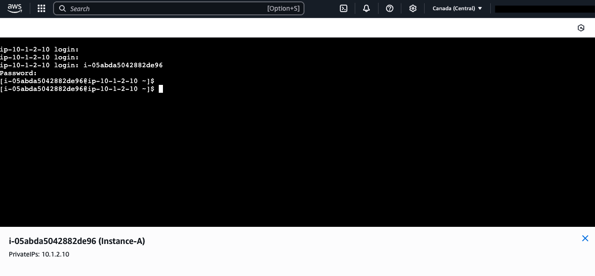

## Tasks in this workshop

In the Cloud WAN portion, we will explore AWS common networking architectures and FortiGate Deployments to provide SDWAN and Cloud WAN services together. 

{}
#### EC2 Instance Connect
In each of these scenarios, you'll need to connect to EC2 instances via Instance Connect.  

From the AWS console, follow these directions below to connect to the specific instance for the given task instruction.
{}

  - In the **EC2 Console** go to the **Instances page** select the **TASK_SPECIFIC_INSTANCE**.
  - Click **Connect > EC2 serial console**.
    - **Copy the instance ID** as this will be the username and **click Connect**. 

    {}

    {}

  - Login to the EC2 instance:
    - You may need to hit **ENTER** to get a login prompt
        - username: <<copied Instance ID from above>>
        - Password: **`FORTInet123!`** 

    {}

    {}
