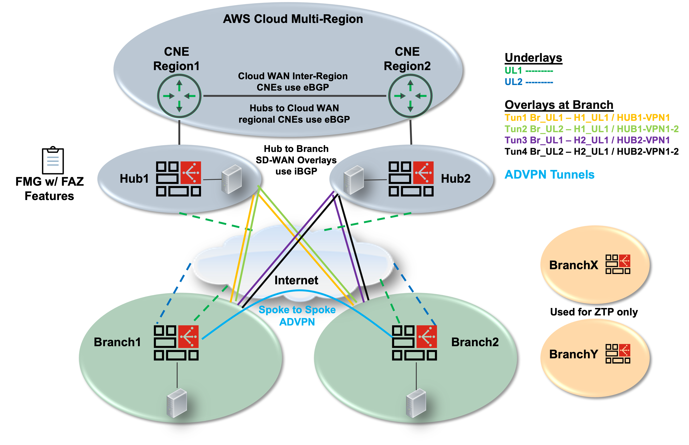

## Getting started with your Lab

---

{} The objective of this lab guide is to teach you one of the many methods of running an SD-WAN POC with FortiManager + ZTP.  There are many different DC designs.  The intention of this workshop is not to cover all possible designs and variations.  This workshop will show you how to use the SD-WAN Overlay Template generator for the majority of the necessary configurations.  Also this workshop will cover AWS Cloud WAN key concepts, advanced routing, and scale considerations.{}

---

{} 
Since there are many components to automate deployment of the workshop and cost, we (Fortinet) are deploying these environments in our own AWS accounts designated for workshops. We will share with you the information needed to access the AWS account and deployed resources on the day of the workshop.
{}

---

## High level workshop diagram:

