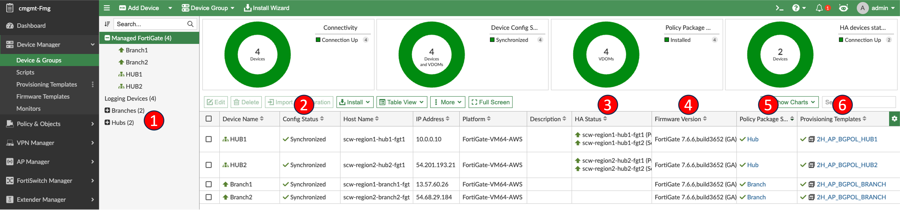
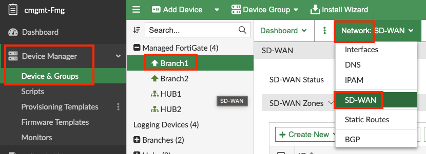
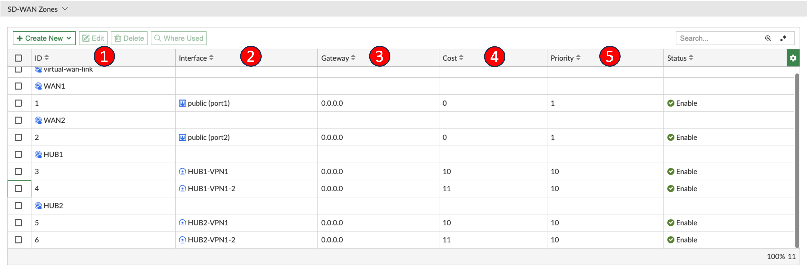
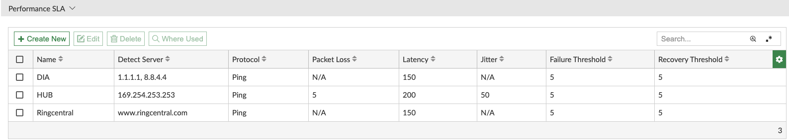
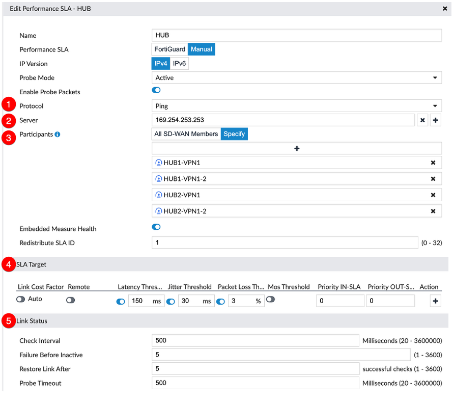
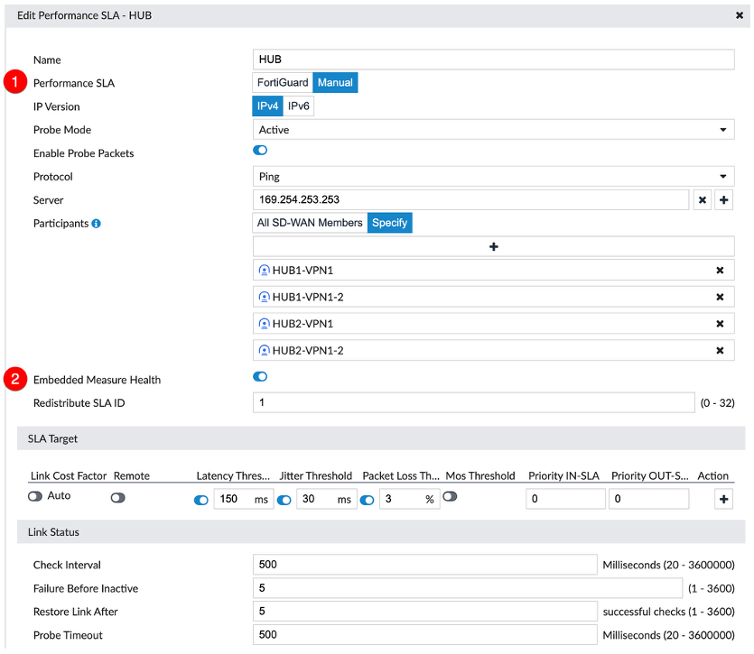
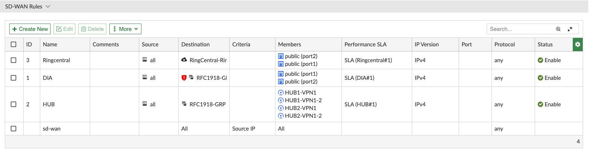
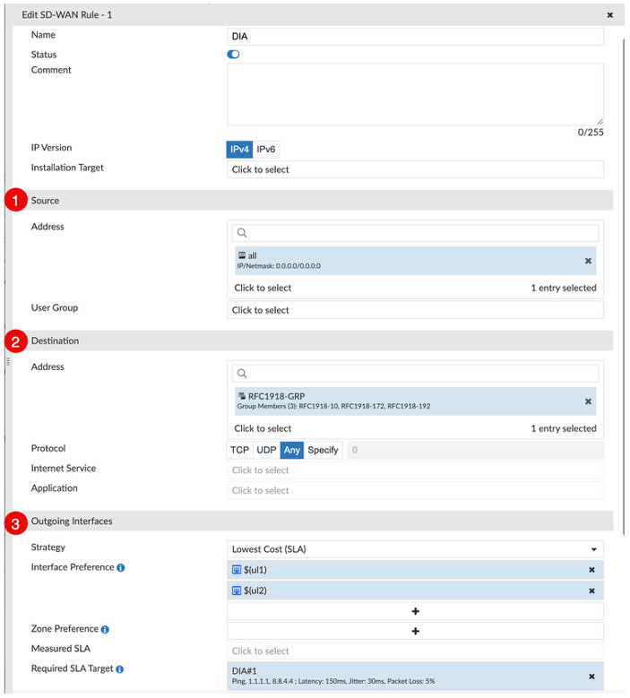
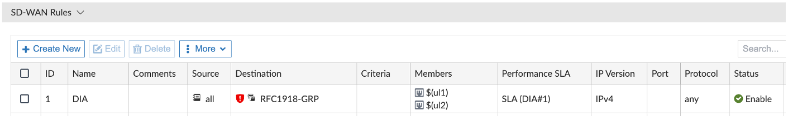

## FortiManager Device Manager Overview

Log into FMG and open Device Manager. Review the items being called out:



1. **Device Groups** – Easily organize devices by type, region, etc.
2. **Config Status** – Quickly identify the device config synchronization status.
3. **HA Status** – Cluster members and their status.
4. **Firmware** – Current firmware version.
5. **Policy Package Status** – Policy Package name installed and its status.
6. **Provisioning Templates** – Template group installed and its status.

---

## FortiGate SD-WAN Configuration Overview

Display SD-WAN configuration on Branch1.



***Navigation: FMG → Device Manager → Device & Groups → Managed FortiGate → Branch1 → Network → SD-WAN***

> [!TIP]
> Showing the configuration on the Branch1 device (vs. showing the SD-WAN Provisioning Template) allows you to avoid explaining Templates, Template Groups, Metadata Variables, and other concepts that will be covered later in the Provisioning section.

---

## Zones & Interface Members



1. **Zones** - Primarily referenced in firewall policy. They can also be used in static routes and SD-WAN service rules.
   - Individual members cannot be referenced in FW policy. Therefore, WAN1 and WAN2 have their own zones.
2. **Members** - The underlay/overlay members that we want to intelligently steer traffic to.
3. **Gateway** – IPs are left blank (0.0.0.0) for members using DHCP. UL1 and UL2 are using DHCP. These IPs are reused as next hops for any static routes that reference SD-WAN members or Zones.
4. **Cost** – Can be used when applying a strategy of "Lowest Cost" in a rule. Explained further in the SD-WAN Rules section.
5. **Priority** – Applied to static routes that reference SD-WAN members.

---

## Performance SLA (Health Checks)

The role of Performance SLAs (Health Checks) is to gather link health information and define thresholds to make steering decisions in SD-WAN rules.

- This demo has a few Performance SLAs defined: an Internet probe for local breakout traffic (DIA), a single SLA for both Hubs (HUB), and a Ringcental specific SLA.

> [!NOTE]
> We generally recommend probes simply from spoke to hub (nothing further into core network) since the primary goal is to pick the best overlay path between them.

This demo has the following Performance SLAs defined:



| SLA Name | Purpose |
|----------|---------|
| **DIA** | Probing reliable IP(s) on the internet to measure if underlay connectivity is up and healthy |
| **HUB** | Probing the same loopback interface anycast IP on each hub |
| **RingCentral** | Probing the www.ringcentral.com SLA target as defined by FortiGuard |

### Performance SLA Key Configuration Details

Edit the HUB Performance SLA and explain key config details:



1. **Protocol** – Protocol used to determine health of link(s).
2. **Server** – IP(s) or FQDN(s) being monitored.
   - If 2 entries are used, **both** MUST be considered unreachable for the health check to be considered failed.
   - Only the first "Server" in the list will be used when displaying stats, but both are being actively probed.
3. **Participants** – SD-WAN member interface(s) used in this SLA.
4. **SLA Target** – Thresholds set to be used in a lowest cost or maximize bandwidth rule.
   - Multiple threshold sets can be defined for different app tolerances if desired.
5. **Link Status**:
   - **Check Interval** – How frequently the probes are sent, default is 500ms (½ second).
   - **Failures before inactive** – How many UNANSWERED probes before the link is considered "failed" state.
   - **Restore link after** – How many GOOD probes before it goes back to a "healthy" state.

> [!TIP]
> For the HUB performance SLA the Branch FGTs will reach out to the server 169.254.253.253 which is the "HUB1/2-Lo" loopback interface on both Hub FGTs. Since all HUB1/2 and HUB1/2-2 members are selected, checks will be ran across all four members.

### Performance SLA New Features

Edit the HUB Performance SLA and explain key config details:



1. **Performance SLA**
   - **FortiGuard** – SLA targets defined in and downloaded from FortiGuard.
   - **Manual** – SLA targets configured by the administrator.
2. **Embedded Measure Health** – SLA statistics and status forwarded to the hub as embedded data in the probes. The server IP in the shown config exists on each hub. This is the destination the embedded information is sent to.

{} 
The Embedded Measure Health only works between FortiGates supporting this custom feature. So this will not work when the defined server IP is a 3rd party product.
{}

---

## SD-WAN Rules

SD-WAN rules steer traffic based on strategy. In this lab there are different rules for:

- **RingCentral** (ISDB)
- **DIA** (Address Group Negate)
- **HUB** (Address Group)

The rules page works like a **top-down policy engine**. The first matched rule is used, and no further rules are evaluated. Other reasons for "skipping" a rule include members being out of SLA or down (configurable).



> **Note:** There is always an implicit/default ALL/ALL rule at the bottom of the list (cannot be removed).

{} 
Previously when going through the SOT wizard there was a note that we are allowing the Branch traffic destined to each region to go directly to that region's Hub to avoid cross region charges. Here are the changes we implemented after the original SOT was created to allow this behavior:

  - Under SD-WAN Zones, select and edit the HUB1 and HUB2 and expand Advanced Options and see that **service-sla-tie-break** is set to **fib-best-match**
  - Under SD-WAN Zones, select and edit the HUB1-VPN1 and HUB2-VPN1 and expand Advanced Options and see that **cost and priority** are set to **10** and **priority-in-sla** is set to **10** and **priority-in-sla** is set to **110**
  - Under SD-WAN Zones, select and edit the HUB1-VPN1-2 andHUB2-VPN1-2 and expand Advanced Options and see that **cost** is set to **11** and **priority** is set to **10** and **priority-in-sla** is set to **11** and **priority-in-sla** is set to **111**
  - Under SD-WAN Rules, select and edit the HUB rule and see that **Tie Break** is set to **Best Match**

**Note** the priority-in/out-sla values are shared with the Hub FGTs via the embedded information in the ICMP Health Check. On the Hub FGT this is translated into BGP MED values to use based on current SLA status. Reference [**Fortinet Documentation**](https://docs.fortinet.com/document/fortigate/7.6.0/sd-wan-new-features/460015/map-sd-wan-member-priorities-to-bgp-med-attribute-when-spoke-advertises-routes-using-ibgp-to-hub-7-6-1) for more information.

For a quick example of how the embedded information from the Branches ICMP Health Checks turn into BGP MED, notice the output below from a Hub FGT. This is when both Branches are in SLA. Notice that:
  - `diag sys sdwan health-check remote FROM_EDGE` has the fields **rmt_sla=in** and **rmt_prio=10** for the VPN tunnels over the **primary paths (VPN1_0, VPN1_1)**
  - The **backup paths (VPN1-2_0, VPN1-2_1)** show **rmt_sla=in** and **rmt_prio=11**
  - The latency, jitter, and packet loss are reported for each path
  - BGP routes for the selected route show the BGP Metric is 10
 
```
scw-region1-hub1-fgt1(Primary) # diag sys sdwan health-check remote FROM_EDGE
Remote Health Check: FROM_EDGE(2)
  Passive remote statistics of VPN1-2(17):
VPN1-2_0(10.0.0.3): timestamp=06-11 06:25:54.511, src=169.254.252.1, latency=0.161, jitter=0.006, pktloss=0.000%, mos=4.404, SLA id=1(pass), rmt_ver=2, rmt_sla=in, rmt_prio=11, last_sla_change=06-11 05:07:07.145
VPN1-2_1(10.0.0.4): timestamp=06-11 06:25:54.671, src=169.254.252.2, latency=19.432, jitter=0.103, pktloss=0.000%, mos=4.394, SLA id=1(pass), rmt_ver=2, rmt_sla=in, rmt_prio=11, last_sla_change=06-11 05:07:14.652
Remote Health Check: FROM_EDGE(1)
  Passive remote statistics of VPN1(16):
VPN1_0(169.254.252.1): timestamp=06-11 06:25:54.511, src=169.254.252.1, latency=0.242, jitter=0.027, pktloss=0.000%, mos=4.404, SLA id=1(pass), rmt_ver=2, rmt_sla=in, rmt_prio=10, last_sla_change=06-11 05:07:06.652
VPN1_1(169.254.252.2): timestamp=06-11 06:25:54.671, src=169.254.252.2, latency=18.857, jitter=0.036, pktloss=0.000%, mos=4.395, SLA id=1(pass), rmt_ver=2, rmt_sla=in, rmt_prio=10, last_sla_change=06-11 05:07:14.650

scw-region1-hub1-fgt1(Primary) # get router info bgp neighbors 169.254.252.1 routes 
Status codes: s suppressed, d damped, h history, * valid, > best, i - internal,
              S Stale
Origin codes: i - IGP, e - EGP, ? - incomplete

VRF 0 BGP table version is 4, local router ID is 169.254.253.251
   Network          Next Hop            Metric     LocPrf Weight RouteTag Path
*>i10.32.0.32/28    169.254.252.1   10            100      0        0 ? <-/1>

Total number of prefixes 1


scw-region1-hub1-fgt1(Primary) # get router info bgp neighbors 169.254.252.2 routes
Status codes: s suppressed, d damped, h history, * valid, > best, i - internal,
              S Stale
Origin codes: i - IGP, e - EGP, ? - incomplete

VRF 0 BGP table version is 4, local router ID is 169.254.253.251
   Network          Next Hop            Metric     LocPrf Weight RouteTag Path
*>i10.48.0.32/28    169.254.252.2   10            100      0        0 ? <-/1>

Total number of prefixes 1
```

Now, compare the same fields to the same output when the primary path for one Branch (loopback IP of 169.254.252.1) is out of SLA. Notice that:
  - **VPN1_0** shows **rmt_sla=out, rmt_prio=110** and **latency=202.522**
  - `get router info bgp neighbors 169.254.252.1 routes` shows a metric change to **11 for the backup path (VPN1-2_0)**
```
scw-region1-hub1-fgt1(Primary) # diag sys sdwan health-check remote FROM_EDGE
Remote Health Check: FROM_EDGE(2)
  Passive remote statistics of VPN1-2(17):
VPN1-2_0(10.0.0.3): timestamp=06-11 06:36:55.522, src=169.254.252.1, latency=0.198, jitter=0.026, pktloss=0.000%, mos=4.404, SLA id=1(pass), rmt_ver=2, rmt_sla=in, rmt_prio=11, last_sla_change=06-11 05:07:07.145
VPN1-2_1(10.0.0.4): timestamp=06-11 06:36:55.420, src=169.254.252.2, latency=19.441, jitter=0.118, pktloss=0.000%, mos=4.394, SLA id=1(pass), rmt_ver=2, rmt_sla=in, rmt_prio=11, last_sla_change=06-11 05:07:14.652
Remote Health Check: FROM_EDGE(1)
  Passive remote statistics of VPN1(16):
VPN1_0(169.254.252.1): timestamp=06-11 06:36:55.120, src=169.254.252.1, latency=202.522, jitter=0.071, pktloss=5.000%, mos=4.159, SLA id=1(remote), rmt_ver=2, rmt_sla=out, rmt_prio=110, last_sla_change=06-11 06:36:50.595
VPN1_1(169.254.252.2): timestamp=06-11 06:36:55.419, src=169.254.252.2, latency=18.848, jitter=0.021, pktloss=0.000%, mos=4.395, SLA id=1(pass), rmt_ver=2, rmt_sla=in, rmt_prio=10, last_sla_change=06-11 05:07:14.650

scw-region1-hub1-fgt1(Primary) # get router info bgp neighbors 169.254.252.1 routes
Status codes: s suppressed, d damped, h history, * valid, > best, i - internal,
              S Stale
Origin codes: i - IGP, e - EGP, ? - incomplete

VRF 0 BGP table version is 4, local router ID is 169.254.253.251
   Network          Next Hop            Metric     LocPrf Weight RouteTag Path
*>i10.32.0.32/28    169.254.252.1   11            100      0        0 ? <-/1>

Total number of prefixes 1


scw-region1-hub1-fgt1(Primary) # get router info bgp neighbors 169.254.252.2 routes
Status codes: s suppressed, d damped, h history, * valid, > best, i - internal,
              S Stale
Origin codes: i - IGP, e - EGP, ? - incomplete

VRF 0 BGP table version is 4, local router ID is 169.254.253.251
   Network          Next Hop            Metric     LocPrf Weight RouteTag Path
*>i10.48.0.32/28    169.254.252.2   10            100      0        0 ? <-/1>

Total number of prefixes 1
```

{}

### SD-WAN Rule Key Options

Edit the DIA Rule and explain:



1. **Source address/User group**
   - **Input device** (interface) can be selected or negated in advanced options.

2. **Destination** – Can use address/address group (can be negated) and protocol OR ISDB/App/App group/App Category. Matching based on Route-Tag and TOS/DSCP is also available.

3. **Strategies**

| Strategy | Description |
|----------|-------------|
| **Manual** | Matching traffic towards SD-WAN members in configured order if member interfaces are up. No health check is referenced. |
| **Best Quality** | Choose the best quality link based on selected quality criteria (latency/jitter/etc.) using the measured SLA (health check). `custom-profile` can apply importance (weight) for criteria: `(packet-loss-weight × packet loss) + (latency-weight × latency) + (jitter-weight × jitter) + (bandwidth-weight / bandwidth)` |
| **Lowest Cost** | Use the lowest cost member if the SLA is met. If cost is the same, use the order in which the members are listed (default) or fib-best-match as the tie break. |
| **Load Balance** | An option that can be used with Manual or Lowest Cost steering. Uses ALL of the members listed as long as they meet the required SLA target(s). Sessions can be load balanced using: round-robin (default), source-ip, source-dest-ip, inbandwidth, outbandwidth, or bibandwidth. |

### Steering Rules for This Demo


- **RingCentral** – Lowest Cost (SLA) using an Internet Service DataBase (ISDB) definition. The ISDB is a comprehensive public IP address database combining IP address range, IP owner, service port number, and IP security credibility. The data comes from the FortiGuard service system.
- **DIA** – Local breakout traffic steering. The red exclamation point indicates all traffic **NOT** equal to the RFC1918 address group as the destination (`set dst-negate enable`).

  

- **HUB** – **HUB1** is preferred over **HUB2** in this template. 
  - This rule evaluates the overlays to **HUB1** and **HUB2**. The rules use member cost and then member order. Branch member preference and health is communicated upstream to the Hubs and from there to the client DC.
  - For eBGP routes received from Cloud WAN, fib-best-match is the tie break for ECMP routes advertised from Cloud WAN down to the Branches. This allows Branches to select the best path based on things like shortest AS Path so region 1 destinations are preferred over HUB1 and region 2 to HUB2 in a normal state.
- **Implicit rule** (bottom of the page) – Traffic that doesn't match an explicit rule will be load balanced to all members of SD-WAN (as long as a valid route exists). Based on routing setup in this lab, internet traffic should not traverse the VPN even if this rule is hit, as route priorities have been configured on overlay member interfaces. It should also be impossible for this rule to be hit since rules for all traffic that is and is not RFC-1918 are defined — this covers all IPv4 address space.

{} 
When you have ECMP paths and traffic is matching the implicit SDWAN rule, you may run into uneven usage because of the default load balancing algorithm. The default is set to **source-ip-based** which may favor one path heavily. You can use the command `set load-balance-mode source-dest-ip-based` to spread out traffic more evenly. Other options are **weight-based, usage-based, and measured-volume-based**. For more information, reference [**Fortinet Documentation**](https://docs.fortinet.com/document/fortigate/8.0.0/administration-guide/25967/equal-cost-multi-path).
{}


### This concludes this section