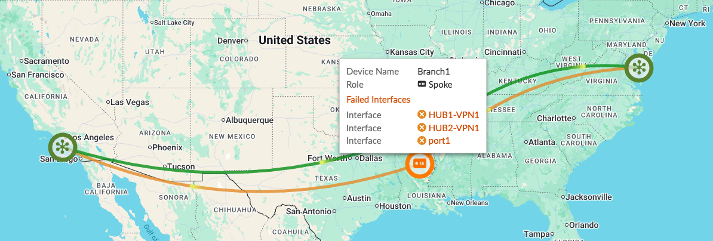
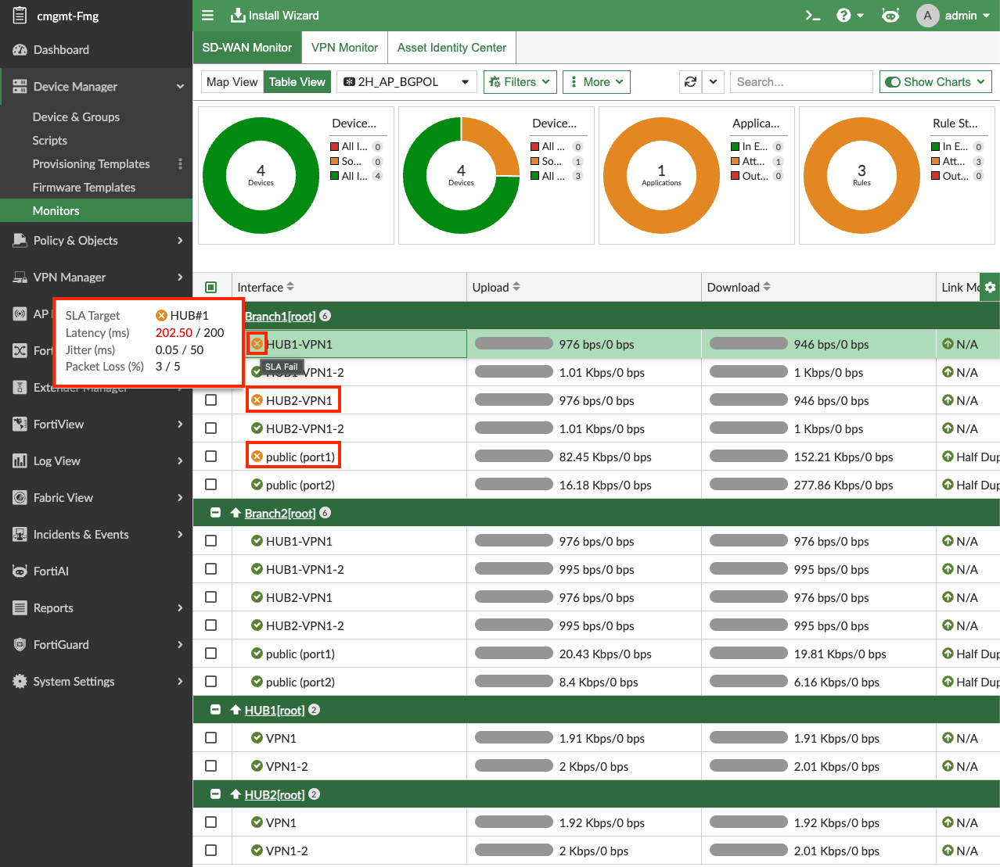
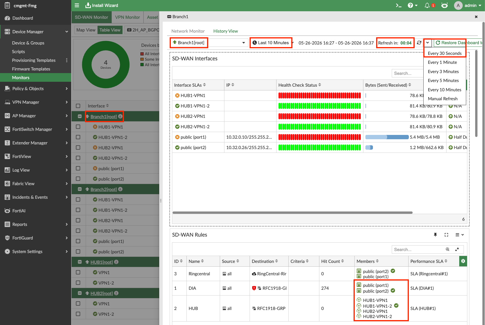
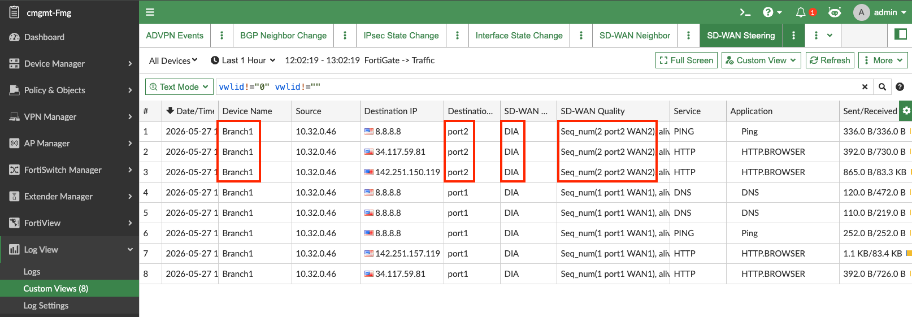
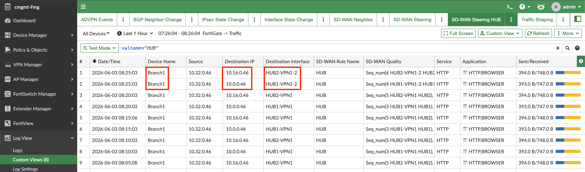
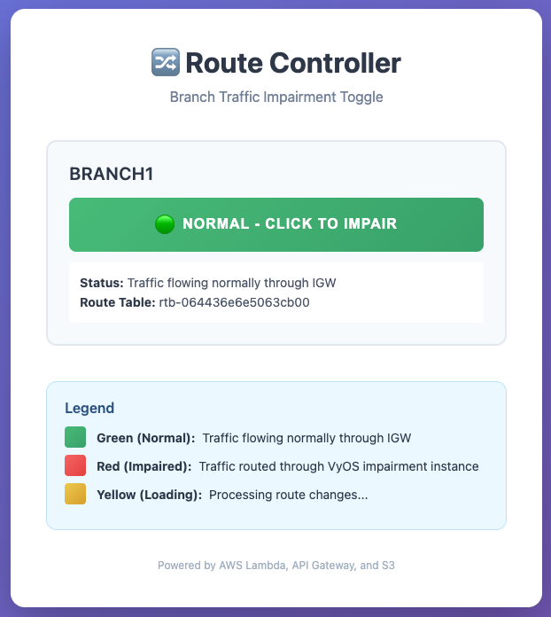
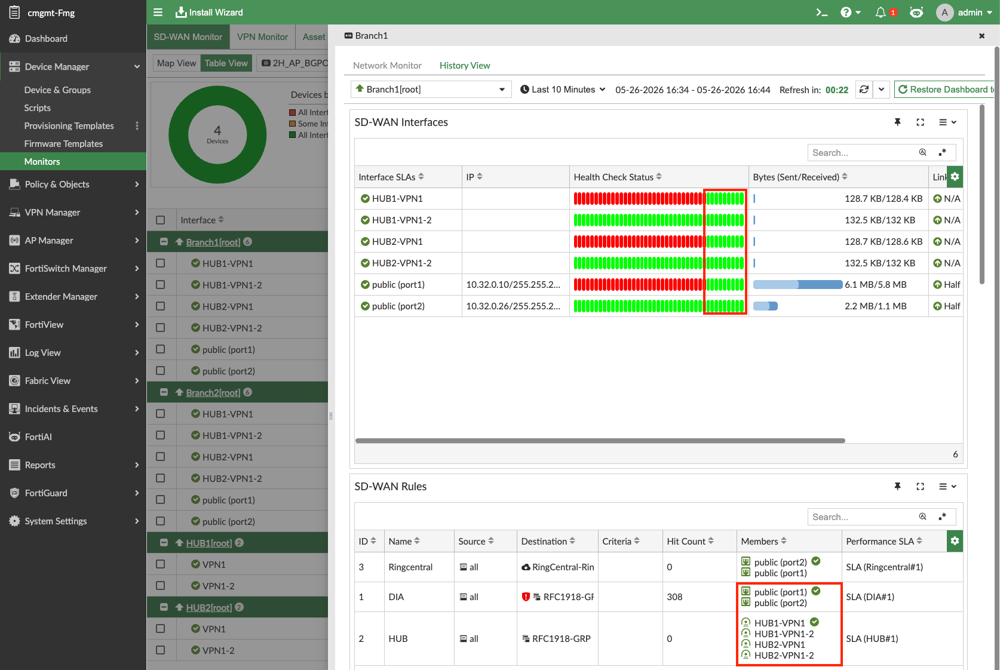

> Using FortiManager for SD-WAN Monitoring

## Adding Impairment to Branch1 Underlay1

1. Open the route controller website by navigating to the `route_controller_website_url` in your [**environment outputs**](../0_labprep/02_logistics).

   

2. Click the green button to implement **~200ms** of additional delay. The button will go from green  → to yellow  → then stay on red once the VPC routes have been changed.

   

   This will increase the latency on Branch1's Underlay1 link to over **200ms**, which is over the latency threshold configured in your HUB Health Check SLA.

---

## Observing the Impairment

While our impairment is in place, lets look at a few places we can see this.  
Let's look at the Main SD-WAN Monitor Map View again.

### Map View

- Notice **Branch1 is Orange**. You can then see the Underlay1 links that are failing their Performance SLA. **You may need wait a few minutes and navigate onto another page in the FMG GUI and come back to Map View.**

  

### Table View

- Click Table View
- When hovering over the orange **'x'** next to an SD-WAN member, you can see the failed Performance SLA and the Latency (ms) value in red showing it is over the SLA threshold.

  

### History View

***Navigation: FMG → Click Branch1 → History View*** → choose **last 10 Minutes** and set the auto refresh to **every 30 seconds**.

- Your screen should now show **red status** for all Underlay1 health checks.
- Both over-threshold and dead show red. **Yellow** will show when a time frame bar has both a healthy and unhealthy result in it.
- **Members:** The member with the check mark is the current preferred path. Hovering over the interface member shows details including health statistics — this can quickly provide information about why a path was or wasn't chosen.
- **DIA** SD-WAN Rule prefers UL1 (port1), so it is impacted by a UL1 impairment and is now using UL2 (port2).
- **HUB** SD-WAN Rule prefers UL1 (port1), so it is impacted by a UL1 impairment and is now using UL2 as well.
- **RingCentral** SD-WAN Rule prefers UL2 (port2), so it is not impacted by a UL1 impairment.

---

## SD-WAN Steering Logging During Impairment

***Navigation: FMG → Log View → Custom Views → SD-WAN Steering & SD-WAN Steering HUB***

&nbsp;

- DIA traffic on Branch1 **has moved** from **port1** to **port2** as dictated by the SD-WAN rule "DIA".
- HUB1 traffic on Branch1 **has moved** from **HUB1-VPN1** to **HUB1-VPN1-2** as dictated by the SD-WAN rule "HUB".
- HUB2 traffic on Branch1 **has moved** from **HUB2-VPN1** to **HUB2-VPN1-2** as dictated by the SD-WAN rule "HUB". This is not shown with a green check mark, reference the note below for more information.
- RingCentral did **not** move as it was preferring port2 in the rule and port2 was not affected.

{}
Since we are using **Best Match** for the **Tie Break** method in the HUB SDWAN rule, traffic from the Branch FGTs destined to a unique or more preferred route to Hub2 would use **HUB2-VPN1-2** to get there in the impaired state.
{}

---

## Removing the Impairment

1. Return to the route controller website and click the red button.
2. The button will go from red  → to yellow  → then stay on green once the VPC routes have been restored.

   

   This will set the latency on Branch1's Underlay1 link back to ~**20ms**. Therefore, the latency will be below the 200ms latency threshold configured in your HUB Health Check SLA.

This should normalize your SD-WAN Health Check Status and SD-WAN Rule member selection.

### This concludes this section