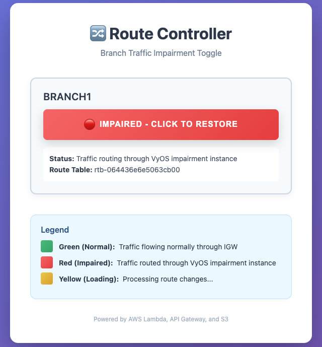
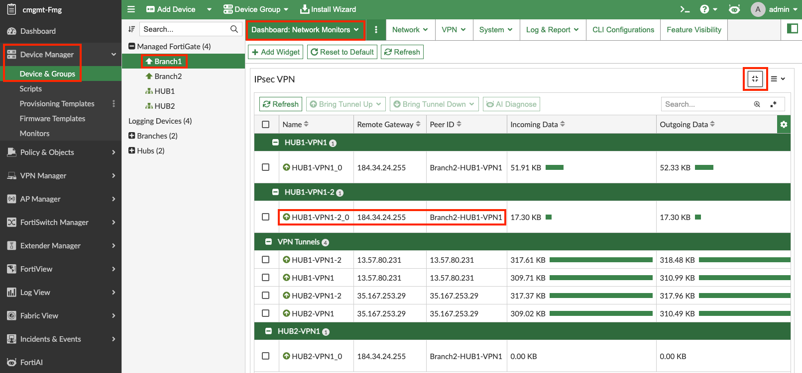
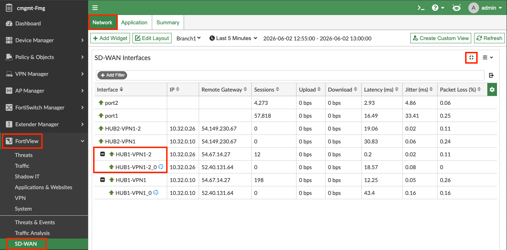
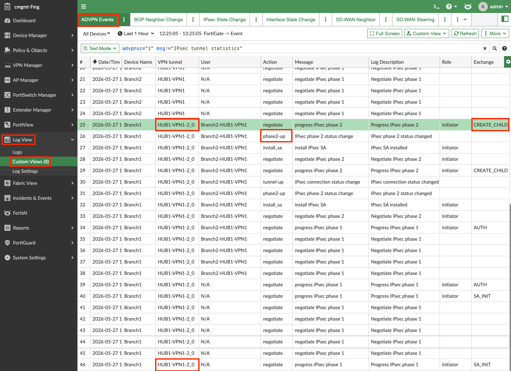

## Adding Impairment to Branch1 Underlay1

1. Open the route controller website by navigating to the `route_controller_website_url` in your [**environment outputs**](../0_labprep/02_logistics).

   

2. Click the green button to implement **~200ms** of additional delay. The button will go from green  → to yellow  → then stay on red once the VPC routes have been changed.

   

   This will increase the latency on Branch1's Underlay1 link to over **200ms**, which is over the latency threshold configured in your HUB Health Check SLA.

---

## ADVPN Monitoring During Impairment

### IPsec VPN Dashboard

***Navigation: FMG → Device Manager → Device & Groups → Branch1 → Dashboard → Network Monitors → IPsec VPN (Enlarge)***

Now that Underlay1 has latency over its SLA threshold, the traffic moves to **HUB1-VPN1-2** and creates an ADVPN shortcut IPsec tunnel **HUB1-VPN1-2_0**.

### FortiView Monitors

***Navigation: FMG → FortiView → Network → SD-WAN → SD-WAN Interfaces (Enlarge)***

On the FortiAnalyzer Secure SD-WAN Monitor, you can also see the new ADVPN shortcut tunnel **HUB1-VPN1-2_0** under its parent IPsec tunnel **HUB1-VPN1-2**.

> ADVPN shortcut IPsec tunnels are depicted with the (♽) special symbol next to them on this monitor.

---

## ADVPN Logging During Impairment

***Navigation: FMG → Log View → Custom Views → ADVPN Events***

---

## Removing the Impairment

1. Return to the route controller website and click the red button.
2. The button will go from red  → to yellow  → then stay on green once the VPC routes have been restored.

   

   This will set the latency on Branch1's Underlay1 link back to ~**20ms**. Therefore, the latency will be below the 200ms latency threshold configured in your HUB Health Check SLA.

This should normalize your SD-WAN Health Check Status and SD-WAN Rule member selection.

---

## Stop ADVPN Traffic fom Branch1 to Branch2

1. Using your [**environment outputs**](../0_labprep/02_logistics), login to the AWS console and navigate to the **EC2 Console**, confirm you are in the **us-west-1 (N. California) region** in the upper right hand corner, and connect to **scw-region1-branch1-linux-instance** using the **[serial console directions](../0_labprep/05_awsec2serialconsole)** to get the unique username and console access.
    - Username: instance-id (serial console directions link above shows how to get this for your environment)
    - Password: (relevant credentials in your environment outputs)

2. Stop the running ping with ***ctrl + C***

### This concludes this section