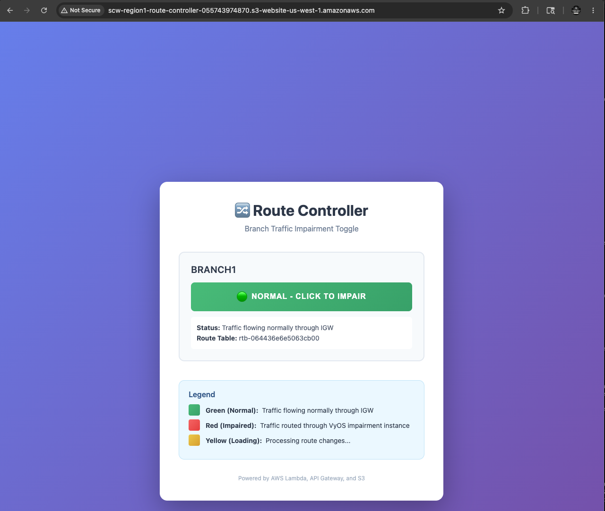
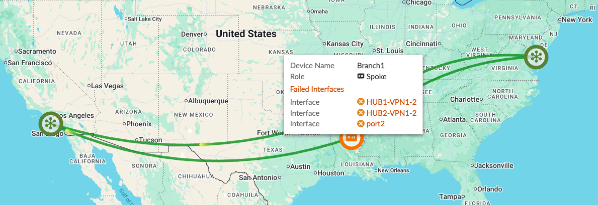
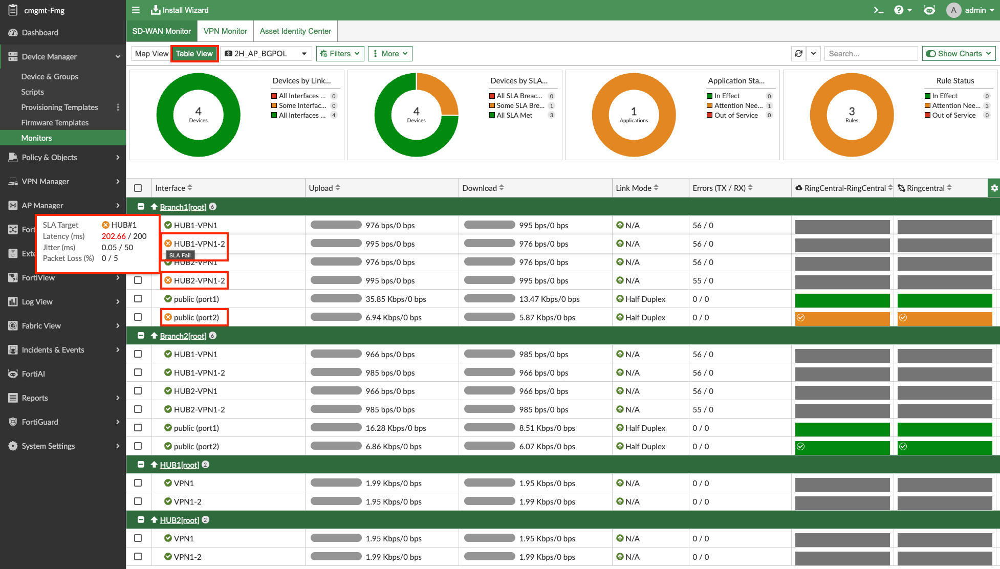
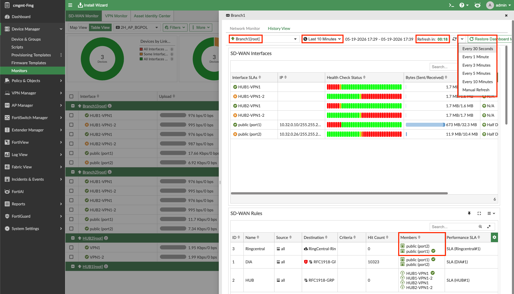
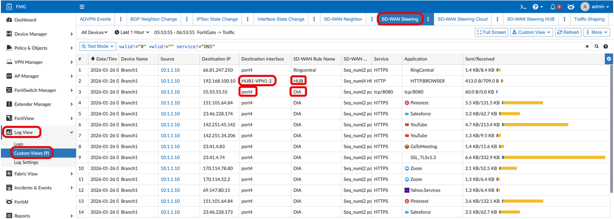
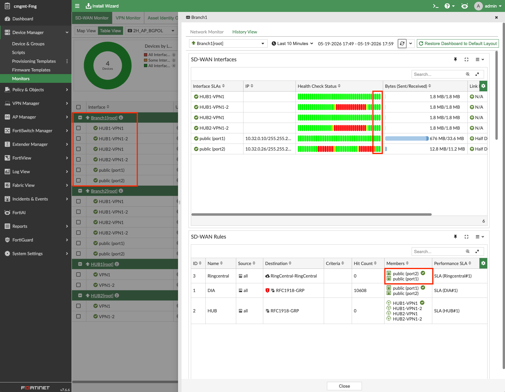

> Using FortiManager for SD-WAN Monitoring

## Adding Impairment to Branch1 Underlay2

1. Open the route controller website by navigating to the `route_controller_website_url` in your environment outputs.

   

2. Click the green button to implement ~202ms of delay. The button will go from green > to yellow > then stay on red once the VPC routes have been changed.

   

   This will increase the latency on Branch1's Underlay2 link to over **200ms**, which is over the latency threshold configured in your HUB Health Check SLA.

---

## Observing the Impairment

While our impairment is in place, lets look at a few places we can see this.  
Let's look at the Main SD-WAN Monitor Map View again.

### Map View

- Notice **Branch1 is Orange**. You can then see the Underlay2 links that are failing their Performance SLA.

  

### Table View

- Click Table View
- When hovering over the orange **'x'** next to an SD-WAN member, you can see the failed Performance SLA and the Latency (ms) value in red showing it is over the SLA threshold.

  

### History View

**Navigation:** Click Branch1 → History View → choose **last 10 Minutes** and show the auto refresh options.

- Your screen should now show **red status** for all Underlay2 health checks.
- Both over-threshold and dead show red. **Yellow** will show when a time frame bar has both a healthy and unhealthy result in it.
- **Members:** The member with the check mark is the current preferred path. Hovering over the interface member shows details including health statistics — this can quickly provide information about why a path was or wasn't chosen.
- **RingCentral** SD-WAN Rule prefers UL2 (port2), so it is impacted by a UL2 impairment.

---

## SD-WAN Steering Logging During Impairment

{}
TODO... I need to add the custom views and logging is only working for Hub1 FGT consistently, so not there yet.
{}

***Navigation: FMG → Log View → Custom Views → SD-WAN Steering***

#wip
- DIA traffic on Branch1 was not affected as from **port1** is preferred to **port2**.
- HUB1 traffic on Branch1 has moved from **HUB2-VPN1** to **HUB2-VPN1-2** as dictated by the SD-WAN rule "HUB."
- RingCentral did move as it was preferring port1 in the rule and port2 was not affected.

#original
- DIA traffic on Branch1 has moved from **'port3'** to **'port4'** as dictated by the "DIA" SD-WAN Rule.
- HUB1 traffic on Branch1 has moved from **HUB1-VPN1** to **HUB1-VPN1-2** as dictated by the SD-WAN rule "HUB."
- RingCentral did **NOT** move as it was preferring port4 in the rule and port4 was not affected.

---

## Removing the Impairment

1. Return to the route controller website and click the red button.
2. The button will go from red > to yellow > then stay on green once the VPC routes have been restored.

   

   This will set the latency on Branch1's Underlay2 link back to ~**20ms**. Therefore, the latency will be below the 200ms latency threshold configured in your HUB Health Check SLA.

This should normalize your SD-WAN Health Check Status and SD-WAN Rule member selection.

